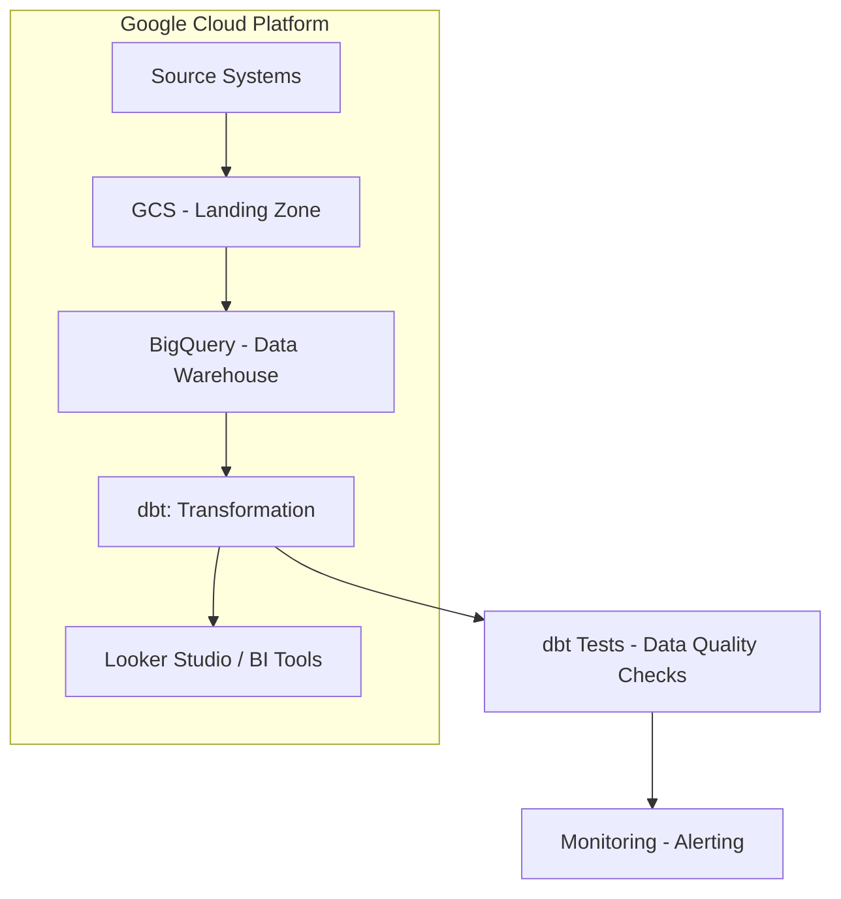
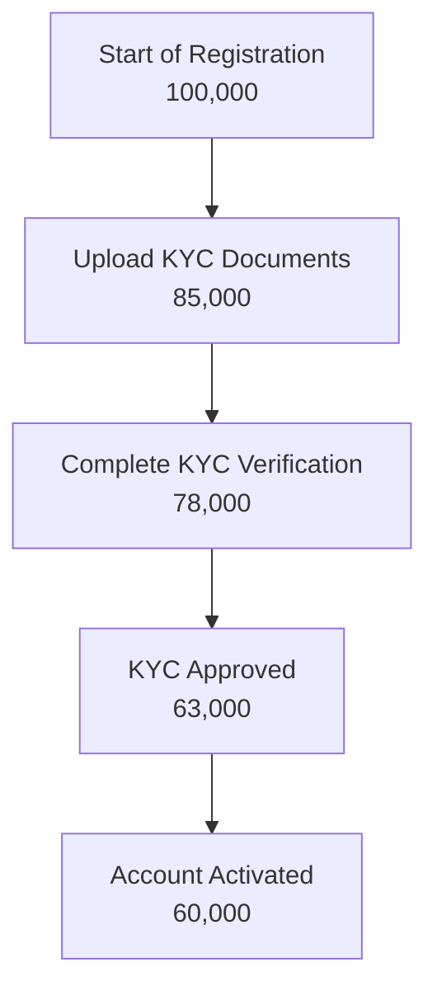

# Customer Onboarding Journey Analysis (KYC/AML)

---
## Terminology
---
<details>
<summary>Key Terms and Definitions in Onboarding and KYC/AML</summary>

---

  | **Term**                          | **Definition**                                                                 |
  |------------------------------------|-------------------------------------------------------------------------------|
  | **A/B Testing**                    | A method of testing two versions to measure the impact of a change.           |
  | **abandonment_flag**               | A variable indicating a user abandoned the process at a certain step.         |
  | **AML**                            | Anti-Money Laundering – Ensures customers are not involved in illegal finance.|
  | **approval rate**                  | The rate of user profiles approved through verification steps.                |
  | **audit log / audit trail**        | A log recording all actions for audit and compliance purposes.                |
  | **auto-approve rule**              | A rule allowing automatic approval if certain conditions are met.             |
  | **baseline metrics**               | Baseline metrics before changes, used for post-improvement comparison.        |
  | **business impact**                | Impact on business operations or objectives.                                  |
  | **channel_id**                     | Registration channel ID, used in attribution analysis.                        |
  | **churn**                          | The rate of users leaving or stopping service usage.                          |
  | **cohort**                         | A group of users sharing common characteristics or start time.                |
  | **conversion**                     | The rate of users completing a step or the entire onboarding process.         |
  | **CPA (Cost per Acquisition)**     | Cost to acquire a new user (if cost data is integrated).                      |
  | **CSAT (Customer Satisfaction Score)**| A measure of user satisfaction, usually via surveys.                      |
  | **device_model**                   | The model of device used by the user.                                         |
  | **device_type**                    | The type of device used (Mobile, Desktop, Tablet, etc.).                      |
  | **dim table**                      | Dimension table – contains descriptive info like user, device, time, etc.     |
  | **document rejection reason**      | Specific reason a document was rejected during KYC.                           |
  | **drop-off**                       | Users leaving the onboarding process at a specific step.                      |
  | **drop-off rate**                  | Percentage of users not completing a step in the onboarding funnel.           |
  | **duration_in_step_seconds**       | Time a user spends at a specific step in onboarding.                          |
  | **event_name**                     | Name of the event in the app log (e.g., KYC_STARTED).                        |
  | **face_match_score**               | Score measuring the match between selfie and ID photo.                        |
  | **false negative**                 | System fails to detect risk when it exists.                                   |
  | **false positive**                 | System incorrectly flags a profile as risky.                                  |
  | **funnel conversion rate**         | Conversion rate between steps in the onboarding journey.                      |
  | **geo_country / geo_city**         | Country/city where the user lives or registers.                               |
  | **insight**                        | Valuable information derived from data to support decision-making.            |
  | **internal_risk_score**            | Internal risk score assessed by the system based on indicators.               |
  | **KYC**                            | Know Your Customer – Customer identity verification process as required.      |
  | **kyc_result**                     | KYC result: Approved, Rejected, Pending, etc.                                 |
  | **liveness_check**                 | Process to check if the user is real, not a photo or bot.                     |
  | **manual_review**                  | Manual profile review process by humans.                                      |
  | **manual_review_queue_volume**     | Number of profiles waiting for manual review at a given time.                 |
  | **monitoring dashboard**           | Visual dashboard for real-time performance monitoring.                        |
  | **OCR**                            | Optical Character Recognition – Technology to read text from document images. |
  | **ocr_confidence**                 | Confidence level of OCR results.                                              |
  | **ocr_status**                     | OCR status: Success, Failure, Partial.                                        |
  | **onboarding**                     | The process of moving a new user from registration to full service access.    |
  | **onboarding journey**             | The user's journey from registration to full activation.                      |
  | **onboarding_step**                | The order of steps in the onboarding funnel.                                  |
  | **operational efficiency**         | Operational efficiency, reflected in productivity and process optimization.   |
  | **PEP**                            | Politically Exposed Person – Requires stricter monitoring.                    |
  | **pep_flag / sanction_flag**       | Flags indicating user is on political or sanction lists.                      |
  | **onboarding funnel**              | Sequence of steps users must complete during onboarding.                      |
  | **registration_channel**           | Channel where user started registration (Web, Mobile, Referral, etc.).        |
  | **registration_completion_rate**   | Percentage of users completing the entire registration process.               |
  | **retry_count**                    | Number of times user resubmitted verification documents.                      |
  | **risk_score**                     | Aggregate risk score of the user.                                             |
  | **risk traceability**              | Ability to trace risk decisions back to source data.                          |
  | **ROI (Return on Investment)**     | Value gained versus cost for improvements or projects.                        |
  | **sanction match rate**            | Rate of users matching sanction lists.                                        |
  | **session_id**                     | Unique identifier for a user session.                                         |
  | **stakeholder**                    | Stakeholder – individuals or groups affected by analysis results.             |
  | **time_to_kyc_completion**         | Time from registration to KYC completion.                                     |
  | **time_to_kyc_success**            | Time from user start to KYC completion.                                       |
  | **user_id**                        | Unique identifier for the user.                                               |

---
</details>

---
## Table of Contents
---
<details>
<summary>Overview of Main Chapters and Sections</summary>

---

  - [Executive Summary](#executive-summary)
  - [1. Problem Statement](#1-problem-statement)
  - [2. Project Objectives](#2-project-objectives)
  - [3. Project Plan and Phases](#3-project-plan-and-phases)
  - [4. Data Sources and Schema Design](#4-data-sources-and-schema-design)
    - [4.1 – Raw Data Sources](#41--raw-data-sources)
    - [4.2 – Proposed Data Schema](#42--proposed-data-schema)
  - [5. Data Transformation Logic](#5-data-transformation-logic)
    - [5.1 – Data Flow Overview](#51--data-flow-overview)
    - [5.2 – Detailed Transformation Steps](#52--detailed-transformation-steps)
      - [5.2.1 – Raw Data Ingestion](#521--raw-data-ingestion)
      - [5.2.2 – Data Cleaning & Standardization](#522--data-cleaning--standardization)
      - [5.2.3 – Data Enrichment](#523--data-enrichment)
      - [5.2.4 – Fact Table Construction](#524--fact-table-construction)
      - [5.2.5 – Dimension Table Construction](#525--dimension-table-construction)
    - [5.3 – Data Quality Assurance](#53--data-quality-assurance)
    - [5.4 – Recommended Tools & Technologies](#54--recommended-tools--technologies)
    - [5.5 – Summary of Transformation Logic](#55--summary-of-transformation-logic)
  - [6. Analytics Framework and KPIs](#6-analytics-framework-and-kpis)
    - [6.1 – Funnel Modeling](#61--funnel-modeling)
    - [6.2 – Funnel Metrics Analysis](#62--funnel-metrics-analysis)
    - [6.3 – Key Performance Indicators](#63--key-performance-indicators)
    - [6.4 – User Behavior Analytics](#64--user-behavior-analytics)
    - [6.5 – Compliance & Risk Insights](#65--compliance--risk-insights)
  - [7. Reporting and Dashboard Strategy](#7-reporting-and-dashboard-strategy)
    - [7.1 – Theme-Oriented Dashboard Structure](#71--theme-oriented-dashboard-structure)
    - [7.2 – Stakeholder-Oriented Dashboards](#72--stakeholder-oriented-dashboards)
    - [7.3 – Visualization Guidelines](#73--visualization-guidelines)
  - [8. Business Impact and Recommendations](#8-business-impact-and-recommendations)
    - [8.1 – Analysis-Driven Recommendations](#81--analysis-driven-recommendations)
    - [8.2 – Expected Business Impact](#82--expected-business-impact)
    - [8.3 – Measurement & Monitoring Plan](#83--measurement--monitoring-plan)

---
</details>

---
## Executive Summary
---
<details>
<summary>High-Level Overview of Analytics Framework and Key Business Impacts</summary>

---

  - This report focuses on analyzing the customer onboarding journey and KYC/AML process in the financial sector, aiming to optimize user conversion, enhance compliance, and reduce operational risk.
  - Based on a hypothetical business case, the analytics team designed a comprehensive analytics system, including:
    - A standardized data schema following the Star Schema model.
    - A data processing pipeline from collection, cleaning, to fact/dim table construction and data quality control (DQA).
    - An analytics framework with core KPIs, behavioral analysis, and risk analysis.
    - Thematic and user-oriented dashboards to support decision-making for Operations, Risk, Marketing, and Product teams.
  - From both quantitative and qualitative analyses, the report provides actionable recommendations, such as UI improvements, OCR algorithm optimization, and automation for low-risk profile approvals.
  - Expected business impacts include:
    - Increased conversion rate of successful user registrations.
    - Reduced operational costs, especially manual processing costs.
    - Improved user experience and satisfaction.
    - Enhanced risk management and regulatory compliance.
  - This report not only offers a strategic perspective but also details technical, process, and measurement aspects, ready for real-world application or scaling to larger analytics projects.

---
</details>

---
## 1. Problem Statement
---
<details>
<summary>Detailed Description of Business Challenges in Onboarding and KYC/AML Process</summary>

---

- **Current Situation:**
  - Many potential customers start the onboarding process but drop out midway.
  - There are significant friction points, especially in KYC/AML verification steps.
- **Consequences:**
  - `Loss of Potential Customers`: Direct impact on attracting users and growing business.
  - `Increased Operational Costs`: Due to manual support, failed verifications, and retries.
  - `Poor User Experience`: Leads to user discomfort and negative initial impression.
  - `Regulatory Compliance Issues`: KYC/AML process inefficiencies pose potential legal risks.
- **Common Challenges:** We lack clear understanding, based on data about the onboarding journey of customers, to accurately identify pain points and optimize the process while maintaining compliance.

---
</details>

---
## 2. Project Objectives
---
<details>
<summary>Clear and Measurable Goals and Outcomes of the Analytical Initiative</summary>

---

- **Main Objective:**
  - Build a robust analytics system to gain deep insights into the customer onboarding journey.
  - This system will allow us to optimize the process, reduce drop-off rates, and improve user experience.
  - Simultaneously, we will ensure full compliance with KYC/AML regulations.
- **Key Questions:**
  - Which `step` in the onboarding process has the highest drop-off rate?
  - Why do users drop out at specific points?
  - How long does it take for a customer to complete the entire onboarding and KYC/AML process?
  - What incremental improvements can be made to streamline the process without compromising security and compliance?

---
</details>

---
## 3. Project Plan and Phases
---
<details>
<summary>Comprehensive Strategy from Start to Finish to Address Analytical Challenges</summary>

---

- This plan outlines a four-stage approach, focusing on transforming raw data into actionable insights:

  ---

  #### Phase 1: Data Collection and Setup (Building a Foundation)
  ---
  - **What We'll Do:**
    - Collaborate with technical teams to identify and collect all data related to user registration and KYC/AML verification.
    - Example data:
      - `User registration timestamp` (`timestamp`) (start, completion of each step)
      - `Steps completed` or attempted
      - `Errors encountered` during the process
      - `Waiting times` for each verification step
      - `Verification results` (success/failure, failure reasons)
      - `Communication logs` with users (e.g., email/SMS notifications)
    - Design a clear `data schema` (`blueprint`) or `schema` for easy understanding and use.
  - **Objective:**
    - Ensure clean, accurate data is available for analysis.

  ---

  #### Phase 2: Building the Analytics Framework (Painting a Comprehensive Picture)
  ---
  - **What We'll Do:**
    - Create funnels (`funnels`) to visualize the entire customer journey from registration to activation.
    - Define key performance indicators (`KPIs`) such as:
      - `Conversion rate by step`
      - `Average time to complete verification`
      - `KYC failure rate by reason`
      - `Cost per successful onboarding`
    - Propose A/B testing methods for different onboarding flows or benchmarks.
  - **Objective:**
    - Identify bottlenecks and understand the impact of each step.

  ---

  #### Phase 3: Deep Analysis and Problem Identification (Identifying Root Causes)
  ---
  - **What We'll Do:**
    - Conduct deep analysis to understand why customers drop out.
    - Investigate factors such as:
      - The complexity of KYC/AML document submission
      - Waiting time for response
      - Clarity of instructions
    - Analyze cases of `KYC/AML rejection` to identify common reasons and suggest improvements to compliance processes.
  - **Objective:**
    - Identify root causes of issues and opportunities for improvement.

  ---

  #### Phase 4: Reporting and Proposing Solutions (Turning Data into Actionable Actions)
  ---
  - **What We'll Do:**
    - Summarize findings into a clear, actionable report.
    - Examples of proposed actions:
      - Simplifying step X
      - Automating check Y
      - Improving notification for user at step Z
    - Draft a `dashboard` (control panel) for easy real-time tracking of performance.
  - **Objective:**
    - Provide detailed information and solutions for cross-functional collaboration to improve user experience and business effectiveness.

  ---

- **Using GenAI:**
  - Throughout all phases, GenAI tools will be leveraged to speed up analysis, generate reports, and ensure data accuracy, maximizing efficiency and output quality.

---
</details>

---
## 4. Data Sources and Schema Design
---
<details>
<summary>Detailed Description of Raw Data Sources and Proposed Data Schema</summary>

---

#### 4.1 – Raw Data Sources
---
- To build the analytics framework for the onboarding journey and KYC/AML, we need to collect data from various systems involved in the registration and verification process.
- Below are the main data sources:

  ---

  ##### 📄 Group 1: User Registration Logs
  ---
  - Includes all information related to user registration time.
  - Important fields:
    - `user_id`: Unique identifier
    - `registration_start_time`: Registration start time
    - `registration_channel`: Web / mobile / referral
    - `device_type`, `os_version`, `browser`: Used for analyzing device usage
    - `language`, `region`: Used for regional analysis

  ---

  ##### 🪪 Group 2: Identity Verification Logs
  ---
  - Includes information about user-provided documents and OCR processing.
  - Main fields:
    - `doc_type`: CMND / CCCD / Passport
    - `ocr_status`, `ocr_confidence`: OCR result
    - `upload_time`, `verification_result`, `rejection_reason"
    - `retry_count`: Number of retries (if any)

  ---

  ##### 🧠 Group 3: Biometric Verification Data
  ---
  - Verifies real user (`liveness`) and face match.
  - Fields:
    - `face_match_score`: Face match score
    - `liveness_check_result`: true/false
    - `device_camera_quality`: Camera quality
    - `frame_blur_score`: Image clarity assessment
    - `action_prompt_passed`: Whether the action was performed correctly (looking left/right...)

  ---

  ##### 🚦 Group 4: Risk & Compliance Data
  ---
  - Data from anti-money laundering (`AML`) and PEP/sanction check systems.
  - Fields:
    - `pep_flag`, `sanction_flag`: Whether user is on political or sanction lists
    - `internal_risk_score`: Internal risk score
    - `risk_decision`: approve / manual_review / reject
    - `manual_review_reason` (if applicable)

  ---

  ##### 💬 Group 5: User Communication Logs
  ---
  - Records emails, notifications, and customer support interactions.
  - Fields:
    - `email_sent`, `sms_sent`, `push_notification_sent"
    - `time_sent`, `user_response_time"
    - `support_ticket_opened`, `ticket_status`, `assigned_agent_id"

  ---

  ##### 📱 Group 6: App Event Logs
  ---
  - Logs user behavior such as app usage, actions at each onboarding step.
  - Fields:
    - `screen_viewed`, `step_started`, `step_completed"
    - `timestamp`, `session_duration`, `abandonment_flag"

  ---

- These data sources form the foundation for designing `schema`, defining `funnels`, and calculating `KPIs` in the following sections.

---
#### 4.2 – Proposed Data Schema
---
- To support the analysis of the onboarding journey and KYC/AML, we propose a centralized data model, including tables designed to collect and organize information from various raw data sources.
- The goal is to create a clear, queryable schema that calculates KPIs and builds `funnels` efficiently.
- Our proposed schema includes the following main tables:

  ---

  ##### 📊 Table: `dim_users` (User Information)
  ---
  - **Purpose:** Contains basic and static user attributes.
  - **Relationship:** Linked to all other tables through `user_id`.
  - **Structure:**

    | Field Name (Field Name) | Data Type (Data Type) | Description (Description) |
    | :---------------------- | :-------------------- | :---------------------- |
    | `user_id`               | `STRING`              | `Primary Key`, unique identifier for the user. |
    | `registration_start_time` | `TIMESTAMP`           | Time user started registering for an account. |
    | `registration_channel`  | `STRING`              | Initial registration channel (e.g., `Web`, `Mobile App`, `Referral`, `Partnership`). |
    | `device_type`           | `STRING`              | Device type used for registration (`Mobile`, `Tablet`, `Desktop`). |
    | `os_version`            | `STRING`              | Operating system version (`iOS 17`, `Android 13`, `Windows 10`). |
    | `browser_type`          | `STRING`              | Browser type (`Chrome`, `Safari`, `Firefox`). |
    | `language_preference`   | `STRING`              | Language user has selected or system detected. |
    | `geo_country`           | `STRING`              | User's country based on IP or initial registration information. |
    | `email`                 | `STRING`              | Email used for registration (can be encrypted/hashed for security). |
    | `phone_number`          | `STRING`              | Phone number used (can be encrypted/hashed). |
    | `account_status`        | `STRING`              | Current account status (`Pending`, `Verified`, `Rejected`, `Suspended`). |
    | `registration_completion_time` | `TIMESTAMP`         | Time user completed basic registration process. |

  ---

  ##### 📈 Table: `fact_onboarding_events` (Onboarding Events)
  ---
  - **Purpose:** Records each event or step a user completes during onboarding. This is the main table for building funnels.
  - **Relationship:** Linked to `dim_users` through `user_id`.
  - **Structure:**

    | Field Name (Field Name) | Data Type (Data Type) | Description (Description) |
    | :---------------------- | :-------------------- | :---------------------- |
    | `event_id`              | `STRING`              | Unique identifier for each event. |
    | `user_id`               | `STRING`              | `Foreign Key`, links to `dim_users`. |
    | `event_timestamp`       | `TIMESTAMP`           | Timestamp of the event. |
    | `event_name`            | `STRING`              | Name of the event (`KYC_STARTED`, `ID_DOCUMENT_UPLOADED`, `LIVENESS_CHECK_FAILED`, `ACCOUNT_ACTIVATED`). |
    | `onboarding_step`       | `INT`                 | Step number in the onboarding journey (e.g., `1` for registration, `2` for document upload). |
    | `step_description`      | `STRING`              | Detailed description of the step. |
    | `event_status`          | `STRING`              | Status of the event (`SUCCESS`, `FAILURE`, `PENDING`, `RETRY`). |
    | `error_code`            | `STRING`              | Error code (if any) for failed events. |
    | `error_message`         | `STRING`              | User-friendly error description (if any). |
    | `session_id`            | `STRING`              | `ID` of the session the event occurred in. |
    | `duration_in_step_seconds` | `INT`                 | Time user spent at this step before transitioning or exiting. |

  ---

  ##### 📋 Table: `fact_kyc_verification_details` (KYC Details)
  ---
  - **Purpose:** Stores detailed information about each KYC submission and biometric verification.
  - **Relationship:** Linked to `dim_users` through `user_id`.
  - **Structure:**

    | Field Name (Field Name) | Data Type (Data Type) | Description (Description) |
    | :---------------------- | :-------------------- | :---------------------- |
    | `kyc_submission_id`     | `STRING`              | Unique identifier for each KYC submission. |
    | `user_id`               | `STRING`              | `Foreign Key`, links to `dim_users`. |
    | `submission_timestamp`  | `TIMESTAMP`           | Time user submitted KYC information. |
    | `document_type`         | `STRING`              | Type of document submitted (`Passport`, `National ID`, `Driver's License`). |
    | `ocr_status`            | `STRING`              | OCR status (`Success`, `Failure`, `Partial`). |
    | `ocr_confidence_score`  | `FLOAT`               | Confidence score of OCR result (0.0 - 1.0). |
    | `face_match_score`      | `FLOAT`               | Face match score from ID photo and `liveness` photo (0.0 - 1.0). |
    | `liveness_check_result` | `BOOLEAN`             | Result of liveness check (`true` if real user). |
    | `kyc_result`            | `STRING`              | Final KYC result (`Approved`, `Rejected`, `Under Review`, `Retry Needed`). |
    | `rejection_reason`      | `ARRAY<STRING>`        | List of reasons for rejection (e.g., `Blurred Document`, `Face Mismatch`, `Document Expired`). |
    | `processing_time_seconds` | `INT`                 | Time taken for KYC processing (automatic/manual). |
    | `agent_id`              | `STRING`              | `ID` of manual reviewer (if applicable). |
    | `number_of_retries`     | `INT`                 | Number of times user needs to resubmit KYC for this attempt. |

  ---

  ##### 🚨 Table: `fact_risk_assessments` (Risk Assessment)
  ---
  - **Purpose:** Records risk assessment results for AML/PEP/Sanction for users.
  - **Relationship:** Linked to `dim_users` through `user_id`.
  - **Structure:**

    | Field Name (Field Name) | Data Type (Data Type) | Description (Description) |
    | :---------------------- | :-------------------- | :---------------------- |
    | `risk_assessment_id`    | `STRING`              | Unique identifier for each risk assessment. |
    | `user_id`               | `STRING`              | `Foreign Key`, links to `dim_users`. |
    | `assessment_timestamp`  | `TIMESTAMP`           | Time risk assessment was conducted. |
    | `risk_score`            | `INT`                 | Overall risk score of the user (e.g., 1-100). |
    | `pep_flag`              | `BOOLEAN`             | `True` if user is identified as PEP (politically exposed person). |
    | `sanction_flag`         | `BOOLEAN`             | `True` if user is on sanction lists. |
    | `aml_status`            | `STRING`              | Status of AML check (`Clear`, `Match Found`, `Under Investigation`). |
    | `final_risk_decision`   | `STRING`              | Final risk decision (`Approved`, `Manual Review`, `Rejected`). |
    | `decision_reason`       | `ARRAY<STRING>`        | Specific reasons for risk decisions. |

  ---

  ##### 💬 Table: `fact_user_communications` (User Communications)
  ---
  - **Purpose:** Records all system-generated messages or support tickets sent to users during onboarding.
  - **Relationship:** Linked to `dim_users` through `user_id`.
  - **Structure:**

    | Field Name (Field Name) | Data Type (Data Type) | Description (Description) |
    | :---------------------- | :-------------------- | :---------------------- |
    | `communication_id`      | `STRING`              | Unique identifier for each communication. |
    | `user_id`               | `STRING`              | `Foreign Key`, links to `dim_users`. |
    | `communication_timestamp` | `TIMESTAMP`           | Time message/notification sent. |
    | `communication_type`    | `STRING`              | Type of communication (`Email`, `SMS`, `Push Notification`, `In-App Message`). |
    | `message_content`       | `STRING`              | Main content of the message (can be shortened or encrypted). |
    | `delivery_status`       | `STRING`              | Status of delivery (`Sent`, `Delivered`, `Failed`, `Opened`). |
    | `user_interaction_status` | `STRING`             | Status of user interaction (`Clicked`, `Ignored`, `Responded`). |
    | `support_ticket_id`     | `STRING`              | `ID` of support ticket related (if any). |

  ---
  ##### 📄 Table: `fact_manual_review_logs` (Manual Review Logs)
  ---
  - **Purpose:** Records detailed information about manual KYC review process by staff.
  - **Relationship:** Linked to `dim_users` through `user_id` and may be linked to `fact_kyc_verification_details` through `kyc_submission_id`.
  - **Structure:**

    | Field Name (Field Name) | Data Type (Data Type) | Description (Description) |
    | :---------------------- | :-------------------- | :---------------------- |
    | `review_id`             | `STRING`              | Unique identifier for each manual review. |
    | `user_id`               | `STRING`              | `Foreign Key`, links to `dim_users`. |
    | `kyc_submission_id`     | `STRING`              | `Foreign Key`, links to `fact_kyc_verification_details`. |
    | `review_start_time`     | `TIMESTAMP`           | Time manual review process started. |
    | `review_end_time`       | `TIMESTAMP`           | Time manual review process ended. |
    | `review_result`         | `STRING`              | Result of review (`Approved`, `Rejected`, `Needs More Info`). |
    | `review_notes`          | `STRING`              | Notes from reviewer about this case. |
    | `reviewer_id`           | `STRING`              | `ID` of staff member conducting review. |

  ---

  ##### 📊 Relationship Diagram between Tables (ERD)
  ---

  ```mermaid
  erDiagram
      dim_users ||--o{ fact_onboarding_events : has
      dim_users ||--o{ fact_kyc_verification_details : has
      dim_users ||--o{ fact_risk_assessments : has
      dim_users ||--o{ fact_user_communications : has
      dim_users ||--o{ fact_manual_review_logs : has
      fact_kyc_verification_details ||--o{ fact_manual_review_logs : triggers
  ```
---
- With this schema design, we can easily build queries to support funnel analysis (`drop-off rate`, `completion rate`), time analysis (`time-to-verify`), as well as assessing the effectiveness of KYC/AML and manual review processes.
- This forms a robust foundation for subsequent steps: data transformation, KPI calculation, and dashboard building.

---

</details>

---
## 5. Data Transformation Logic
---
<details>
<summary>Description of Data Cleaning, Standardization, and Aggregation Processes</summary>

---
#### 5.1 – Data Flow Overview
---

- The goal of this section is to provide a comprehensive view of the data collection, processing, and transformation to support the onboarding journey and KYC/AML analysis.
- The data flow is designed following the modern ELT (Extract, Load, Transform) model, allowing for flexible processing of large-scale data on cloud data warehouse platforms.
- The main stages of the data flow include:

  - **1. Raw Data Ingestion:**
    - Data is collected continuously or in batches from various sources such as: registration systems, KYC/Biometric systems, risk/compliance systems, communication systems, and app event logs.
    - Collection methods include `API integration`, `database replication`, and `log forwarding`.

  - **2. Raw Data Storage:**
    - Data is stored in its raw form here, often on cloud storage services like `Google Cloud Storage` (GCS) or `Amazon S3`, ensuring data integrity and `re-processing` capabilities when needed.

  - **3. Loading Data into Data Warehouse:**
    - Data from `Landing Zone` is loaded into a powerful data warehouse (`Google BigQuery`, Snowflake, Redshift), providing a solid foundation for high-performance data processing.

  - **4. Data Transformation:**
    - This stage performs cleaning, standardization, enrichment, and aggregation of data directly in the `Data Warehouse` to build `dim` and `fact` tables according to the designed schema.

  - **5. Analytical Data Layer:**
    - The `dim` and `fact` tables are processed and optimized, ready for analytical purposes and reporting.

  - **6. Data Consumption / Reporting:**
    - Data from the analytical layer is used by BI tools (`Business Intelligence`) to create `dashboards`, reports, and calculate KPIs.

- The overall data flow can be visualized as follows:
---

  ```mermaid
    flowchart TD
  subgraph Source_Systems [Source Systems]
    A[Registration System] --> RawData
    B[KYC/Biometric System] --> RawData
    C[Risk/Compliance System] --> RawData
    D[Communication System] --> RawData
    E[App Event Logs] --> RawData
    F[Manual Review System] --> RawData
  end

  RawData["Raw Data Storage (GCS/S3)"] --> Load["Load into Data Warehouse (BigQuery)"]
  Load --> Transform["Data Transformation (dbt/SQL)"]
  Transform --> AnalyticalLayer["Analytical Data Layer (Dim & Fact Tables)"]
  AnalyticalLayer --> Consumption["Reports & Dashboards (Looker Studio/Power BI)"]
  ```
---

- This data flow is designed to ensure data integrity, scalability, and efficiency, providing a solid foundation for all analytical activities related to the onboarding journey and KYC/AML.

---
#### 5.2 – Detailed Transformation Steps
---

##### 5.2.1 – Raw Data Ingestion
---

<details>
<summary>Description of data collection from multiple source systems</summary>

---
- The first step in the ELT pipeline is **ingestion of raw data from various source systems**, ensuring that the data is comprehensive and accurate for subsequent processing steps.
- Data comes from **multiple distributed systems**, each with different formats and update rates.

- **Main source systems:**
    - Data is collected from the following systems:
        - **User Registration System**: user profile and onboarding start time.
        - **KYC & Biometric System**: includes ID documents, OCR status, face match, and liveness.
        - **Risk & Compliance System**: PEP/sanction data, internal risk score, and risk decision.
        - **Communication System**: email, SMS, push notifications, and support ticket status.
        - **Mobile App**: event logs for onboarding steps, abandonments, and session durations.

- **Proposed ingestion methods:**

| Source Type | Integration Method | Technology Fit |
|------------|--------------------|----------------|
| API endpoints | Periodic API calls or triggered by events | `Airflow`, `Cloud Functions` |
| Database logs | Realtime streaming or CDC (Change Data Capture) | `Debezium`, `Kafka`, `BigQuery Data Transfer` |
| File-based logs | Batch upload from storage (CSV, JSON, Parquet) | `Cloud Storage + dbt`, `Fivetran` |
| Event tracking | Sent from client/app via events | `Segment`, `Snowplow`, `GA4`, `Firebase` |
| Manual review logs | Manually entered or synced from CRM system | `CSV`, `Google Sheets`, `App Script` |

- **Notes:**
    - Ensure **consistent user identification** (`user_id`) across systems (using UUID or hashed ID).
    - All timestamps must be **converted to UTC** for consistent analysis.
    - Raw data should be stored in **Landing Zone** in its original format, without transformation, to ensure re-processability and error checking.
...

---

- The data ingestion phase is crucial, as it directly impacts the reliability of the analytics system. The design must ensure:
  - High automation
  - Good error handling
  - Scalability as the system grows

---
</details>


---
##### 5.2.2 – Data Cleaning & Standardization
---

<details>
<summary>Description of data cleaning, standardization, and data processing steps to ensure data quality and consistency</summary>

---

- The goal of this phase is to transform raw data into a clean, standardized format that is ready for analysis.
- If the input data is "garbage" (Garbage In), the output of the analysis will be significantly skewed (Garbage Out).

---

##### 🎯 Reasons for cleaning and standardization

| Common Issue | Consequence if not addressed |
|--------------|------------------------------|
| Missing / NULL data | Causes statistical errors and issues with joins across tables |
| Non-standard formatting | Cannot be converted or compared |
| Duplicate records | Causes double counting and incorrect analysis results |
| Outliers | Causes average to be skewed and leads to misinterpretation |
| Lack of consistency | Causes issues with filtering and grouping |

---

##### 🧹 Data cleaning steps

| Issue | Data processing method |
|-------|----------------------|
| **Missing / NULL data** | Default value (`unknown`), mark as critical if missing, set `is_incomplete` flag |
| **Duplicate records** | Identify based on `user_id + event_name + timestamp`, keep latest record |
| **Invalid values** | Use boundary checks, mark as invalid or set `invalid` flag |
| **Incorrect timestamps** | Normalize to `UTC`, discard records with timestamps too far in the future |
| **Disparate data** | Aggregate related fields, standardize variable names |

---

##### 🛠 Standardization of formats and strings

| Subject | Standardization rules |
|---------|----------------------|
| **Text fields** | lowercase, trim spaces, capitalize correctly (`Ho Chi Minh`) |
| **Country / Region** | Map to ISO-3166 (`VN`, `Viet Nam`, `Vietnam` → `Vietnam`) |
| **Device / OS / Browser** | Use standardized mapping (`chrome`, `iOS 17`, `Android`) |
| **Time** | Convert to `ISO 8601` UTC (`2025-06-17T08:00:00Z`) |
| **ID** | Standard format: UUID or hashed, not empty, not duplicate |

---

##### 🔧 Tools and techniques proposed

| Step | Proposed tool |
|------|---------------|
| Basic cleaning | SQL (BigQuery Standard SQL) |
| String standardization | Python (`pandas`, `str.lower()`, `regex`, `fuzzywuzzy`) |
| Deduplication | `ROW_NUMBER() OVER`, `DISTINCT`, `pandas.duplicated()` |
| Time check | `TIMESTAMP_DIFF`, check `> NOW()` |
| Standardization | Python dict / SQL CASE / JOIN reference table |

---

- Additionally, a **quality flag** column is added to the data for future analysis, e.g.:
  - `is_valid` (TRUE/FALSE)
  - `data_quality_flag`
  - `cleaning_note`

- Cleaning and standardization not only help create reliable data but also lay the groundwork for high-quality `fact`/`dim` tables and accurate KPIs.

---
</details>


---
##### 5.2.3 – Data Enrichment
---

<details>
<summary>Adding supplementary information to data to enhance analytical value</summary>

---

- After data has been cleaned and standardized, the next step is **enrichment**.
- The goal of this phase is to add valuable information that helps calculate KPIs, track user behavior, and analyze effectiveness.

---

##### 🔍 Common enrichment strategies

| Data Group | Application of enrichment techniques |
|-------------|---------------------------|
| **User registration** | Calculate `registration_duration` = `completion_time - start_time` |
| **Device & region** | Lookup `geo-IP`, analyze device usage from `User-Agent` |
| **App events** | Add `event_stage`, calculate average `step_duration` |
| **KYC/AML** | Calculate `is_high_risk_user`, categorize `risk_level` |
| **Communication** | Determine `response_delay_bucket`, analyze user response |
| **Session** | Calculate `session_count`, `avg_session_duration` |

---

##### 🧠 Enrichment based on business logic

- User segmentation: by country, device, registration channel
- Cohort by registration week: `W25_2025`
- Special behavior flag: `first_pass_KYC`, `likely_churn = true`

---

##### 🛠 Support tools

| Purpose | Suggested tool |
|---------|---------------|
| Enrich text format | SQL `LOWER()`, `REGEXP`, Python `re` |
| Join tables | SQL `JOIN`, `LEFT JOIN` |
| Logical categorization | SQL `CASE`, Python `if-else` |
| External API integration | Python `requests`, Spark `UDF` |

---

📌 **See additional advanced strategies below**:

</details>

<details>
<summary>📌 Extended: Advanced enrichment strategies</summary>

---

##### ✅ Enrichment from external sources

##### 🌍 Geographic location from IP
- **Method**: IP → country, city, timezone
- **Source**: MaxMind GeoIP2, IP2Location API
- **Reason**: Analyzing drop-off by region, local compliance

##### 💻 Device & operating system
- Extracted from User-Agent string
- Example: enrich with `device_category`, `os_version`, `browser_family`
- Useful for checking if KYC failure rate is related to device?

##### 📣 Marketing campaign insights
- Source/medium/campaign from Firebase, Adjust
- Add fields: `marketing_channel`, `is_paid_user`

---

##### ✅ Enrichment based on calculations

| New field | Description | Objective |
|------------|--------|----------|
| `duration_in_step_seconds` | Time per step | UX tracking |
| `kyc_attempt_number` | Total number of retries | Friction analysis |
| `risk_level_category` | Group risk_score | More understandable report |
| `day_of_week`, `hour_of_day` | Extracted from timestamp | Analyze behavior by time of day/day of week |
| `kyc_verification_status_granular` | Granularize KYC status | Identify bottlenecks |

---

##### ✅ Advanced techniques

- **User-defined enrichment logic**: add `user_type` = `trusted`, `new`, `risky`
- **Predictive enrichment** (if further out): Probability `conversion_likelihood`, `likely_to_drop`

---

- These enrichments add context to the analysis, contributing to a more **accurate onboarding funnel**, **deep cohort analysis**, and **business-driven decision-making**.

---
</details>


---
##### 5.2.4 – Fact Table Construction
---

<details>
<summary>Description of logic and steps to create fact tables from cleaned and enriched data</summary>

---

- **Fact** tables store quantitative or event data over time, forming the backbone for most analyses such as: `funnel`, `conversion rate`, `drop-off analysis`, `retention`, `failure reason`, `risk decision`, etc.
- They have **foreign key `user_id`** linked to `dim_users` and are often tied to time (`timestamp`).

---

##### ✅ Key fact tables to be constructed

---

##### 📊 `fact_onboarding_events` – Events in the Onboarding Journey

- **Data source:** Event logs from app/web (`app_event_logs`)
- **Each record:** A specific action taken by a user during onboarding

| Field | Explanation of logic |
|-------|---------------------|
| `event_name` | Mapped from original event code, standardized into groups like `KYC_STARTED`, `ID_UPLOAD`, `LIVENESS_PASS`, `ACCOUNT_ACTIVATED`, etc. |
| `onboarding_step` | Assigns a step number in the onboarding funnel (e.g., `1` for registration, `2` for document upload) |
| `duration_in_step_seconds` | Calculated as `event_end_time - event_start_time` or time between events |
| `event_status` | Labels `SUCCESS`, `FAILURE`, `PENDING`, `RETRY` |
| `error_code`, `error_message` | Pulled from system when event fails |
| `session_id`, `device_type` | From app logs or cookie headers |

- **Aggregation:** Can use `COUNT(DISTINCT step)` to calculate completion rate.

---

##### 📋 `fact_kyc_verification_details` – KYC Details

- **Data source:** KYC system, OCR, liveness check
- **Each record:** A submission of KYC information

| Field | Explanation of logic |
|-------|---------------------|
| `kyc_submission_id` | Encoded from internal system or UUID |
| `document_type`, `ocr_status`, `face_match_score` | Extracted from provider response |
| `kyc_result` | Mapped to `Approved`, `Rejected`, `Retry`, `Under Review` |
| `rejection_reason` | Can be `ARRAY<STRING>` if multiple reasons |
| `number_of_retries` | Calculated as `COUNT(*)` per `user_id` |
| `processing_time_seconds` | `submission_end_time - start_time`, or system log processing time |

- **Enrichment flag:** `is_first_pass_success = TRUE` if only one record exists and `kyc_result = Approved`

---

##### 🚨 `fact_risk_assessments` – Risk Assessment

- **Data source:** Internal risk scoring system, or external integration (API sanction check)
- **Each record:** A risk assessment for a user

| Field | Explanation |
|-------|-----------|
| `risk_score` | 0–100, based on scoring system |
| `pep_flag`, `sanction_flag` | Boolean |
| `final_risk_decision` | Mapped to `Clear`, `Review`, `Reject` |
| `decision_reason` | `ARRAY<STRING>` if multiple reasons |

---

##### 💬 `fact_user_communications` – User Communications

- **Data source:** CRM, email/SMS/push notification system, support tickets
- **Each record:** A communication sent to a user

| Field | Explanation |
|-------|-----------|
| `communication_type` | `Email`, `SMS`, `Push`, `In-App Message` |
| `delivery_status` | `Delivered`, `Failed`, `Opened` |
| `user_interaction_status` | Enriched with `Clicked`, `Ignored`, `Responded` |
| `support_ticket_id` | Linked to `ticket` table if applicable |

---

##### 📎 `fact_manual_review_logs` – Manual Review Logs

- **Data source:** Internal system logs of manual KYC reviews
- **Each record:** Access to a user's profile for manual review

| Field | Explanation |
|-------|-----------|
| `reviewer_id` | Encoded ID of staff member conducting review |
| `action_type` | `Approve`, `Escalate`, `Reject` |
| `notes`, `review_duration` | Operational data used to assess productivity & consistency |

---

##### 🔗 Relationships with Dimension Tables

- Each fact table will have foreign keys:  
  - `user_id` → `dim_users`  
  - `session_id` → (if needed, split `dim_sessions`)  
  - `document_type`, `communication_type`, etc. may be `dim_code` (depending on project)

---

##### 🛠 Tools and Techniques

| Step | Suggested tool |
|------|----------------|
| Join, transform | SQL (BigQuery), dbt |
| Handle complex enrichments | Python (pandas), Spark |
| Automated ETL | dbt model, Airflow DAG |
| Validation | Great Expectations, dbt tests |

---

- Building good fact tables help **reduce analysis time**, **minimize logic errors**, and **scale the analytics system in the future**.

---
</details>


---
##### 5.2.5 – Dimension Table Construction
---

<details>
<summary>Description of logic and steps to create dimension tables from cleaned and enriched data</summary>

---

- **Dimension** tables provide contextual information about events and metrics in fact tables.
- They contain attributes used for filtering, grouping, and analyzing data – e.g., which user, when, through which channel, using which device.
- Each dimension table has a **primary key (Primary Key)** and fact tables will reference them through **foreign keys (Foreign Key)**.

---

##### 📘 `dim_users` – User Information

- **Purpose:** Stores descriptive and static user attributes and state.
- **Data sources:**  
  - User registration system  
  - KYC/Biometric verification data  
  - Risk & Compliance data  

- **Building logic:**
  - Ensure each `user_id` is unique.
  - **SCD Type 1:** Suitable for continuously updated attributes like `email`, `phone_number`.
  - **SCD Type 2:** For attributes needing historical tracking like `risk_category`, `user_segment`.

- **Characteristics:**
  - `user_id`, `registration_time`, `first_kyc_success_time`
  - `latest_kyc_status`, `risk_category`, `is_active_user`
  - `user_segment`, `geo_country`, `language_preference`

---

##### 📅 `dim_time` – Time Information

- **Purpose:** Analyze time-based data by day/week/month/quarter/year.
- **Data sources:** Generated automatically via SQL/Python.

- **Data fields:**
  - `date_key` (YYYYMMDD), `date`, `day_of_week`, `week_num`, `month`, `quarter`, `year`
  - `is_weekend`, `holiday_name`

- **Application:** Helps slice/dice data in the dashboard.

---

##### 📶 `dim_channel` – Registration Channel / Marketing

- **Purpose:** Provides context about where users come from.
- **Data sources:** From marketing attribution (`GA`, `Firebase`, `AppsFlyer`...)

- **Building logic:**
  - Standardize `channel`, `source`, `medium` values
  - Group them into `channel_group` categories like `Paid`, `Organic`, `Referral`

- **Data fields:**
  - `channel_id`, `channel_name`, `channel_group`, `source`, `campaign_id`

---

##### 📱 `dim_device` – User Device

- **Purpose:** Analyze user experience on different devices.
- **Data sources:** Extracted from `User-Agent` strings or event logs.

- **Enrichment logic:**
  - Extract from `user_agent` string → `device_type`, `os`, `browser`, `device_model`

- **Data fields:**
  - `device_id`, `device_type`, `os_version`, `browser_type`, `device_model`

---

##### 💬 `dim_communication_type` – Communication Type

- **Purpose:** Standardize communication types in `fact_user_communications`
- **Example values:** `Email`, `SMS`, `Push`, `In-App Message`

---

##### 📄 `dim_document_type` – Document Type

- **Purpose:** Standardize and categorize user-provided documents.
- **Example values:** `Passport`, `National ID`, `Driver's License`

---

##### 🔗 Relationships Between Fact and Dimension Tables

| Fact Table | Referenced Dimension Table |
|------------|-----------------------------|
| `fact_onboarding_events` | `dim_users`, `dim_time`, `dim_channel`, `dim_device` |
| `fact_kyc_verification_details` | `dim_users`, `dim_document_type`, `dim_time` |
| `fact_risk_assessments` | `dim_users`, `dim_time` |
| `fact_user_communications` | `dim_users`, `dim_communication_type`, `dim_time` |

---

##### 🛠 Tools and Techniques

| Task | Suggested tool |
|------|----------------|
| Build `dim_users` | SQL (BigQuery), `dbt` (for SCD Type 2), Python |
| Generate `dim_time` | SQL (`GENERATE_DATE_ARRAY` – BigQuery), Python |
| Standardize `dim_channel`, `dim_device` | SQL `CASE`, `UDF`, `user_agents` library |
| Manage pipelines | dbt models, Airflow DAGs |

---

##### ✅ Summary

- Building accurate dimension tables is crucial for deep analysis, slice/dice effectiveness, and building user-friendly dashboards.
- Each table needs to ensure: clean data, no duplicates, standardized format, and easy `JOIN` with fact tables.
- Dimension tables add value to the analysis by providing context that single event data cannot convey.

---
</details>


---
#### 5.3 – Data Quality Assurance
---

<details>
<summary>Description of various measures and tools to maintain data quality throughout the Data Pipeline</summary>

---

##### 🎯 Objectives and Importance

- **Data Quality Assurance (DQA)** is crucial for building trust in the analytics system.
- Especially important in highly regulated environments like `KYC/AML`, data inaccuracies can lead to:
  - Incorrect risk assessment
  - Biased behavioral analysis
  - Audit non-compliance

---

##### 🔍 5 Key Elements of Data Quality

- **Accuracy**: Data accurately reflects business operations (e.g., `user_id`, `event_time` must be correct).
- **Completeness**: Data does not miss required fields (`kyc_result`, `registration_channel`...).
- **Consistency**: No inconsistencies between systems, records (e.g., KYC status should not change unexpectedly).
- **Timeliness**: Data is present at the right time for analysis (e.g., dashboard updates daily).
- **Validity**: Adherence to data format, data type, and business rules (`email`, `risk_score`, `status`...).

---

##### 🧱 Layered QA Strategy

##### ✅ 1. Source Layer – At Source

- **Objective**: Detect dirty data before entering the pipeline.
- **Examples**:
  - Check number of columns in CSV file.
  - Ensure schema of JSON file is correct.

##### ✅ 2. Transformation Layer – When Cleaning & Enriching

- **Objective**: Ensure data integrity and accuracy after each processing step.
- **Examples**:
  - `user_id` is unique in `dim_users`.
  - `kyc_result` only contains valid values.
  - All `foreign keys` in `fact_*` exist in `dim_*`.

##### ✅ 3. Consumption Layer – Before Analysis

- **Objective**: Ensure data is ready for BI/dashboard use.
- **Examples**:
  - Compare `conversion rate` between dashboard and SQL query.
  - Total new users per day should not suddenly be zero.

---

##### 🛠 Specific Checks and Suggestive Tools

| Type of Check | Description & Objective | Tool / Technique |
|----------------|------------------------|----------------|
| **Uniqueness** | Ensure primary key (user_id, event_id) is unique | `dbt tests: unique`, `SQL COUNT(DISTINCT)` |
| **Completeness** | All required fields are not NULL | `dbt not_null`, `SQL WHERE col IS NULL` |
| **Validity** | Values are valid and conform to expected format | `dbt accepted_values`, `SQL REGEXP`, `CASE WHEN` |
| **Referential Integrity** | `FK` in fact tables exist in dim | `dbt relationships`, `LEFT JOIN NULL CHECK` |
| **Volume/Growth** | Detect unusual drops/increases in record count | `BigQuery Monitoring`, `Looker Health`, `dbt metrics` |
| **Timeliness** | Is data being updated on schedule? | `Airflow DAG SLA`, `last_updated_at`, `alert rules` |
| **Consistency** | Compare KPIs between source system and analysis results | `dbt snapshots`, `SQL JOIN + ASSERT`, `data diff` |

---

##### 🔄 Error Handling Process

1. **Identify errors**: Automatically via dbt test or alert from monitoring system.
2. **Alert**: Send notification via email/Slack to relevant team.
3. **Root Cause Analysis**: Identify: is it a data source issue, parsing error, or logic transformation?
4. **Fix & Backfill**: Correct errors and re-run affected data.
5. **Post-fix monitoring**: Ensure no recurrence.

---

##### ✅ Summary

- DQA is not "final QA" but rather **continuous monitoring across the pipeline**.
- Building comprehensive checks at all levels helps:
  - Catch issues early → save costs.
  - Increase trust with Compliance, Product teams.
  - Protect the company from legal risks, especially in KYC/AML.

---
</details>


#### 5.4 – Recommended Tools & Technologies
---
<details>
<summary>Listing and explaining the tools and technologies chosen for building the Data Pipeline</summary>

---

##### 🎯 Objectives

- Build a modern, robust onboarding/KYC analytics system that is scalable and maintainable.
- Prioritize cloud-native tools (Google Cloud Platform) in combination with open-source tools (dbt, Airflow).
- Ensure the pipeline supports a variety of analytical needs, real-time and batch.

---

##### 🏗️ Overall Architecture and Data Flow



---

##### 📌 Tools by Function

---

##### 1. Raw Data Storage (Raw Data Landing Zone / Data Lake)

- **Tool:** Google Cloud Storage (GCS)
- **Reason for choice:**
  - Unlimited scalability
  - Deep integration with BigQuery, Airflow, Cloud Functions
  - Low cost and durability

---

##### 2. Data Warehouse

- **Tool:** Google BigQuery
- **Reason for choice:**
  - Serverless, handles large-scale data processing quickly
  - Standard SQL and BigQuery ML support
  - Direct integration with Looker Studio, Power BI

---

##### 3. Data Ingestion Tools

- **Tools:**
  - BigQuery Data Transfer Service
  - Cloud Functions, Cloud Run
  - Kafka, Google Cloud Pub/Sub
  - Fivetran, Airbyte

- **Reason for choice:** Efficiently handles ingestion from SaaS, API, and streaming event logs

---

##### 4. Data Transformation

- **Tool:** dbt + BigQuery SQL
- **Options:** Python / PySpark (Cloud Dataflow)

- **Reason for choice:**
  - Modular modeling, version control
  - Auto-documentation and testing
  - In-warehouse processing optimization

---

##### 5. Orchestration

- **Tool:** Apache Airflow (Cloud Composer)
- **Reason for choice:**
  - Clear DAG management
  - Integration with alerting system
  - Large community, easy to scale

---


##### 6. Data Quality Assurance (DQA)

- **Tool:** dbt tests, Great Expectations, Soda Core
- **Reason for choice:**
  - Checks `not_null`, `unique`, `relationships`
  - Defines clear expectations, generates data quality reports
  - Integrated into CI/CD

---

##### 7. BI / Visualization

- **Tool:** Looker Studio (or Power BI, Tableau)
- **Reason for choice:**
  - Free, user-friendly, suitable for non-technical stakeholders
  - Connects directly to BigQuery, supports real-time interaction
  - Creates dynamic, shareable dashboards

---

##### ✅ Summary of Recommended Tools

| Component | Main Tool | Notes |
|-----------|-----------|-------|
| Data Lake | Google Cloud Storage (GCS) | Stores raw data, good scalability |
| Data Warehouse | BigQuery | Analyzes large datasets, high performance |
| Ingestion | Pub/Sub, Fivetran, Cloud Functions | Supports both batch and streaming ingestion |
| Transformation | dbt + SQL, Python | Modularizes logic, easy to test and maintain |
| Orchestration | Airflow / Cloud Composer | Orchestrates pipeline, handles errors |
| Data Quality Assurance (DQA) | dbt tests, Great Expectations | Monitors data quality across the pipeline |
| Visualization / BI | Looker Studio, Power BI, Tableau | Generates reports and dashboards for stakeholders |

---

</details>

---

#### 5.5 – Summary of Transformation Logic
---
<details>
<summary>Summary of ETL/ELT process before transitioning to analytics</summary>

---

- The data transformation section (Section 5) detailed the process from raw data to analytical processing, including:
  - ✅ Collecting and cleaning data from multiple heterogeneous sources.
  - ✅ Enriching data with external information and derived variables.
  - ✅ Building `fact` (event, behavior) and `dim` (contextual) tables.
  - ✅ Applying comprehensive data quality control.
  - ✅ Selecting modern, cloud-native tools that are cost-effective and scalable (BigQuery, dbt, Airflow, Looker).

- This data flow ensures that the entire analytics foundation for onboarding and KYC/AML is:
  - 🔍 **Accurate** in terms of business operations
  - 💡 **Ready for deep analysis** to uncover insights
  - 🧱 **Scalable** as needs grow

- This lays the solid foundation for moving on to **Chapter 6 – Analytics Framework and KPIs**, where data will truly shine as a powerful support for business decision-making.

---
</details>

</details>

---
## 6. Analytics Framework and KPIs
---
<details>
<summary>Defining Key Performance Indicators and Analytical Methods</summary>

#### 6.1 – Funnel Modeling
---
<details>
<summary>Designing the customer journey funnel and key pain points</summary>

---

- **Objective:** Understand user behavior at each step of the onboarding process and identify friction points to optimize the experience.

- **Key steps in the onboarding journey:**

  | Step | Description of User Behavior | Data Criteria in Datalayer | Data Source |
  |------|-----------------------------|---------------------------|-------------|
  | B1   | Start registration          | `event_name = 'REGISTRATION_STARTED'` | `fact_onboarding_events` |
  | B2   | Upload KYC documents       | `event_name = 'ID_DOCUMENT_UPLOADED'` | `fact_onboarding_events` |
  | B3   | Complete KYC verification | `event_name = 'LIVENESS_CHECK_COMPLETED'` | `fact_onboarding_events` |
  | B4   | KYC approved               | `kyc_result = 'Approved'` | `fact_kyc_verification_details` |
  | B5   | Account activated          | `event_name = 'ACCOUNT_ACTIVATED'` | `fact_onboarding_events` |

- **Key performance indicators in the funnel:**

  | Indicator Name | Formula / Logic |
  |----------------|-----------------|
  | `step_completion_rate` | Completion rate of each step: `count(Bn) / count(B1)` |
  | `drop_off_rate_Bn` | Drop-off rate at step Bn: `1 - step_completion_rate(Bn)` |
  | `avg_time_between_steps` | Average time between steps: `AVG(Timestamp(Bn+1) - Timestamp(Bn))` |
  | `kyc_retry_ratio` | `COUNT(retry > 0) / COUNT(all)` in `fact_kyc_verification_details` |
  | `conversion_rate` | `count(B5) / count(B1)` – successful onboarding completion rate |

- **Benefits of funnel analysis:**
  - Identify bottlenecks in the onboarding process.
  - Provide UI improvements, UX enhancements, or changes to KYC verification process.
  - Track onboarding effectiveness over time, by device, channel, etc.

---

</details>

---
#### 6.2 – Funnel Metrics Analysis
---
<details>
<summary>Analyzing user journey through key steps in the onboarding process</summary>

---

##### 🎯 Objectives

- Understand where users are dropping off (drop-off) in the onboarding process.
- Evaluate the effectiveness of each step transition.
- Help optimize the onboarding process, reducing friction points.

---

##### 🧭 Key Steps in the Onboarding Funnel

- Key steps can be determined as follows (depending on business logic):
  1. **Start of Registration** (`registration_started`)
  2. **Upload KYC Documents** (`document_uploaded`)
  3. **Complete KYC Verification** (`liveness_completed`)
  4. **KYC Approved** (`kyc_approved`)
  5. **Account Activated** (`account_activated`)

---

##### 📊 Key Performance Indicator in the Funnel

| Step | Number of Users | Conversion Rate | Drop-off Rate | Notes |
|------|----------------|-----------------|----------------|---------|
| Start of Registration | 100,000 | – | – | |
| Upload KYC Documents | 85,000 | 85% | 15% | Some users drop out immediately after registration |
| Complete KYC Verification | 78,000 | 91.8% | 8.2% | |
| KYC Approved | 63,000 | 80.7% | 19.3% | |
| Account Activated | 60,000 | 95.2% | 4.8% | Some accounts are pending due to additional checks |

---

##### 🧩 Segmenting Funnel – Segmenting the Funnel

- Analyze by operating system:
  - iOS vs Android: Is there a difference in drop-off rate after liveness check?
- Analyze by registration channel:
  - Paid Ads vs Organic vs Referral – which group has a better conversion rate?
- Analyze by geographic region:
  - Are there any countries or regions with unusually high drop-off rates?

---

##### 📈 Funnel Chart (Mermaid Example)


---

##### 💡 Suggested Actions
- Identify and address the biggest friction points in the funnel.
- Conduct A/B testing with UI improvements or user guidance at high drop-off steps.
- Design real-time error notifications or support at KYC verification steps to reduce retry rates and drop-off.

---

</details>

---

#### 6.3 – Key Performance Indicators
---
<details>
<summary>Aggregating key performance metrics (approval rate, retry count, KYC time...) and proposing calculation formulas</summary>

---

##### 🎯 Objectives

- Define a system of core performance indicators (`Key Performance Indicators – KPIs`) to measure quality, speed, effectiveness, and scalability of the onboarding, KYC, and risk management processes.
- These KPIs form the basis for optimizing the user journey, improving the KYC system, and assessing operational efficiency.

---

##### 📌 Main KPIs

| **KPI Name** | **Definition** | **Formula (Pseudo SQL / Logic)** | **Data Source** | **Business Impact** |
|---------------|----------------|------------------------------------|-------------------|---------------------|
| **Registration Completion Rate** | Percentage of users successfully activating accounts out of total registrations. | `COUNT(DISTINCT user_id WHERE event = 'account_activated') / COUNT(DISTINCT user_id WHERE event = 'registration_started')` | `fact_onboarding_events` | Measures overall effectiveness of onboarding. |
| **KYC Approval Rate** | Rate of KYC applications approved. | `COUNT(*) WHERE kyc_result = 'Approved' / COUNT(*)` | `fact_kyc_verification_details` | Evaluates effectiveness of KYC system. |
| **Avg. Time to KYC Approval** | Average time from registration to KYC approval. | `AVG(TIMESTAMP_DIFF(kyc_approved_time, registration_time, MINUTE))` | `fact_onboarding_events`, `fact_kyc_verification_details` | Measures speed and user experience. |
| **KYC Retry Rate** | Rate of users needing to retry KYC > 1 time. | `COUNT(user_id HAVING COUNT(kyc_submission_id) > 1) / COUNT(DISTINCT user_id)` | `fact_kyc_verification_details` | Measures clarity of KYC instructions. |
| **Face Match Failure Rate** | Rate of failed face matches. | `COUNT(*) WHERE face_match_score < 0.5 / COUNT(*)` | `fact_kyc_verification_details` | Measures technology effectiveness. |
| **Document Rejection Rate by Reason** | Analyzes reasons for document rejections. | `COUNT(*) WHERE rejection_reason = 'Blurred Document' / TOTAL` | `fact_kyc_verification_details` | Identifies common issues in KYC. |
| **Risky User % (by Category)** | Percentage of users with high risk. | `COUNT(*) WHERE risk_score >= 80 / COUNT(*)` | `fact_risk_assessments` | Tracks overall risk level of the system. |
| **Manual Review Queue Volume** | Number of KYC reviews pending. | `COUNT(*) WHERE kyc_result = 'Under Review'` | `fact_kyc_verification_details`, `fact_manual_review_logs` | Manages workload of KYC team. |
| **Avg. Manual Review Time** | Average time spent on manual KYC reviews. | `AVG(review_end - review_start)` | `fact_manual_review_logs` | Evaluates productivity of KYC team. |
| **Drop-off Rate by Step** | Drop-off rate for each step in the funnel. | `1 - (users_at_step_n / users_at_step_n-1)` | `fact_onboarding_events` | Identifies steps needing improvement. |

---

##### 🧮 Multidimensional Analysis for KPIs

- **By registration channel:** `registration_channel` → Identify most effective channel.
- **By device:** `device_type`, `os_version` → Assess performance by platform.
- **By geography:** `geo_country`, `geo_city` → Identify regional differences.
- **By time:** `date_key`, `day_of_week`, `hour_of_day` → Identify trends over time.

---

##### 🎯 Setting Targets & Monitoring

- Each KPI should be linked to a specific **business objective** (OKR).
- Examples:
  - `KYC Approval Rate` ≥ 85%
  - `Time to KYC Approval` ≤ 15 minutes
  - `Drop-off at step 2` < 10%
- **Frequency of monitoring:** Daily/weekly/monthly → Display on dashboard Looker/Power BI.

---

##### 🛠 Specific Tools

| Tool | Application |
|------|-------------|
| **SQL (BigQuery)** | Calculate KPIs, filter by dimensions |
| **dbt metrics** | Manage KPIs as standard models, versioned |
| **Looker Studio / Power BI** | Display and share live KPIs |
| **Airflow** | Automatically refresh scheduled data |

---

</details>

---
#### 6.4 – User Behavior Analytics
---
<details>
<summary>Segmenting user behavior by device, channel, time, and analyzing specific behaviors</summary>

---

##### 🎯 Objectives

- Understand how users interact with the system at each step of onboarding and KYC/AML.
- Identify factors leading to success or failure as users progress through the onboarding process.
- Optimize user experience and reduce drop-off rates.

---

##### 🧩 Specific Analysis Areas

---

###### 1. Behavioral Segmentation

- **By device, OS, browser:**
  - Use `dim_device` to group user behavior by `device_type`, `os_version`, `browser`.
  - *Example analysis:* Are users with iOS more likely to succeed on KYC than Android? Higher error rate with Firefox?

- **By registration channel (`dim_channel`):**
  - Compare completion time and drop-off rate for different channels (`Organic`, `Paid`, `Referral`).
  - Analyze ROI in combination with attribution data.

- **By time (`dim_time`):**
  - KYC success rate by hour of day (heatmap).
  - Analyze `processing delays` by day of week or peak hours.

- **By geographic location (`geo_country`, `geo_city`):**
  - Cross-tab performance by location, using map charts to display.
  - Analyze regions with high rejection rates (low-quality images, data issues...).

- **By result of KYC status:**
  - Differences in behavior between first-time `KYC Passed` and `Retry multiple times` groups.
  - Group users with high `risk_score` and see how their interactions differ.

---

###### 2. Analyzing Retry KYC/AML

- **Objective:** Determine why users need to retry KYC/AML and its impact on conversion rate.

- **Additional insight indicators:**
  - `Avg Retry Count per User`
  - `Median Time Between Retries`
  - `Top 3 Reasons for Rejection`
  - `Retry Success Rate`: % of users successful after first retry, second...

- **Analysis by `user cohort`:** What percentage of users who retry ≥ 2 times have a lower conversion rate?

---

###### 3. Analyzing system errors and user experience

- **Heatmap of Errors by Step + Device:**
  - Create a chart showing errors by step and device type.
  - Analyze which specific errors are common across onboarding steps.

- **Drop-off rate due to system issues:**
  - Which error has the highest probability of causing user abandonment?

---

###### 4. Analyzing Active vs. Inactive Users

- **Objective:** Understand if users return after onboarding has been completed.

- **Insight suggestions:**
  - `D1`, `D7`, `D30` Retention Rate
  - `Avg Time to First Transaction`
  - `Active Rate by Onboarding Speed`: Users completing KYC in <15 minutes have higher D7 active rate?

---

##### 🛠 Tools and Techniques

| Tool | Application |
|------|-------------|
| **BigQuery SQL** | Analyze behavior, calculate retries, cohort analysis, retention |
| **dbt models** | Create `user_behavior_metrics`, `user_retention_flags` tables |
| **Python + Pandas + Seaborn** | Create heatmaps, histograms, clustering of behaviors |
| **BI tools (Looker Studio, Power BI)** | Dashboard funnel by segment, retry analysis |
| **Segment / Mixpanel (customizable)** | Track real-time behavior, support A/B testing of onboarding flow |

---

##### 📈 Suggested Dashboard Ideas

- **Funnel by Device Type / Channel**
- **Retry Rate Heatmap by Day**
- **KYC Completion vs. Drop-off Timeline**
- **User Flow Sankey Diagram**
- **Error Root Cause TreeMap**

---

</details>

---
#### 6.5 – Compliance & Risk Insights
---
<details>
<summary>Analyzing PEP, sanction, risk_score, and related factors for AML/KYC compliance</summary>

---

##### 🎯 Objectives

- Identify and analyze risks associated with user onboarding behavior.
- Ensure adherence to KYC/AML regulatory requirements.
- Improve operational efficiency of manual and automated checks.

---

##### 📊 Key Metrics and Analysis

---

###### 1. Risk Score Distribution Analysis

- **Insight indicators:**
  - `Avg. Risk Score`, `Median Risk Score`
  - `Risk Score Distribution by Channel/Geo`
  - `% High-Risk Users (> threshold)`

- **Visualization:** Histogram or Boxplot by `geo_country`, `registration_channel`.

- **Advanced analysis:**
  - Identify correlations between `device_type`, `time_of_day`, `doc_type` and risk level.

- **Data sources:** `fact_risk_assessments`, `dim_users`, `dim_channel`, `dim_device`.

---

###### 2. PEP & Sanction Screening Effectiveness

- **Metrics:**
  - `PEP Match Rate`, `Sanction Match Rate`
  - `False Positive Rate`
  - `Median Time to Resolve Flagged Users`

- **Advanced analysis:**
  - Rate of false positives between countries (false positive by country).
  - Impact of flagging on conversion rate.

- **Data sources:** `fact_risk_assessments`, `fact_manual_review_logs`, `dim_users`.

---

###### 3. Analysis of KYC Rejection Reasons (Rejection vs. Risk Insight)

- **Metrics:**
  - `Top Rejection Reasons for High-Risk Users`
  - `Risk Score vs. KYC Approval Probability` (logistic regression analysis)
  - `KYC Drop-off vs. Rejection Risk`

- **Advanced analysis:**
  - Use clustering to group users who are rejected multiple times and have high risk → identify "high-risk profile".

- **Data sources:** `fact_kyc_verification_details`, `fact_risk_assessments`, `dim_users`.

---

###### 4. Manual Review Analysis (Manual Handling Efficiency)

- **Metrics:**
  - `Avg. Review Duration`, `Volume per Agent`
  - `Escalation Rate`: % of cases escalated to higher level
  - `Decision Accuracy`: Comparing manual review vs. ML/Rule decision

- **Advanced analysis:**
  - Performance analysis at agent level (agent-level benchmarking).
  - Suggest real-time dashboard: "Queue by risk level", "Agent workload heatmap".

- **Data sources:** `fact_manual_review_logs`, `fact_risk_assessments`.

---

###### 5. Anomaly Detection and Realtime Alerts (Real-time Fraud Monitoring)

- **Scenario:**
  - `Multiple Failed KYC Attempts from Same IP`
  - `Sudden Surge in High-Risk Signups (per geo/channel)`
  - `Spike in Sanction Hits`

- **Techniques:**
  - `Streaming detection`: Pub/Sub + Dataflow
  - `Rule engine`: Trigger alert if threshold exceeded
  - `ML-based anomaly detection`: Isolation Forest or Autoencoder (using BigQuery ML or Vertex AI)

- **Suggested dashboard alerts:**
  - ⚠️ **Fraud Spike Alert Panel**
  - 🔎 **Suspicious Behavior Timeline**

---

##### 🛠 Tools and Techniques

| Component | Proposed tool | Application |
|------------|-----------------|-------------|
| Data Query & Transform | BigQuery SQL, dbt | Analyze `risk`, `KYC`, `review` tables |
| Anomaly Detection | Python (Scikit-learn), BigQuery ML | Build ML model for anomaly detection |
| Realtime Monitoring | Cloud Pub/Sub, Dataflow | Event stream & rule-based alerts |
| Dashboard & Reporting | Looker Studio, Power BI | Reports for Compliance & Ops team |
| Review Logs Tracking | Google Sheets / BigQuery + Data Studio | Simplifies performance monitoring for agents |

---

##### 💡 Suggested Extensions

- Combine KYC, Risk, and User Behavior data → build **Risk Profiling Engine**.
- Implement `user_risk_summary` (dbt model) for standardized Compliance reporting.
- Evaluate the business impact of false positives (`false positive cost`) and optimize the algorithm.

---

</details>


</details>


---
## 7. Reporting and Dashboard Strategy
---
<details>
<summary>Visual representations and structure of reports for stakeholders</summary>

---

### 🎯 Objectives

- Provide clear, timely, actionable insights for all stakeholders.
- Design dashboards tailored to each stakeholder group: Operations, Risk, Compliance, Marketing, Product.
- Focus on themes: Onboarding journey, KYC effectiveness, operational monitoring, manual review process.

---

### 📐 Design Principles

- **Thematic segmentation:** Each dashboard focuses on a specific question set.
- **Interactive (two-way):** Allows users to filter by time, channel, device, location, risk level, etc.
- **Visualization appropriate:** Choose the right chart type for the data type (funnel, line chart, bar, stacked column, table, etc.).
- **Information hierarchy:** From high-level overview to detailed drill-down.

---

#### 7.1 – Theme-Oriented Dashboard Structure
---
<details>
<summary>Overview of main dashboards based on core analytical areas</summary>

---

##### 📊 Dashboard 1: Onboarding Funnel Overview
- **Objective:** Track completion rate of onboarding and key drop-off points.
- **Components:**
  - Funnel Chart: From `Started Registration` → `KYC Started` → `Liveness Check` → `Account Activated`.
  - Drop-off Rate by Step (bar chart)
  - Segment by Channel / Device / Country
  - Trendline: Completion Rate by day

##### 📈 Dashboard 2: KYC Performance
- **Objective:** Measure KYC effectiveness and operational quality.
- **Components:**
  - KYC Approval Rate & Retry Rate (KPI cards)
  - Avg. Time to Approval (line chart)
  - Document Rejection Reasons (pie chart)
  - KYC Attempts Distribution

##### ⚠️ Dashboard 3: Risk & Compliance Monitoring
- **Objective:** Monitor user risk, PEP/Sanction alerts.
- **Components:**
  - Distribution of Risk Scores (histogram)
  - PEP / Sanction Flagged User Trend
  - Manual Review Volume by Category
  - Decision Breakdown (Approved, Rejected, Escalated)

##### 🔄 Dashboard 4: Manual Review Operations
- **Objective:** Track performance of KYC review team.
- **Components:**
  - Avg. Manual Review Time
  - Queue Size over Time
  - Review Outcome by Agent
  - SLA Compliance Rate

##### 📢 Dashboard 5: Channel Effectiveness
- **Objective:** Evaluate effectiveness of marketing channels in attracting new users.
- **Components:**
  - Completion Rate by Channel
  - Avg. Time to KYC by Channel
  - Risk Score by Channel
  - Conversion Funnel by Channel

---
</details>

#### 7.2 – Stakeholder-Oriented Dashboards
---
<details>
<summary>Designing dashboards tailored to each stakeholder group within the organization</summary>

---

- Each stakeholder group within the organization has different information needs and perspectives. Designing specific dashboards for each group helps ensure data is understood correctly and decisions are made quickly.

---

##### 🎯 1. Executive Dashboard – For C-Level

- **Objective:** Provide a high-level view of onboarding and KYC/AML system performance.
- **Key metrics:**
  - Total new users per day/week/month
  - Onboarding funnel conversion rate
  - KYC approval rate
  - Risky user % over time
- **Characteristics:**
  - Minimalist design, prioritizing key performance indicators in numeric form
  - Trend line (chart) over time
  - Compact, no need for excessive drill-down

---

##### 👮 2. Risk & Compliance Dashboard

- **Objective:** Track compliance with AML/KYC regulations and key risk indicators.
- **Key metrics:**
  - Number of users flagged PEP/Sanction
  - Average risk score and distribution
  - Manual review volume
  - False positive rate
- **Characteristics:**
  - Heatmap, histogram for visual distribution analysis
  - Drill-down to specific risk cases
  - Ability to set alerts if thresholds are exceeded

---

##### ⚙️ 3. Operational Dashboard – For KYC/Manual Review Team

- **Objective:** Track daily KYC volume and operational efficiency.
- **Key metrics:**
  - Number of cases pending review
  - Average processing time
  - KYC retry rate
  - Backlog by day
- **Characteristics:**
  - Bar chart by day, detailed table by staff member
  - Alert if backlog exceeds threshold
  - Filtering options by staff member, document type

---

##### 📱 4. Product/UX Dashboard – For Product Development Team

- **Objective:** Analyze user behavior, identify friction points.
- **Key metrics:**
  - Drop-off rate per onboarding step
  - Average time spent per step
  - Analysis of retry reasons by device/channel
- **Characteristics:**
  - Funnel chart, line chart, step-by-step breakdown by OS, device
  - Ability to conduct A/B testing on new UI

---

##### 📣 5. Marketing Dashboard

- **Objective:** Assess effectiveness of marketing campaigns in attracting new users.
- **Key metrics:**
  - New user acquisition by channel
  - Conversion rate by campaign
  - CPA if integrated with cost data
- **Characteristics:**
  - Stacked bar chart, line chart, pie chart
  - Ability to integrate with data from Google Ads, Firebase, AppsFlyer...

---

</details>

### 🧰 Deployment Tools

| Component | Suggested tool | Reason |
|-----------|----------------|--------|
| BI Tool | Looker Studio | Easy to use, integrates with BigQuery |
| Alternative | Power BI, Tableau | Meet business needs at higher levels |
| Visualization Libraries | matplotlib, seaborn | Useful for in-depth analysis or notebooks |
| Drill-down logic | SQL (BigQuery), dbt | Prepare data layer for dashboards |

---
#### 7.3 – Visualization Guidelines
---
<details>
<summary>Guidelines for selecting charts, colors, and formatting to ensure dashboards are clear, consistent, and professional</summary>

---

- **Objective:** Ensure consistency and clarity across all dashboards, allowing stakeholders to easily understand and interpret data without misinterpretation or visual overload.

---

##### 🎨 1. Chart Selection Based on Context

| Purpose | Appropriate Chart | Notes |
|----------------------------------------|---------------------------------------------|-------------------------------------------------------------------------|
| Tracking completion rate of each step    | Funnel Chart                                 | Suitable for onboarding or conversion funnels                            |
| Comparing rates (between groups/channels) | Stacked Bar Chart, Grouped Bar Chart         | Used for rates between groups, devices, countries                        |
| Analyzing trends over time               | Line Chart, Area Chart                       | Used for KPIs like Completion Rate over time, Retry Rate over weeks     |
| Distributing data                       | Histogram, Box Plot                          | Used for Risk Score, Time to Approve                                   |
| Analyzing composition (composition)     | Pie Chart, Donut Chart                       | Used for Document Rejection Reasons                                    |
| Detailed drill-down                     | Table, Tree Map                              | Used when detailed data is needed (e.g., data by individual agent)       |

---

##### 🎯 2. Color Scheme and Formatting Suggestions

- **Color based on semantic meaning:**
  - `Green`: Success, completed (approved, activated...)
  - `Red`: Error, rejected (rejected, error...)
  - `Orange`: Warning, pending (under review, pending...)
  - `Blue`: Neutral, default (ongoing, neutral...)

- **Avoid using more than 5-6 main colors on one dashboard.**

- **Data formatting:**
  - Use `,` for thousands separator (e.g., `12,345`).
  - Use `%` for percentages and consistent formatting (`76.4%`, not `76,4 percent`).
  - Date format should be standardized `YYYY-MM-DD`, or `DD/MM/YYYY` depending on user language.

---

##### ✅ 3. Additional Guidelines

- **Provide clear titles** for each chart/table.
- **Label axes (axis labels)** comprehensively, avoiding abbreviations.
- **Tooltips / Hover labels** should be enabled in BI tools to provide supplementary information without cluttering the chart.
- **Default filter** should be `7 days ago` or `current month`, but allow customization.
- **Important KPIs** should be prominently displayed at the top of the dashboard.

---

> ⚠️ Maintaining visual consistency helps dashboards stay consistent, easy to maintain, and trusted by users.

---
</details>


</details>


---
## 8. Business Impact and Recommendations
---
<details>
<summary>Analyzing business impact and suggesting improvements</summary>

---

- This section presents specific actions that can be taken to improve the performance of the onboarding and KYC/AML systems, based on data analysis from Chapters 6–7.
- At the same time, this section also proposes a framework for measuring the effectiveness of ongoing improvements and maintaining the process through continuous feedback loops.

---

### 8.1 – Analysis-Driven Recommendations
<details>
<summary>Proposing specific actions from data analysis</summary>

---

#### Optimizing Onboarding Funnel (Onboarding Funnel Optimization)

- **Discovery:** High drop-off rate at `Liveness Check` and `Document Upload` steps.
- **Proposed actions:**
  - Embed video tutorials directly in the app for visual guidance.
  - Reduce the number of required initial data fields.
  - Conduct `A/B testing` with different user interfaces.
  - Improve error handling with clear, easy-to-follow instructions.

---

#### Improving KYC Performance

- **Discovery:** High `KYC Retry Rate` due to system issues or inadequate images.
- **Proposed actions:**
  - Upgrade OCR technology to machine learning models.
  - Enhance clear and immediate user feedback.
  - Expand the list of acceptable documents.
  - Improve image upload UX, avoid errors from user actions.

---

#### Enhancing Operational Efficiency

- **Discovery:** High manual processing time, backlog issues.
- **Proposed actions:**
  - Automatically approve low-risk profiles.
  - Prioritize and categorize cases based on urgency.
  - Build a dashboard to assist reviewers.

---

#### Managing Risks & Compliance

- **Discovery:** High `false positive` rate in PEP/Sanction screening.
- **Proposed actions:**
  - Optimize risk scoring algorithm.
  - Add data from user behavior to risk assessment.
  - Implement `audit log` for risk decision process.

---

</details>

---

### 8.2 – Expected Business Impact
<details>
<summary>Quantifying value and expected benefits</summary>

---

| **Objective** | **Expected Impact** | **Measurement Metric** | **Business Benefits** |
|---------------|---------------------|------------------------|----------------------|
| Increase conversion | Increase successful onboarding rate | `Registration Completion Rate`, `KYC Approval Rate` | Expand user base, increase revenue |
| Reduce operational costs | Automate processes, decrease manual processing time | `Avg. Manual Review Time`, `Queue Volume` | Reduce manual labor, optimize costs |
| Improve user experience | Decrease errors, increase KYC processing speed | `KYC Retry Rate`, `Time to KYC Success` | Increase user satisfaction, reduce risk of abandonment |
| Reduce operational risk | Increase accuracy of risk assessment | `False Positive Rate`, `Risky User %` | Protect assets, increase trust with partners and regulators |
| Make better decisions | Provide clear data through dashboards | Frequency of dashboard use, number of decisions based on data | Make faster, more accurate decisions |

---

</details>

---

### 8.3 – Measurement & Monitoring Plan
<details>
<summary>Framework for measuring the effectiveness of ongoing improvements</summary>

---

- **Baseline setup:**
  - Measure current KPIs before any changes to establish a benchmark.

---

- **Continuous monitoring via dashboard:**
  - Use dashboard (Chapter 7) to monitor KPIs daily/weekly/monthly.

---

- **Cohort analysis:**
  - Compare user behavior before and after improvements by time period.

---

- **A/B testing:**
  - Conduct `A/B` tests with different interface designs or logic to determine the most effective changes.

---

- **Monthly reporting:**
  - Summarize impacts monthly/quarterly, sent to relevant stakeholders.

---

- **Feedback loop:**
  - Receive feedback from users and operational teams to improve further.

---

</details>

</details>

---