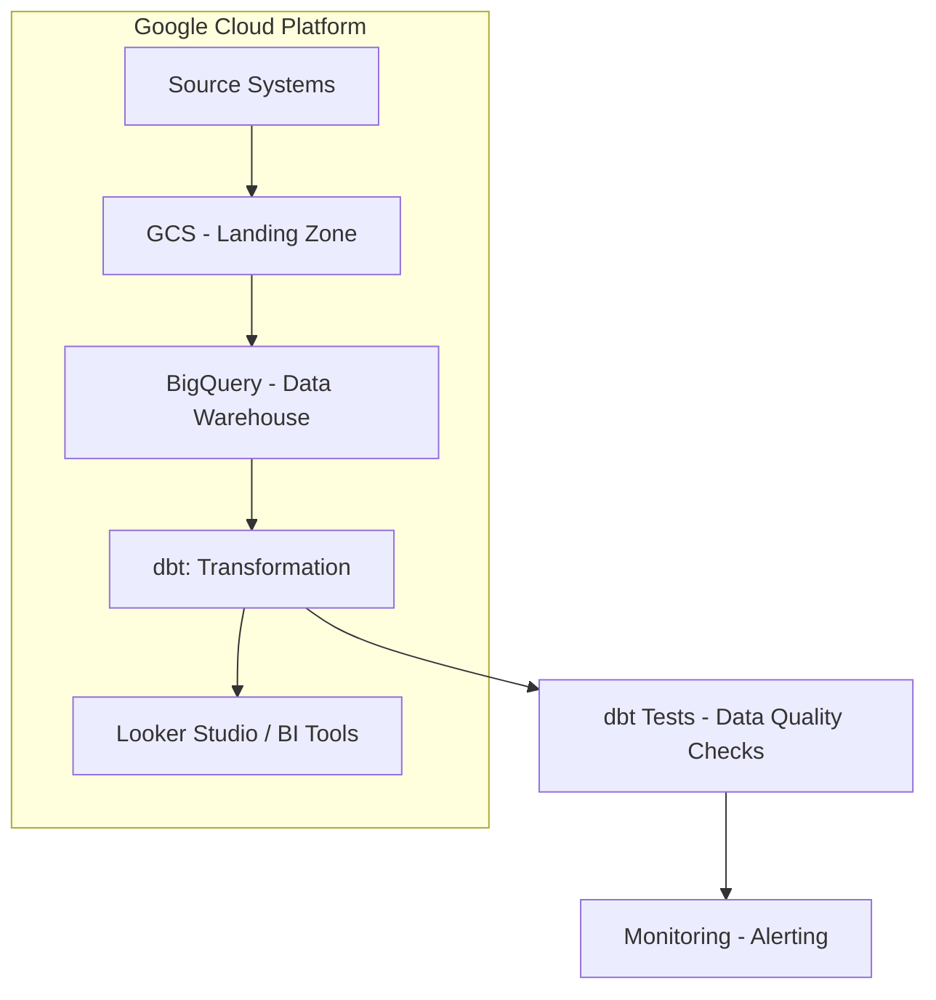

# Phân Tích Hành Trình Onboarding Khách Hàng (KYC/AML)

---
## Thuật Ngữ
---

<details>
<summary>Giải Nghĩa Các Thuật Ngữ Quan Trọng Trong Onboarding và KYC/AML</summary>

---

| **Thuật Ngữ**              | **Định Nghĩa** |
|----------------------------|----------------|
| **KYC**                    | Know Your Customer – Quy trình xác minh danh tính khách hàng theo quy định. |
| **AML**                    | Anti-Money Laundering – Chống rửa tiền, đảm bảo khách hàng không liên quan đến hoạt động tài chính phi pháp. |
| **Onboarding**             | Quá trình đưa người dùng mới từ đăng ký đến khi có thể sử dụng đầy đủ dịch vụ. |
| **Chuyển đổi (Conversion)**| Tỷ lệ người dùng hoàn tất một bước hoặc toàn bộ quá trình onboarding. |
| **Phễu Onboarding (Funnel)** | Chuỗi các bước người dùng cần thực hiện trong quá trình onboarding (ví dụ: đăng ký → gửi giấy tờ → kích hoạt). |
| **Điểm ma sát (Friction Point)** | Các bước hoặc yếu tố trong quy trình gây cản trở, khiến người dùng dễ rời bỏ. |
| **OCR**                   | Optical Character Recognition – Công nghệ đọc ký tự từ ảnh giấy tờ. |
| **Xác minh sinh trắc (Liveness Check)** | Kiểm tra khuôn mặt hoặc chuyển động để đảm bảo người thật đang thao tác. |
| **PEP**                   | Politically Exposed Person – Cá nhân có ảnh hưởng chính trị, cần giám sát chặt chẽ hơn. |
| **Tỷ lệ chấp thuận (Approval Rate)** | Tỷ lệ hồ sơ người dùng được duyệt qua các bước xác minh. |
| **Tỷ lệ từ chối (Rejection Rate)** | Tỷ lệ hồ sơ bị từ chối qua các bước KYC. |
| **Tỷ lệ rớt bước (Drop-off Rate)** | Phần trăm người dùng không hoàn thành một bước nào đó trong phễu onboarding. |
| **Chờ xử lý thủ công**      | Những hồ sơ cần nhân viên can thiệp, không thể xử lý tự động. |
| **user\_id**                   | Mã định danh duy nhất của người dùng                                 |
| **registration\_channel**      | Kênh mà người dùng bắt đầu đăng ký (Web, Mobile, Referral...)        |
| **ocr\_confidence**            | Mức độ tin cậy của kết quả nhận dạng ký tự từ giấy tờ                |
| **face\_match\_score**         | Điểm đo mức độ khớp giữa ảnh selfie và giấy tờ tùy thân              |
| **liveness\_check**            | Quy trình kiểm tra người dùng là người thật, không phải ảnh hoặc bot |
| **pep\_flag / sanction\_flag** | Cờ đánh dấu người dùng nằm trong danh sách chính trị hoặc bị cấm vận |
| **internal\_risk\_score**      | Điểm rủi ro nội bộ do hệ thống đánh giá dựa trên các chỉ báo         |
| **abandonment\_flag**          | Biến đánh dấu người dùng đã từ bỏ quy trình tại một bước nào đó      |
| **retry\_count**               | Số lần người dùng gửi lại giấy tờ xác minh                           |

---
</details>

## Tóm Tắt Tổng Quan
---
<details>
<summary>Tổng Quan Cao Cấp về Khung Phân Tích và Tác Động Kinh Doanh Chính</summary>

---

- Phần này cung cấp một bản tóm tắt ngắn gọn về vấn đề, giải pháp đề xuất và lợi ích mong đợi.
- Nó nêu bật các thành phần cốt lõi của khung phân tích cho quy trình `onboarding` khách hàng và `KYC/AML`.
- Tập trung vào giá trị chiến lược của dự án đối với các bên liên quan trong kinh doanh.

---

</details>

---

## 1. Phát Biểu Vấn Đề
---
<details>
<summary>Mô Tả Chi Tiết Thách Thức Kinh Doanh trong Quy Trình Onboarding Khách Hàng và KYC/AML</summary>

---

- **Tình Hình Hiện Tại:**
  - Nhiều khách hàng tiềm năng bắt đầu quy trình đăng ký nhưng bỏ dở giữa chừng.
  - Tồn tại các `điểm ma sát` đáng kể, đặc biệt trong các bước xác minh `KYC/AML` phức tạp.
- **Hậu Quả:**
  - `Mất Khách Hàng Tiềm Năng`: Ảnh hưởng trực tiếp đến việc thu hút người dùng và tăng trưởng kinh doanh.
  - `Tăng Chi Phí Vận Hành`: Do hỗ trợ thủ công, xác minh thất bại và xử lý lại.
  - `Trải Nghiệm Khách Hàng Chưa Tối Ưu`: Dẫn đến sự khó chịu của người dùng và ấn tượng ban đầu tiêu cực.
  - `Rủi Ro Tuân Thủ`: Quy trình `KYC/AML` kém hiệu quả tiềm ẩn rủi ro pháp lý và tuân thủ.
- **Thách Thức Chung:** Chúng ta thiếu hiểu biết rõ ràng, dựa trên dữ liệu về hành trình `onboarding` của khách hàng để xác định chính xác các `điểm đau` và tối ưu hóa quy trình một cách hiệu quả, đồng thời duy trì tuân thủ.

---

</details>

---

## 2. Mục Tiêu Dự Án
---
<details>
<summary>Các Mục Tiêu Rõ Ràng và Kết Quả Mong Đợi của Sáng Kiến Phân Tích</summary>

---

- **Mục Tiêu Chính:**
  - Xây dựng một hệ thống phân tích mạnh mẽ để có cái nhìn sâu sắc về hành trình `onboarding` của khách hàng.
  - Hệ thống này sẽ cho phép tối ưu hóa quy trình, giảm tỷ lệ bỏ cuộc và nâng cao trải nghiệm người dùng.
  - Đồng thời, đảm bảo tuân thủ đầy đủ các quy định `KYC/AML`.
- **Các Câu Hỏi Chính Cần Trả Lời:**
  - `Bước nào` trong quy trình `onboarding` có tỷ lệ bỏ cuộc cao nhất?
  - `Tại sao` người dùng lại bỏ dở quy trình tại những điểm cụ thể đó?
  - `Mất bao lâu` để một khách hàng hoàn tất toàn bộ luồng `onboarding` và xác minh?
  - `Những cải tiến khả thi nào` có thể được thực hiện để tinh gọn và đơn giản hóa quy trình mà không ảnh hưởng đến bảo mật và tuân thủ?

---

</details>

---

## 3. Kế Hoạch và Các Giai Đoạn Dự Án
---
<details>
<summary>Chiến Lược Toàn Diện Từ Đầu Đến Cuối để Giải Quyết Vấn Đề Phân Tích Onboarding</summary>

---

- Kế hoạch này phác thảo phương pháp tiếp cận 4 giai đoạn, tập trung vào việc biến dữ liệu thô thành thông tin chi tiết có thể hành động:

  ---

  #### Giai Đoạn 1: Thu Thập & Chuẩn Bị Dữ Liệu (Xây Dựng Nền Tảng)
  ---
  - **Những Gì Chúng Ta Sẽ Làm:**
    - Hợp tác với các nhóm kỹ thuật để xác định và thu thập tất cả dữ liệu liên quan đến đăng ký và xác minh khách hàng.
    - Ví dụ về dữ liệu:
      - `Thời điểm đăng ký của người dùng` (`timestamp`) (bắt đầu, hoàn thành từng bước).
      - `Các bước cụ thể đã hoàn thành` hoặc đã cố gắng thực hiện.
      - `Lỗi gặp phải` trong quá trình.
      - `Thời gian chờ đợi` cho mỗi bước xác minh.
      - `Kết quả xác minh` (thành công/thất bại, lý do thất bại).
      - `Nhật ký liên lạc` với người dùng (ví dụ: thông báo email/SMS).
    - Thiết kế một `sơ đồ dữ liệu` (`blueprint`) hoặc `schema` rõ ràng để dễ hiểu và sử dụng.
  - **Mục Tiêu:**
    - Đảm bảo có sẵn dữ liệu sạch, chính xác và có thể sử dụng được để phân tích.

  ---

  #### Giai Đoạn 2: Xây Dựng Khung Phân Tích (Vẽ Bức Tranh Toàn Cảnh)
  ---
  - **Những Gì Chúng Ta Sẽ Làm:**
    - Xây dựng các `phễu` (`funnels`) để trực quan hóa toàn bộ hành trình của khách hàng từ khi bắt đầu đăng ký đến khi kích hoạt tài khoản.
    - Định nghĩa các `chỉ số hiệu suất chính` (`KPIs`) như:
      - `Tỷ lệ chuyển đổi theo từng bước`.
      - `Thời gian trung bình để hoàn tất xác minh`.
      - `Tỷ lệ thất bại KYC` theo lý do.
      - `Chi phí trên mỗi lần onboarding thành công`.
    - Đề xuất các phương pháp `kiểm thử A/B` (`A/B testing`) cho các luồng `onboarding` khác nhau hoặc so sánh hiệu suất với các `benchmark`.
  - **Mục Tiêu:**
    - Xác định chính xác các bước gây tắc nghẽn và hiểu rõ tác động của chúng.

  ---

  #### Giai Đoạn 3: Phân Tích Chuyên Sâu & Xác Định Vấn Đề (Tìm Ra Gốc Rễ)
  ---
  - **Những Gì Chúng Ta Sẽ Làm:**
    - Thực hiện phân tích chuyên sâu để hiểu `tại sao` khách hàng bỏ cuộc.
    - Điều tra các yếu tố như:
      - Độ phức tạp của quy trình tải tài liệu.
      - Thời gian chờ đợi phản hồi.
      - Sự rõ ràng của hướng dẫn.
    - Phân tích các trường hợp `KYC/AML bị từ chối` để xác định các lý do phổ biến và đề xuất cải thiện quy trình tuân thủ.
  - **Mục Tiêu:**
    - Chỉ ra nguyên nhân gốc rễ của các vấn đề và các cơ hội cải thiện cụ thể.

  ---

  #### Giai Đoạn 4: Báo Cáo & Đề Xuất Giải Pháp (Biến Dữ Liệu Thành Hành Động)
  ---
  - **Những Gì Chúng Ta Sẽ Làm:**
    - Tổng hợp các phát hiện vào một báo cáo rõ ràng, dễ hiểu, tập trung vào các khuyến nghị có thể hành động.
    - Ví dụ về các khuyến nghị:
      - `Đơn giản hóa bước X` trong luồng.
      - `Tự động hóa kiểm tra Y`.
      - `Cải thiện thông báo cho người dùng` ở bước Z.
    - Phác thảo `Dashboard` (bảng điều khiển) để các nhóm liên quan có thể dễ dàng theo dõi hiệu suất theo thời gian thực.
  - **Mục Tiêu:**
    - Cung cấp thông tin chi tiết và giải pháp để các nhóm Sản phẩm, Marketing, Vận hành và Tuân thủ có thể cùng nhau hợp tác, nâng cao trải nghiệm khách hàng và hiệu quả kinh doanh.

  ---

- **Sử Dụng Công Cụ GenAI:**
  - Trong suốt tất cả các giai đoạn, các công cụ `GenAI` sẽ được tận dụng để tăng tốc độ phân tích, tạo báo cáo và đảm bảo độ chính xác, tối đa hóa hiệu quả và chất lượng đầu ra.

---

</details>

---
## 4. Nguồn Dữ Liệu và Thiết Kế Schema
---
<details>
<summary>Mô Tả Chi Tiết về Các Nguồn Dữ Liệu Thô và Mô Hình Dữ Liệu Đề Xuất</summary>

---

#### 4.1 – Nguồn Dữ Liệu Thô (Raw Data Sources)
---
- Để xây dựng khung phân tích hành trình `onboarding`, chúng ta cần thu thập dữ liệu từ nhiều hệ thống khác nhau trong quy trình đăng ký và xác minh.
- Dưới đây là các nhóm dữ liệu thô chính:

  ---

  ##### 🧾 Nhóm 1: Dữ Liệu Đăng Ký Người Dùng (User Registration Logs)
  ---
  - Bao gồm tất cả thông tin liên quan đến thời điểm người dùng bắt đầu quá trình đăng ký.
  - Trường dữ liệu quan trọng:
    - `user_id`: Mã định danh duy nhất
    - `registration_start_time`: Thời điểm bắt đầu đăng ký
    - `registration_channel`: Web / mobile / referral
    - `device_type`, `os_version`, `browser`: Dùng để phân tích hành vi thiết bị
    - `language`, `region`: Phục vụ phân tích theo địa lý

  ---

  ##### 🪪 Nhóm 2: Dữ Liệu Xác Minh Danh Tính (Identity Verification Logs)
  ---
  - Bao gồm thông tin giấy tờ người dùng cung cấp và quá trình xử lý `OCR`.
  - Trường dữ liệu chính:
    - `doc_type`: CMND / CCCD / Passport
    - `ocr_status`, `ocr_confidence`: Kết quả nhận dạng ký tự
    - `upload_time`, `verification_result`, `rejection_reason`
    - `retry_count`: Số lần thử lại (nếu có)

  ---

  ##### 🧠 Nhóm 3: Dữ Liệu Sinh Trắc (Biometric Verification)
  ---
  - Xác minh người thật (`liveness`) và đối chiếu khuôn mặt.
  - Trường dữ liệu:
    - `face_match_score`: Mức độ khớp khuôn mặt
    - `liveness_check_result`: true/false
    - `device_camera_quality`: chất lượng camera
    - `frame_blur_score`: đánh giá độ rõ ảnh
    - `action_prompt_passed`: có làm đúng yêu cầu (nhìn trái/phải...)

  ---

  ##### 🚦 Nhóm 4: Đánh Giá Rủi Ro & Tuân Thủ (Risk & Compliance)
  ---
  - Dữ liệu từ hệ thống chống rửa tiền (`AML`) và kiểm tra `PEP/sanction`.
  - Trường dữ liệu:
    - `pep_flag`, `sanction_flag`: Có nằm trong danh sách hay không
    - `internal_risk_score`: Điểm đánh giá nội bộ
    - `risk_decision`: approve / manual_review / reject
    - `manual_review_reason` (nếu có)

  ---

  ##### 💬 Nhóm 5: Nhật Ký Tương Tác & Giao Tiếp (User Communication Logs)
  ---
  - Ghi lại các lần gửi `email`, thông báo, chăm sóc người dùng.
  - Trường dữ liệu:
    - `email_sent`, `sms_sent`, `push_notification_sent`
    - `time_sent`, `user_response_time`
    - `support_ticket_opened`, `ticket_status`, `assigned_agent_id`

  ---

  ##### 📱 Nhóm 6: Hành Vi Ứng Dụng (App Event Logs)
  ---
  - Dữ liệu hành vi như mở `app`, thao tác ở từng bước `onboarding`.
  - Trường dữ liệu:
    - `screen_viewed`, `step_started`, `step_completed`
    - `timestamp`, `session_duration`, `abandonment_flag`

  ---

- Những nhóm dữ liệu này là nền tảng để thiết kế `schema`, xác định `funnel` và tính `KPI` trong các phần tiếp theo.

---
#### 4.2 – Thiết Kế Schema Dữ Liệu Đề Xuất (Proposed Data Schema)
---
- Để hỗ trợ phân tích hành trình `onboarding` khách hàng và `KYC/AML`, chúng ta đề xuất một mô hình dữ liệu tập trung, bao gồm các bảng được thiết kế để thu thập và tổ chức thông tin từ các nguồn dữ liệu thô khác nhau.
- Mục tiêu là tạo ra một `schema` rõ ràng, dễ truy vấn, giúp tính toán các chỉ số `KPI` và xây dựng `phễu` (`funnel`) một cách hiệu quả.
- Các bảng chính trong `schema` đề xuất của chúng ta bao gồm:

  ---

  ##### 📊 Bảng: `dim_users` (Thông tin Người Dùng)
  ---
  - **Mục đích:** Chứa các thông tin cơ bản và thuộc tính tĩnh của người dùng.
  - **Mối quan hệ:** Liên kết với tất cả các bảng khác thông qua `user_id`.
  - **Cấu trúc bảng:**

    | Tên Trường (Field Name) | Kiểu Dữ Liệu (Data Type) | Mô Tả (Description) |
    | :---------------------- | :----------------------- | :------------------ |
    | `user_id`               | `STRING`                 | `Khóa chính` (`Primary Key`), mã định danh duy nhất của người dùng. |
    | `registration_start_time` | `TIMESTAMP`              | Thời điểm khách hàng bắt đầu quá trình đăng ký tài khoản. |
    | `registration_channel`  | `STRING`                 | Kênh đăng ký ban đầu (ví dụ: `Web`, `Mobile App`, `Referral`, `Partnership`). |
    | `device_type`           | `STRING`                 | Loại thiết bị được sử dụng để đăng ký (`Mobile`, `Tablet`, `Desktop`). |
    | `os_version`            | `STRING`                 | Phiên bản hệ điều hành (`iOS 17`, `Android 13`, `Windows 10`). |
    | `browser_type`          | `STRING`                 | Loại trình duyệt (`Chrome`, `Safari`, `Firefox`). |
    | `language_preference`   | `STRING`                 | Ngôn ngữ mà người dùng đã chọn hoặc hệ thống phát hiện. |
    | `geo_country`           | `STRING`                 | Quốc gia của người dùng dựa trên IP hoặc thông tin đăng ký ban đầu. |
    | `email`                 | `STRING`                 | Địa chỉ email được sử dụng khi đăng ký (có thể được mã hóa/băm để bảo mật). |
    | `phone_number`          | `STRING`                 | Số điện thoại được sử dụng (có thể được mã hóa/băm). |
    | `account_status`        | `STRING`                 | Trạng thái tài khoản hiện tại (`Pending`, `Verified`, `Rejected`, `Suspended`). |
    | `registration_completion_time` | `TIMESTAMP`         | Thời điểm người dùng hoàn tất quá trình đăng ký cơ bản. |

  ---

  ##### 📈 Bảng: `fact_onboarding_events` (Các Sự Kiện Hành Trình Onboarding)
  ---
  - **Mục đích:** Ghi lại từng sự kiện hoặc bước mà người dùng thực hiện trong quá trình `onboarding`. Đây là bảng chính để xây dựng `phễu` (`funnel`).
  - **Mối quan hệ:** Liên kết với `dim_users` qua `user_id`.
  - **Cấu trúc bảng:**

    | Tên Trường (Field Name) | Kiểu Dữ Liệu (Data Type) | Mô Tả (Description) |
    | :---------------------- | :----------------------- | :------------------ |
    | `event_id`              | `STRING`                 | `Khóa chính`, mã định danh duy nhất cho mỗi sự kiện. |
    | `user_id`               | `STRING`                 | `Khóa ngoại` (`Foreign Key`), liên kết đến `dim_users`. |
    | `event_timestamp`       | `TIMESTAMP`              | Thời điểm chính xác xảy ra sự kiện. |
    | `event_name`            | `STRING`                 | Tên của sự kiện (`KYC_STARTED`, `ID_DOCUMENT_UPLOADED`, `LIVENESS_CHECK_FAILED`, `ACCOUNT_ACTIVATED`). |
    | `onboarding_step`       | `INT`                    | Số thứ tự của bước trong hành trình `onboarding` (ví dụ: `1` cho đăng ký, `2` cho tải giấy tờ). |
    | `step_description`      | `STRING`                 | Mô tả chi tiết về bước `onboarding`. |
    | `event_status`          | `STRING`                 | Trạng thái của sự kiện (`SUCCESS`, `FAILURE`, `PENDING`, `RETRY`). |
    | `error_code`            | `STRING`                 | Mã lỗi (nếu có) khi sự kiện thất bại. |
    | `error_message`         | `STRING`                 | Mô tả lỗi dễ hiểu (nếu có). |
    | `session_id`            | `STRING`                 | `ID` của phiên làm việc mà sự kiện xảy ra. |
    | `duration_in_step_seconds` | `INT`                 | Thời gian người dùng ở lại trong bước này trước khi chuyển tiếp hoặc thoát. |

  ---

  ##### 📋 Bảng: `fact_kyc_verification_details` (Chi Tiết Xác Minh KYC)
  ---
  - **Mục đích:** Lưu trữ thông tin chi tiết về từng lần nộp/xác minh giấy tờ và sinh trắc học.
  - **Mối quan hệ:** Liên kết với `dim_users` qua `user_id`.
  - **Cấu trúc bảng:**

    | Tên Trường (Field Name) | Kiểu Dữ Liệu (Data Type) | Mô Tả (Description) |
    | :---------------------- | :----------------------- | :------------------ |
    | `kyc_submission_id`     | `STRING`                 | `Khóa chính`, mã định danh duy nhất cho mỗi lần nộp `KYC`. |
    | `user_id`               | `STRING`                 | `Khóa ngoại`, liên kết đến `dim_users`. |
    | `submission_timestamp`  | `TIMESTAMP`              | Thời điểm người dùng gửi thông tin `KYC`. |
    | `document_type`         | `STRING`                 | Loại giấy tờ được nộp (`Passport`, `National ID`, `Driver's License`). |
    | `ocr_status`            | `STRING`                 | Trạng thái nhận dạng `OCR` (`Success`, `Failure`, `Partial`). |
    | `ocr_confidence_score`  | `FLOAT`                  | Điểm tin cậy của kết quả `OCR` (0.0 - 1.0). |
    | `face_match_score`      | `FLOAT`                  | Điểm khớp khuôn mặt từ ảnh giấy tờ và ảnh `liveness` (0.0 - 1.0). |
    | `liveness_check_result` | `BOOLEAN`                | Kết quả kiểm tra người thật (`true` nếu là người thật). |
    | `kyc_result`            | `STRING`                 | Kết quả xác minh cuối cùng (`Approved`, `Rejected`, `Under Review`, `Retry Needed`). |
    | `rejection_reason`      | `ARRAY<STRING>`          | Danh sách các lý do từ chối (ví dụ: `Blurred Document`, `Face Mismatch`, `Document Expired`). |
    | `processing_time_seconds` | `INT`                  | Thời gian xử lý `KYC` tự động/thủ công. |
    | `agent_id`              | `STRING`                 | `ID` của nhân viên xử lý thủ công (nếu có). |
    | `number_of_retries`     | `INT`                    | Số lần người dùng phải nộp lại `KYC` cho lần này. |

  ---

  ##### 🚨 Bảng: `fact_risk_assessments` (Đánh Giá Rủi Ro)
  ---
  - **Mục đích:** Ghi lại kết quả các đánh giá rủi ro `AML`/`PEP`/`Sanction` cho người dùng.
  - **Mối quan hệ:** Liên kết với `dim_users` qua `user_id`.
  - **Cấu trúc bảng:**

    | Tên Trường (Field Name) | Kiểu Dữ Liệu (Data Type) | Mô Tả (Description) |
    | :---------------------- | :----------------------- | :------------------ |
    | `risk_assessment_id`    | `STRING`                 | `Khóa chính`, mã định danh duy nhất cho mỗi lần đánh giá rủi ro. |
    | `user_id`               | `STRING`                 | `Khóa ngoại`, liên kết đến `dim_users`. |
    | `assessment_timestamp`  | `TIMESTAMP`              | Thời điểm đánh giá rủi ro được thực hiện. |
    | `risk_score`            | `INT`                    | Điểm rủi ro tổng thể của người dùng (ví dụ: 1-100). |
    | `pep_flag`              | `BOOLEAN`                | `True` nếu người dùng được xác định là `PEP` (Người có ảnh hưởng chính trị). |
    | `sanction_flag`         | `BOOLEAN`                | `True` nếu người dùng nằm trong danh sách trừng phạt. |
    | `aml_status`            | `STRING`                 | Trạng thái kiểm tra `AML` (`Clear`, `Match Found`, `Under Investigation`). |
    | `final_risk_decision`   | `STRING`                 | Quyết định rủi ro cuối cùng (`Approved`, `Manual Review`, `Rejected`). |
    | `decision_reason`       | `ARRAY<STRING>`          | Các lý do cụ thể cho quyết định rủi ro. |

  ---

  ##### 📧 Bảng: `fact_user_communications` (Tương Tác & Giao Tiếp Người Dùng)
  ---
  - **Mục đích:** Ghi lại tất cả các thông điệp hệ thống hoặc từ bộ phận hỗ trợ gửi đến người dùng trong quá trình `onboarding`.
  - **Mối quan hệ:** Liên kết với `dim_users` qua `user_id`.
  - **Cấu trúc bảng:**

    | Tên Trường (Field Name) | Kiểu Dữ Liệu (Data Type) | Mô Tả (Description) |
    | :---------------------- | :----------------------- | :------------------ |
    | `communication_id`      | `STRING`                 | `Khóa chính`, mã định danh duy nhất cho mỗi lần giao tiếp. |
    | `user_id`               | `STRING`                 | `Khóa ngoại`, liên kết đến `dim_users`. |
    | `communication_timestamp` | `TIMESTAMP`            | Thời điểm gửi tin nhắn/thông báo. |
    | `communication_type`    | `STRING`                 | Loại giao tiếp (`Email`, `SMS`, `Push Notification`, `In-App Message`). |
    | `message_content`       | `STRING`                 | Nội dung chính của tin nhắn (có thể cắt ngắn hoặc mã hóa). |
    | `delivery_status`       | `STRING`                 | Trạng thái gửi (`Sent`, `Delivered`, `Failed`, `Opened`). |
    | `user_interaction_status` | `STRING`               | Trạng thái tương tác của người dùng (`Clicked`, `Ignored`, `Responded`). |
    | `support_ticket_id`     | `STRING`                 | `ID` của `ticket` hỗ trợ liên quan (nếu có). |

  ---
  ##### 📄 Bảng: `fact_manual_review_logs` (Nhật Ký Duyệt Thủ Công)
  ---
  - **Mục đích:** Ghi lại thông tin chi tiết về quá trình duyệt `KYC` thủ công bởi nhân viên.
  - **Mối quan hệ:** Liên kết với `dim_users` qua `user_id` và có thể liên kết với `fact_kyc_verification_details` qua `kyc_submission_id`.
  - **Cấu trúc bảng:**

    | Tên Trường (Field Name) | Kiểu Dữ Liệu (Data Type) | Mô Tả (Description) |
    | :---------------------- | :----------------------- | :------------------ |
    | `review_id`             | `STRING`                 | `Khóa chính`, mã định danh duy nhất cho mỗi lần duyệt thủ công. |
    | `user_id`               | `STRING`                 | `Khóa ngoại`, liên kết đến `dim_users`. |
    | `kyc_submission_id`     | `STRING`                 | `Khóa ngoại`, liên kết đến `fact_kyc_verification_details`. |
    | `review_start_time`     | `TIMESTAMP`              | Thời điểm bắt đầu quá trình duyệt. |
    | `review_end_time`       | `TIMESTAMP`              | Thời điểm kết thúc quá trình duyệt. |
    | `review_result`         | `STRING`                 | Kết quả duyệt (`Approved`, `Rejected`, `Needs More Info`). |
    | `review_notes`          | `STRING`                 | Ghi chú của người duyệt về trường hợp này. |
    | `reviewer_id`           | `STRING`                 | `ID` của nhân viên thực hiện duyệt. |

  ---

  ##### 📊 Sơ đồ quan hệ giữa các bảng (ERD)
  ---

  ```mermaid
  erDiagram
      dim_users ||--o{ fact_onboarding_events : has
      dim_users ||--o{ fact_kyc_verification_details : has
      dim_users ||--o{ fact_risk_assessments : has
      dim_users ||--o{ fact_user_communications : has
      dim_users ||--o{ fact_manual_review_logs : has
      fact_kyc_verification_details ||--o{ fact_manual_review_logs : triggers
  ```
---
- Với thiết kế schema như trên, chúng ta có thể dễ dàng xây dựng các truy vấn phục vụ phân tích funnel (`drop-off rate`, `completion rate`), phân tích thời gian (`time-to-verify`), cũng như đánh giá hiệu quả quy trình `KYC/AML` và `manual review`.
- Đây là nền tảng vững chắc cho các bước xử lý tiếp theo: logic biến đổi dữ liệu, tính KPI và xây dựng dashboard.

---

</details>

---

## 5. Logic Chuyển Đổi Dữ Liệu
---
<details>
<summary>Mô Tả Các Quy Trình Làm Sạch, Chuẩn Hóa và Tổng Hợp Dữ Liệu</summary>

---
#### 5.1 – Tổng Quan Về Luồng Dữ Liệu (Data Flow Overview)
---

- Mục tiêu của phần này là cung cấp một cái nhìn toàn cảnh về quá trình dữ liệu được thu thập, xử lý và chuyển đổi để phục vụ phân tích hành trình `onboarding` khách hàng và `KYC/AML`.
- Luồng dữ liệu được thiết kế theo mô hình `ELT (Extract, Load, Transform)` hiện đại, cho phép linh hoạt trong việc xử lý dữ liệu quy mô lớn trên nền tảng `cloud data warehouse`.
- Các giai đoạn chính của luồng dữ liệu bao gồm:

  - **1. Thu Thập Dữ Liệu Thô (Raw Data Ingestion):**
    - Dữ liệu được thu thập liên tục hoặc theo đợt từ các hệ thống nguồn khác nhau như: hệ thống đăng ký, hệ thống `KYC/Biometric`, hệ thống `Risk/Compliance`, hệ thống giao tiếp, và nhật ký sự kiện ứng dụng.
    - Phương thức thu thập đa dạng bao gồm `API integration`, `database replication`, và `log forwarding`.

  - **2. Khu Vực Lưu Trữ Dữ Liệu Thô (Raw Data Landing Zone / Data Lake):**
    - Dữ liệu thô được lưu trữ nguyên trạng tại đây, thường là trên các dịch vụ `Cloud Storage` (ví dụ: `GCS`, `S3`), đảm bảo tính toàn vẹn và khả năng `re-processing` khi cần.

  - **3. Tải Dữ Liệu Vào Kho Dữ Liệu (Data Loading to Data Warehouse):**
    - Dữ liệu từ `Landing Zone` được tải vào một `Data Warehouse` mạnh mẽ (`Google BigQuery`, Snowflake, Redshift), tạo nền tảng cho các bước chuyển đổi hiệu suất cao.

  - **4. Chuyển Đổi Dữ Liệu (Data Transformation):**
    - Giai đoạn này thực hiện các phép làm sạch, chuẩn hóa, làm giàu và tổng hợp dữ liệu ngay trong `Data Warehouse` để xây dựng các bảng `dim` và `fact` theo `schema` đã thiết kế.

  - **5. Lớp Dữ Liệu Phân Tích (Analytical Data Layer):**
    - Các bảng `dim` và `fact` đã được xử lý và tối ưu hóa nằm trong `Data Warehouse`, sẵn sàng cho các mục đích phân tích và báo cáo.

  - **6. Lớp Tiêu Thụ Dữ Liệu (Data Consumption / Reporting):**
    - Dữ liệu từ lớp phân tích được sử dụng bởi các công cụ `Business Intelligence` (BI) để tạo ra các `dashboard`, báo cáo và tính toán các `KPI`.

- Luồng dữ liệu tổng quát có thể được hình dung qua sơ đồ sau:

    ```mermaid
    flowchart TD
  subgraph Source_Systems [Hệ thống nguồn]
    A[Hệ thống đăng ký] --> RawData
    B[Hệ thống KYC/Biometric] --> RawData
    C[Hệ thống Risk/Compliance] --> RawData
    D[Hệ thống Giao tiếp] --> RawData
    E[App Event Logs] --> RawData
    F[Hệ thống Duyệt thủ công] --> RawData
  end

  RawData["Khu vực lưu trữ dữ liệu thô (GCS/S3)"] --> Load["Tải vào Data Warehouse (BigQuery)"]
  Load --> Transform["Chuyển đổi dữ liệu (dbt/SQL)"]
  Transform --> AnalyticalLayer["Lớp dữ liệu phân tích (Dim & Fact Tables)"]
  AnalyticalLayer --> Consumption["Báo cáo & Dashboard (Looker Studio/Power BI)"]
    ```

- Luồng dữ liệu này được thiết kế để đảm bảo tính toàn vẹn, khả năng mở rộng và hiệu quả, cung cấp nền tảng vững chắc cho mọi hoạt động phân tích về hành trình `onboarding` khách hàng.

---
#### 5.2 – Chi Tiết Các Bước Chuyển Đổi (Detailed Transformation Steps)
---

##### 5.2.1 – Thu Thập Dữ Liệu Thô (Raw Data Ingestion)
---

<details>
<summary>Mô tả cách dữ liệu thô được thu thập từ nhiều hệ thống nguồn</summary>

---

- Giai đoạn đầu tiên trong pipeline ELT là **thu thập dữ liệu thô từ các hệ thống nguồn**, đảm bảo dữ liệu đầy đủ và chính xác cho các bước xử lý tiếp theo.
- Dữ liệu đến từ **nhiều hệ thống phân tán**, mỗi hệ thống có định dạng và tốc độ cập nhật khác nhau.

- **Hệ thống nguồn chính:**
    - Dữ liệu được thu thập từ các nhóm hệ thống sau:
        - **Hệ thống Đăng ký người dùng**: thông tin hồ sơ và thời điểm bắt đầu hành trình onboarding.
        - **Hệ thống KYC & Biometric**: bao gồm ảnh giấy tờ, trạng thái OCR, kết quả kiểm tra khuôn mặt và liveness.
        - **Hệ thống Risk & Compliance**: dữ liệu PEP/sanction, điểm rủi ro nội bộ, kết quả đánh giá.
        - **Hệ thống Giao tiếp & CSKH**: email, SMS, push notification, nhật ký ticket hỗ trợ.
        - **Ứng dụng & Mobile App**: dữ liệu sự kiện hành vi như chuyển bước, thoát giữa chừng, thời lượng thao tác.

- **Phương thức thu thập đề xuất:**

| Loại nguồn | Phương thức tích hợp | Công nghệ phù hợp |
|------------|----------------------|--------------------|
| API endpoints | Tự động gọi API định kỳ hoặc theo sự kiện | `Airflow`, `Cloud Functions` |
| Database logs | Realtime streaming hoặc CDC (Change Data Capture) | `Debezium`, `Kafka`, `BigQuery Data Transfer` |
| File-based logs | Tải theo lô (batch) từ storage (CSV, JSON, Parquet) | `Cloud Storage + dbt`, `Fivetran` |
| Event tracking | Gửi từ client/app theo sự kiện | `Segment`, `Snowplow`, `GA4`, `Firebase` |
| Manual review logs | Nhập tay hoặc đồng bộ từ hệ thống CRM nội bộ | `CSV`, `Google Sheets`, `App Script` |

- **Các điểm cần lưu ý:**
    - Đảm bảo **định danh người dùng thống nhất** (`user_id`) giữa các hệ thống (dùng UUID hoặc hashed ID).
    - Tất cả thời gian phải được **chuyển đổi sang UTC** để đồng bộ khi phân tích.
    - Dữ liệu thô nên được lưu vào **Landing Zone** theo format nguyên gốc, không biến đổi, để đảm bảo khả năng xử lý lại (`replayable`) và kiểm tra sai lệch.
...

---

- Giai đoạn thu thập dữ liệu là nền tảng quan trọng, ảnh hưởng trực tiếp đến độ tin cậy của hệ thống phân tích. Việc thiết kế ingestion pipeline phải đảm bảo:
  - Tự động hóa cao
  - Kiểm soát lỗi tốt
  - Dễ mở rộng khi hệ thống tăng trưởng

---
</details>


---
##### 5.2.2 – Làm Sạch & Chuẩn Hóa Dữ Liệu (Data Cleaning & Standardization)
---

<details>
<summary>Mô tả các quy trình làm sạch, chuẩn hóa và xử lý dữ liệu thô để đảm bảo chất lượng và tính nhất quán</summary>

---

- Mục tiêu của giai đoạn này là biến dữ liệu thô, có thể lộn xộn và không nhất quán, thành một định dạng sạch sẽ, chuẩn hóa và sẵn sàng cho phân tích.
- Đây là bước cực kỳ quan trọng vì nếu đầu vào là dữ liệu "rác" (Garbage In), thì đầu ra của phân tích cũng sẽ sai lệch nghiêm trọng (Garbage Out).

---

##### 🎯 Lý do cần làm sạch và chuẩn hóa

| Vấn đề phổ biến | Hậu quả nếu không xử lý |
|------------------|--------------------------|
| Dữ liệu thiếu / NULL | Gây sai lệch thống kê, lỗi khi join bảng |
| Định dạng không chuẩn | Không thể chuyển đổi hoặc so sánh |
| Trùng lặp bản ghi | Gây trùng đếm, sai kết quả phân tích |
| Giá trị ngoại lệ | Kéo lệch trung bình, gây hiểu nhầm |
| Không thống nhất | Gây khó khăn khi lọc, phân nhóm |

---

##### 🧹 Các bước làm sạch dữ liệu

| Vấn đề | Phương pháp xử lý |
|--------|--------------------|
| **NULL/thiếu dữ liệu** | Gán mặc định (`unknown`), loại bỏ nếu critical, đánh cờ `is_incomplete` |
| **Trùng lặp bản ghi** | Xác định dựa trên `user_id + event_name + timestamp`, giữ bản mới nhất |
| **Giá trị bất hợp lệ** | Dùng kiểm tra biên (boundary check), loại bỏ hoặc đánh cờ `invalid` |
| **Timestamp sai** | Chuẩn hóa về `UTC`, bỏ bản ghi có timestamp tương lai quá xa |
| **Dữ liệu phân tán** | Gộp trường tương đương, chuẩn hóa biến thể tên |

---

##### 🛠 Chuẩn hóa định dạng và chuỗi

| Đối tượng | Quy tắc chuẩn hóa |
|----------|--------------------|
| **Text fields** | lowercase hóa, trim space, viết hoa chuẩn (`Ho Chi Minh`) |
| **Country / Region** | Ánh xạ về ISO-3166 (`VN`, `Viet Nam`, `Vietnam` → `Vietnam`) |
| **Device / OS / Browser** | Dùng bảng mapping chuẩn (`chrome`, `iOS 17`, `Android`) |
| **Thời gian** | Chuyển về `ISO 8601` UTC (`2025-06-17T08:00:00Z`) |
| **Mã định danh** | Format chuẩn: UUID hoặc hashed, không rỗng, không trùng |

---

##### 🔧 Công cụ và kỹ thuật được đề xuất

| Công đoạn | Công cụ đề xuất |
|-----------|------------------|
| Làm sạch cơ bản | SQL (BigQuery Standard SQL) |
| Chuẩn hóa chuỗi | Python (`pandas`, `str.lower()`, `regex`, `fuzzywuzzy`) |
| Phát hiện trùng | `ROW_NUMBER() OVER`, `DISTINCT`, `pandas.duplicated()` |
| Kiểm tra thời gian | `TIMESTAMP_DIFF`, kiểm tra `> NOW()` |
| Mapping chuẩn | Python dict / SQL CASE / JOIN bảng tham chiếu |

---

- Ngoài ra, cần thêm cột **đánh cờ chất lượng** vào bảng dữ liệu để phân tích sau này, ví dụ:
  - `is_valid` (TRUE/FALSE)
  - `data_quality_flag`
  - `cleaning_note`

- Việc làm sạch và chuẩn hóa không chỉ giúp tạo ra dữ liệu tin cậy, mà còn làm nền tảng cho việc xây dựng bảng `fact`/`dim` chất lượng cao và KPI chính xác.

---
</details>


---
##### 5.2.3 – Làm Giàu Dữ Liệu (Data Enrichment)
---

<details>
<summary>Bổ sung thông tin bổ trợ vào dữ liệu để nâng cao giá trị phân tích</summary>

---

- Sau khi dữ liệu được làm sạch và chuẩn hóa, bước tiếp theo là **làm giàu dữ liệu** (enrichment).
- Mục tiêu của giai đoạn này là bổ sung thêm các trường thông tin có giá trị phân tích cao, phục vụ trực tiếp cho việc tính toán `KPIs`, theo dõi hành vi người dùng, và phân khúc hiệu quả.

---

##### 🔍 Các chiến lược enrichment phổ biến

| Nhóm dữ liệu | Kỹ thuật làm giàu áp dụng |
|-------------|---------------------------|
| **User registration** | Tính `registration_duration` = `completion_time - start_time` |
| **Device & region** | Tra cứu `geo-IP`, phân tích thiết bị từ `User-Agent` |
| **App events** | Gắn `event_stage`, tính `step_duration` trung bình |
| **KYC/AML** | Tính `is_high_risk_user`, phân loại `risk_level` |
| **Communication** | Xác định `response_delay_bucket`, hành vi phản hồi |
| **Session** | Tính toán `session_count`, `avg_session_duration` |

---

##### 🧠 Enrichment theo logic kinh doanh

- Phân khúc người dùng: theo quốc gia, thiết bị, nguồn kênh đăng ký
- Cohort tuần đăng ký: `W25_2025`
- Cờ hành vi đặc biệt: `first_pass_KYC`, `likely_churn = true`

---

##### 🛠 Công cụ hỗ trợ

| Mục đích | Công cụ gợi ý |
|---------|---------------|
| Enrich dạng text | SQL `LOWER()`, `REGEXP`, Python `re` |
| Ghép bảng | SQL `JOIN`, `LEFT JOIN` |
| Phân loại logic | SQL `CASE`, Python `if-else` |
| Kết nối API ngoài | Python `requests`, Spark `UDF` |

---

📌 **Xem thêm các chiến lược nâng cao bên dưới**:

</details>

<details>
<summary>📌 Chi tiết mở rộng: Các chiến lược enrichment nâng cao</summary>

---

##### ✅ Enrichment từ nguồn ngoài

##### 🌍 Vị trí địa lý từ IP
- **Cách làm**: IP → country, city, timezone
- **Nguồn**: MaxMind GeoIP2, IP2Location API
- **Lý do**: phân tích drop-off theo vùng, compliance địa phương

##### 💻 Thiết bị & hệ điều hành
- Trích từ User-Agent string
- Ví dụ enrich thêm: `device_category`, `os_version`, `browser_family`
- Hữu ích để kiểm tra liệu tỷ lệ thất bại KYC có liên quan đến thiết bị?

##### 📣 Thông tin chiến dịch Marketing
- Source/medium/campaign từ Firebase, Adjust
- Gắn thêm trường: `marketing_channel`, `is_paid_user`

---

##### ✅ Enrichment tính toán nội bộ

| Trường mới | Mô tả | Mục tiêu |
|------------|--------|----------|
| `duration_in_step_seconds` | Thời gian mỗi bước | UX tracking |
| `kyc_attempt_number` | Tổng lần gửi lại | Đánh giá friction |
| `risk_level_category` | Nhóm hóa risk_score | Báo cáo dễ hiểu hơn |
| `day_of_week`, `hour_of_day` | Trích từ timestamp | Phân tích theo hành vi giờ/ngày |
| `kyc_verification_status_granular` | Chi tiết hóa trạng thái KYC | Nhìn rõ điểm nghẽn |

---

##### ✅ Kỹ thuật chuyên sâu

- **User-defined enrichment logic**: gắn `user_type` = `trusted`, `new`, `risky`
- **Predictive enrichment** (gợi ý nếu đi xa hơn): Xác suất `conversion_likelihood`, `likely_to_drop`

---

- Các enrichment này giúp tạo thêm bối cảnh cho phân tích, góp phần làm **phễu onboarding chính xác hơn**, **phân tích cohort sâu hơn**, và hỗ trợ **ra quyết định kinh doanh hiệu quả**.

---
</details>


---
##### 5.2.4 – Xây Dựng Các Bảng Fact (Fact Table Construction)
---

<details>
<summary>Mô tả logic và các bước để tạo ra các bảng fact từ dữ liệu đã được làm sạch và làm giàu</summary>

---

- Các bảng **fact** lưu trữ dữ liệu định lượng hoặc sự kiện theo dòng thời gian, là nền tảng cho hầu hết các phân tích như: `funnel`, `conversion rate`, `drop-off analysis`, `retention`, `failure reason`, `risk decision`, v.v.
- Chúng có **khóa ngoại `user_id`** liên kết đến `dim_users` và thường gắn với thời gian (`timestamp`) để phân tích theo phiên/chu kỳ.

---

##### ✅ Các bảng fact chính cần xây dựng

---

##### 📊 `fact_onboarding_events` – Các sự kiện trong hành trình Onboarding

- **Nguồn dữ liệu:** Nhật ký sự kiện từ app/web (`app_event_logs`)
- **Mỗi bản ghi:** Một hành động cụ thể của người dùng trong hành trình onboarding

| Trường | Diễn giải logic |
|--------|------------------|
| `event_name` | Được ánh xạ từ mã sự kiện gốc, chuẩn hóa thành nhóm `KYC_STARTED`, `ID_UPLOAD`, `LIVENESS_PASS`, `ACCOUNT_ACTIVATED`, v.v. |
| `onboarding_step` | Gán số thứ tự cho từng bước trong phễu onboarding (ví dụ: `1` = đăng ký, `2` = upload giấy tờ) |
| `duration_in_step_seconds` | Tính toán bằng `event_end_time - event_start_time` hoặc thời gian giữa hai sự kiện |
| `event_status` | Gắn nhãn `SUCCESS`, `FAILURE`, `PENDING`, `RETRY` |
| `error_code`, `error_message` | Lấy từ hệ thống khi bước thất bại |
| `session_id`, `device_type` | Từ app logs hoặc cookie headers |

- **Phép tổng hợp:** Có thể `COUNT(DISTINCT step)` để tính tỷ lệ hoàn tất.

---

##### 📋 `fact_kyc_verification_details` – Chi tiết quá trình KYC

- **Nguồn dữ liệu:** Hệ thống xác minh giấy tờ, OCR, liveness
- **Mỗi bản ghi:** Một lần gửi thông tin xác minh

| Trường | Diễn giải logic |
|--------|------------------|
| `kyc_submission_id` | Mã hóa từ hệ thống nội bộ hoặc UUID |
| `document_type`, `ocr_status`, `face_match_score` | Trích xuất từ kết quả trả về của provider |
| `kyc_result` | Mapping lại trạng thái thô thành `Approved`, `Rejected`, `Retry`, `Under Review` |
| `rejection_reason` | Có thể là `ARRAY<STRING>` nếu lý do phức tạp |
| `number_of_retries` | Tính bằng `COUNT(*)` theo `user_id` |
| `processing_time_seconds` | `submission_end_time - start_time`, hoặc thời gian hệ thống xử lý log |

- **Gắn cờ enrichment:** `is_first_pass_success = TRUE` nếu chỉ có 1 bản ghi và `kyc_result = Approved`

---

##### 🚨 `fact_risk_assessments` – Đánh giá rủi ro AML/PEP

- **Nguồn dữ liệu:** Hệ thống risk scoring nội bộ, hoặc tích hợp bên ngoài (API sanction check)
- **Mỗi bản ghi:** Một lượt đánh giá rủi ro trên user

| Trường | Diễn giải |
|--------|-----------|
| `risk_score` | 0–100, từ hệ thống scoring |
| `pep_flag`, `sanction_flag` | Boolean |
| `final_risk_decision` | Mapping `Clear`, `Review`, `Reject` |
| `decision_reason` | `ARRAY<STRING>` nếu có nhiều lý do |

---

##### 💬 `fact_user_communications` – Tương tác với người dùng

- **Nguồn dữ liệu:** CRM, hệ thống gửi Email/SMS, ticket support
- **Mỗi bản ghi:** Một lượt gửi thông báo hoặc phản hồi hỗ trợ

| Trường | Diễn giải |
|--------|-----------|
| `communication_type` | `Email`, `Push`, `In-app`, `SMS` |
| `delivery_status` | `Delivered`, `Failed`, `Opened` |
| `user_interaction_status` | Gắn enrichment `Clicked`, `Ignored`, `Responded` |
| `support_ticket_id` | Liên kết đến bảng `ticket`, nếu có |

---

##### 📎 `fact_manual_review_logs` – Lượt xử lý thủ công

- **Nguồn:** Hệ thống nội bộ ghi lại các hành động của đội kiểm duyệt người thật
- **Mỗi bản ghi:** Một lượt truy cập hồ sơ để xem xét bằng tay

| Trường | Diễn giải |
|--------|-----------|
| `reviewer_id` | Mã hóa ID nhân sự xử lý |
| `action_type` | `Approve`, `Escalate`, `Reject` |
| `notes`, `review_duration` | Dữ liệu vận hành dùng để đánh giá năng suất & consistency |

---

##### 🔗 Mối quan hệ với Dimension Tables

- Mỗi bảng fact sẽ có các khóa ngoại:  
  - `user_id` → `dim_users`  
  - `session_id` → (nếu cần, tách bảng `dim_sessions`)  
  - `document_type`, `communication_type`, v.v. có thể là `dim_code` (tùy dự án)

---

##### 🛠 Công cụ / Kỹ thuật thực hiện

| Bước | Công cụ gợi ý |
|------|----------------|
| Join, transform | SQL (BigQuery), dbt |
| Xử lý enrich phức tạp | Python (pandas), Spark |
| Tự động hóa ETL | dbt model, Airflow DAG |
| Kiểm tra | Great Expectations, dbt tests |

---

- Việc xây dựng tốt các bảng fact giúp **rút ngắn thời gian phân tích**, **giảm lỗi logic**, và **mở rộng được hệ thống phân tích trong tương lai**.

---
</details>


---
##### 5.2.5 – Xây Dựng Các Bảng Dimension (Dimension Table Construction)
---

<details>
<summary>Mô tả logic và các bước để tạo ra các bảng dimension từ dữ liệu đã được làm sạch và làm giàu</summary>

---

- Các bảng dimension (**dim tables**) cung cấp ngữ cảnh mô tả chi tiết cho các sự kiện và phép đo lường trong các bảng fact.
- Chúng chứa các thuộc tính (attributes) được dùng để lọc, nhóm và phân tích dữ liệu – ví dụ: người dùng nào, thời gian nào, qua kênh nào, sử dụng thiết bị gì.
- Mỗi bảng dim có một **khóa chính (Primary Key)** duy nhất, và các bảng fact sẽ tham chiếu tới thông qua **khóa ngoại (Foreign Key)**.

---

##### 📘 `dim_users` – Thông Tin Người Dùng

- **Mục đích:** Lưu trữ thông tin mô tả và trạng thái của người dùng trong hành trình onboarding.
- **Nguồn dữ liệu:**  
  - Hệ thống đăng ký (registration system)  
  - Dữ liệu xác minh KYC/Biometric  
  - Dữ liệu Risk & Compliance  

- **Logic xây dựng:**
  - Đảm bảo mỗi `user_id` duy nhất.
  - **SCD Type 1:** Dùng cho các thuộc tính cập nhật liên tục như `email`, `phone_number`.
  - **SCD Type 2:** Cho các thuộc tính cần theo dõi lịch sử như `risk_category`, `user_segment`.

- **Các trường đặc trưng:**
  - `user_id`, `registration_time`, `first_kyc_success_time`
  - `latest_kyc_status`, `risk_category`, `is_active_user`
  - `user_segment`, `geo_country`, `language_preference`

---

##### 📅 `dim_time` – Thông Tin Thời Gian

- **Mục đích:** Phân tích thời gian theo ngày/tuần/tháng/quý/năm.
- **Nguồn dữ liệu:** Sinh tự động bằng SQL/Python.

- **Trường dữ liệu:**
  - `date_key` (YYYYMMDD), `date`, `day_of_week`, `week_num`, `month`, `quarter`, `year`
  - `is_weekend`, `holiday_name`

- **Ứng dụng:** Hỗ trợ slice/dice dữ liệu theo thời gian trong dashboard.

---

##### 📶 `dim_channel` – Kênh Đăng Ký / Marketing

- **Mục đích:** Cung cấp ngữ cảnh về nguồn người dùng đến từ đâu.
- **Nguồn dữ liệu:** Từ marketing attribution (`GA`, `Firebase`, `AppsFlyer`...)

- **Logic xây dựng:**
  - Chuẩn hóa các giá trị `channel`, `source`, `medium`
  - Gom nhóm thành `channel_group` như: `Paid`, `Organic`, `Referral`

- **Trường dữ liệu:**
  - `channel_id`, `channel_name`, `channel_group`, `source`, `campaign_id`

---

##### 📱 `dim_device` – Thiết Bị Người Dùng

- **Mục đích:** Phân tích trải nghiệm onboarding theo từng thiết bị.
- **Nguồn dữ liệu:** Trích từ `User-Agent` hoặc event logs.

- **Logic enrichment:**
  - Trích xuất từ chuỗi `user_agent` → `device_type`, `os`, `browser`, `device_model`

- **Trường dữ liệu:**
  - `device_id`, `device_type`, `os_version`, `browser_type`, `device_model`

---

##### 💬 `dim_communication_type` – Loại Giao Tiếp

- **Mục đích:** Chuẩn hóa loại tin nhắn trong `fact_user_communications`
- **Giá trị ví dụ:** `Email`, `SMS`, `Push`, `In-App Message`

---

##### 📄 `dim_document_type` – Loại Giấy Tờ

- **Mục đích:** Chuẩn hóa và phân loại các loại giấy tờ người dùng cung cấp.
- **Giá trị ví dụ:** `Passport`, `National ID`, `Driver's License`

---

##### 🔗 Mối Quan Hệ Giữa Fact và Dimension Tables

| Fact Table | Dimension Table Tham Chiếu |
|------------|-----------------------------|
| `fact_onboarding_events` | `dim_users`, `dim_time`, `dim_channel`, `dim_device` |
| `fact_kyc_verification_details` | `dim_users`, `dim_document_type`, `dim_time` |
| `fact_risk_assessments` | `dim_users`, `dim_time` |
| `fact_user_communications` | `dim_users`, `dim_communication_type`, `dim_time` |

---

##### 🛠 Công Cụ / Kỹ Thuật Đề Xuất

| Tác vụ | Công cụ gợi ý |
|-------|----------------|
| Xây dựng `dim_users` | SQL (BigQuery), `dbt` (cho SCD Type 2), Python |
| Sinh `dim_time` | SQL (`GENERATE_DATE_ARRAY` – BigQuery), Python |
| Chuẩn hóa `dim_channel`, `dim_device` | SQL `CASE`, `UDF`, thư viện `user_agents` |
| Quản lý pipeline | dbt models, Airflow DAGs |

---

##### ✅ Tổng Kết

- Việc xây dựng các bảng dimension chuẩn xác là yếu tố then chốt để phân tích sâu, slice/dice hiệu quả, và xây dựng dashboard thân thiện cho stakeholder.
- Mỗi bảng dimension cần đảm bảo: dữ liệu sạch, không trùng, chuẩn hóa và dễ `JOIN` với các bảng fact.
- Dimension Tables là lớp “ngữ cảnh” bổ sung giá trị phân tích mà dữ liệu sự kiện (event) đơn lẻ không thể mang lại.

---
</details>


---
#### 5.3 – Đảm Bảo Chất Lượng Dữ Liệu (Data Quality Assurance)
---

<details>
<summary>Mô tả các biện pháp và công cụ để duy trì chất lượng dữ liệu xuyên suốt Data Pipeline</summary>

---

##### 🎯 Mục Tiêu & Tầm Quan Trọng

- **Data Quality Assurance (DQA)** là yếu tố then chốt để xây dựng niềm tin vào hệ thống phân tích.
- Đặc biệt trong môi trường tuân thủ nghiêm ngặt như `KYC/AML`, dữ liệu sai lệch có thể dẫn đến:
  - Đánh giá rủi ro sai
  - Phân tích hành vi sai lệch
  - Báo cáo không đạt chuẩn kiểm toán

---

##### 🔍 5 Yếu Tố Cốt Lõi của Chất Lượng Dữ Liệu

- **Accuracy**: Dữ liệu phản ánh đúng thực tế nghiệp vụ (ví dụ: `user_id`, `event_time` phải chính xác).
- **Completeness**: Dữ liệu không thiếu trường bắt buộc (`kyc_result`, `registration_channel`...).
- **Consistency**: Không mâu thuẫn giữa các hệ thống, các bản ghi (ví dụ: KYC status không thay đổi bất hợp lý).
- **Timeliness**: Dữ liệu có mặt đúng lúc để phân tích (ví dụ: dashboard cập nhật hàng ngày).
- **Validity**: Tuân thủ định dạng, kiểu dữ liệu, quy tắc nghiệp vụ (`email`, `risk_score`, `status`...).

---

##### 🧱 Kiểm Tra DQA Theo Tầng (Layered QA Strategy)

##### ✅ 1. Source Layer – Tại Nguồn

- **Mục tiêu**: Phát hiện sớm dữ liệu bẩn trước khi vào pipeline.
- **Ví dụ**:
  - Kiểm tra số cột trong file CSV.
  - Đảm bảo schema của file JSON đúng định dạng.

##### ✅ 2. Transformation Layer – Khi Làm Sạch & Làm Giàu

- **Mục tiêu**: Đảm bảo tính toàn vẹn, chính xác sau mỗi bước xử lý.
- **Ví dụ**:
  - `user_id` là duy nhất trong `dim_users`.
  - `kyc_result` chỉ chứa giá trị hợp lệ.
  - `foreign keys` của `fact_*` đều tồn tại trong `dim_*`.

##### ✅ 3. Consumption Layer – Trước Khi Phân Tích

- **Mục tiêu**: Đảm bảo dữ liệu sẵn sàng cho BI/dashboard.
- **Ví dụ**:
  - So sánh `conversion rate` giữa dashboard và query SQL gốc.
  - Tổng số user mới trong ngày không đột ngột = 0.

---

##### 🛠️ Các Kiểm Tra Cụ Thể và Công Cụ Gợi Ý

| Loại Kiểm Tra            | Mô Tả & Mục Tiêu                                                                 | Công Cụ / Kỹ Thuật                                      |
|--------------------------|-----------------------------------------------------------------------------------|----------------------------------------------------------|
| **Uniqueness**           | Đảm bảo khóa chính (user_id, event_id) là duy nhất                              | `dbt tests: unique`, `SQL COUNT(DISTINCT)`              |
| **Completeness**         | Các trường bắt buộc không NULL                                                   | `dbt not_null`, `SQL WHERE col IS NULL`                 |
| **Validity**             | Giá trị hợp lệ, đúng định dạng                                                   | `dbt accepted_values`, `SQL REGEXP`, `CASE WHEN`        |
| **Referential Integrity**| `FK` trong fact tồn tại trong dim                                                | `dbt relationships`, `LEFT JOIN NULL CHECK`             |
| **Volume/Growth**        | Phát hiện sụt giảm/tăng bất thường về số lượng bản ghi                           | `BigQuery Monitoring`, `Looker Health`, `dbt metrics`   |
| **Timeliness**           | Dữ liệu có được cập nhật đúng lịch không                                         | `Airflow DAG SLA`, `last_updated_at`, `alert rules`     |
| **Consistency**          | So sánh KPI giữa hệ thống nguồn và kết quả phân tích                             | `dbt snapshots`, `SQL JOIN + ASSERT`, `data diff`       |

---

##### 🔄 Quy Trình Xử Lý Lỗi DQA

1. **Phát hiện lỗi**: Tự động qua dbt test hoặc cảnh báo từ hệ giám sát.
2. **Cảnh báo**: Gửi thông báo qua Email/Slack đến nhóm liên quan.
3. **Root Cause Analysis**: Tìm nguyên nhân: lỗi source, parsing, logic transformation?
4. **Khắc phục & Backfill**: Sửa lỗi và chạy lại phần dữ liệu bị ảnh hưởng.
5. **Theo dõi sau khắc phục**: Đảm bảo không tái diễn.

---

##### ✅ Tổng Kết

- DQA không phải là “chốt kiểm tra” cuối cùng, mà là **điểm giám sát xuyên suốt pipeline**.
- Việc xây dựng hệ thống kiểm tra toàn diện ở mọi tầng giúp:
  - Ngăn lỗi từ sớm → tiết kiệm chi phí.
  - Tăng uy tín của đội Data đối với Compliance, Product.
  - Bảo vệ doanh nghiệp khỏi rủi ro pháp lý, đặc biệt với KYC/AML.

---
</details>


#### 5.4 – Công Cụ và Công Nghệ Đề Xuất (Recommended Tools & Technologies)
---
<details>
<summary>Liệt kê và giải thích các công cụ, công nghệ được lựa chọn cho việc xây dựng Data Pipeline</summary>

---

##### 🎯 Mục Tiêu

- Xây dựng một hệ thống xử lý dữ liệu onboarding/KYC hiện đại, mạnh mẽ, dễ mở rộng và duy trì.
- Ưu tiên các công cụ cloud-native (Google Cloud Platform) kết hợp với các công cụ mã nguồn mở nổi bật (dbt, Airflow).
- Đảm bảo pipeline hỗ trợ các nhu cầu phân tích đa dạng, theo thời gian thực và theo lô.

---

##### 🏗️ Kiến Trúc Tổng Thể và Luồng Dữ Liệu



---

##### 📌 Công Cụ Theo Chức Năng

---

##### 1. Nền Tảng Lưu Trữ Dữ Liệu Thô (Raw Data Landing Zone / Data Lake)

- **Công cụ:** Google Cloud Storage (GCS)
- **Lý do lựa chọn:**
  - Khả năng mở rộng không giới hạn
  - Tích hợp sâu với BigQuery, Airflow, Cloud Functions
  - Chi phí thấp và bền vững

---

##### 2. Kho Dữ Liệu (Data Warehouse)

- **Công cụ:** Google BigQuery
- **Lý do lựa chọn:**
  - Serverless, xử lý dữ liệu quy mô lớn nhanh chóng
  - Chuẩn SQL và hỗ trợ BigQuery ML
  - Kết nối trực tiếp với Looker Studio, Power BI

---

##### 3. Công Cụ Tích Hợp / Thu Thập Dữ Liệu (Ingestion Tools)

- **Công cụ:**
  - BigQuery Data Transfer Service
  - Cloud Functions, Cloud Run
  - Kafka, Google Cloud Pub/Sub
  - Fivetran, Airbyte

- **Lý do lựa chọn:** Hỗ trợ ingestion từ SaaS, API, và streaming event logs hiệu quả

---

##### 4. Công Cụ Chuyển Đổi Dữ Liệu (Transformation)

- **Công cụ:** dbt + BigQuery SQL
- **Tùy chọn:** Python / PySpark (Cloud Dataflow)

- **Lý do lựa chọn:**
  - Modular modeling, version control
  - Auto-documentation và testing
  - In-warehouse processing tối ưu hiệu suất

---

##### 5. Công Cụ Điều Phối (Orchestration)

- **Công cụ:** Apache Airflow (Cloud Composer)
- **Lý do lựa chọn:**
  - Quản lý DAGs rõ ràng
  - Tích hợp cảnh báo khi pipeline lỗi
  - Cộng đồng lớn, dễ mở rộng

---


##### 6. Công Cụ Đảm Bảo Chất Lượng Dữ Liệu (DQA)

- **Công cụ:** dbt tests, Great Expectations, Soda Core
- **Lý do lựa chọn:**
  - Kiểm tra `not_null`, `unique`, `relationships`
  - Định nghĩa các expectation rõ ràng, tạo báo cáo tình trạng dữ liệu
  - Tích hợp vào CI/CD

---

##### 7. Công Cụ BI / Trực Quan Hóa (Visualization)

- **Công cụ:** Looker Studio (hoặc Power BI, Tableau)
- **Lý do lựa chọn:**
  - Miễn phí, dễ dùng, phù hợp stakeholder không kỹ thuật
  - Kết nối gốc BigQuery, tương tác real-time
  - Tạo dashboard động, chia sẻ dễ dàng

---

##### ✅ Tổng Kết Công Cụ Đề Xuất

| Thành phần                      | Công cụ chính                              | Ghi chú                                              |
|--------------------------------|--------------------------------------------|------------------------------------------------------|
| Data Lake                      | Google Cloud Storage (GCS)                 | Lưu trữ dữ liệu thô, mở rộng tốt                    |
| Data Warehouse                 | BigQuery                                   | Phân tích dữ liệu lớn, hiệu suất cao                |
| Ingestion                      | Pub/Sub, Fivetran, Cloud Functions         | Hỗ trợ cả batch và streaming ingestion              |
| Transformation                 | dbt + SQL, Python                          | Modular hóa logic xử lý, dễ kiểm thử và maintain    |
| Orchestration                  | Airflow / Cloud Composer                   | Điều phối pipeline linh hoạt và có kiểm soát lỗi    |
| Data Quality Assurance (DQA)  | dbt tests, Great Expectations              | Giám sát chất lượng dữ liệu toàn pipeline           |
| Visualization / BI            | Looker Studio, Power BI, Tableau           | Tạo báo cáo và dashboard cho các bên liên quan      |

---

</details>

---

#### 5.5 – Tổng Kết Giai Đoạn Chuyển Đổi Dữ Liệu (Summary of Transformation Logic)
---
<details>
<summary>Tóm lược toàn bộ giai đoạn ETL/ELT trước khi chuyển sang phân tích</summary>

---

- Giai đoạn chuyển đổi dữ liệu (Section 5) đã mô tả chi tiết luồng xử lý từ thô đến phân tích, bao gồm:
  - ✅ Thu thập và làm sạch dữ liệu từ nhiều nguồn không đồng nhất.
  - ✅ Làm giàu dữ liệu bằng thông tin bên ngoài và biến phái sinh.
  - ✅ Xây dựng các bảng `fact` (sự kiện, hành vi) và `dim` (ngữ cảnh mô tả).
  - ✅ Áp dụng kiểm soát chất lượng dữ liệu toàn diện.
  - ✅ Lựa chọn công cụ hiện đại, cloud-native, chi phí tối ưu và dễ mở rộng (BigQuery, dbt, Airflow, Looker).

- Luồng dữ liệu này đảm bảo rằng toàn bộ nền tảng phân tích cho hành trình `onboarding` và `KYC/AML` là:
  - 🔍 **Chính xác** về nghiệp vụ
  - 💡 **Sẵn sàng phân tích sâu** để khám phá insight
  - 🧱 **Mở rộng được** khi nhu cầu tăng trưởng

- Đây là tiền đề vững chắc để bước sang **Chương 6 – Khung phân tích và KPI**, nơi dữ liệu sẽ thực sự phát huy sức mạnh hỗ trợ ra quyết định kinh doanh.

---
</details>

</details>

---
## 6. Khung Phân Tích và Các KPIs
---
<details>
<summary>Định Nghĩa Các Chỉ Số Hiệu Suất Chính và Các Phương Pháp Phân Tích</summary>

---

- Phần này sẽ trình bày chi tiết phương pháp phân tích `phễu` (`funnel analysis`), định nghĩa tỷ lệ `chuyển đổi` (`conversion rates`) và các chỉ số liên quan khác.

---

</details>

---

## 7. Chiến Lược Báo Cáo và Dashboard
---
<details>
<summary>Các Hình Ảnh Trực Quan và Cấu Trúc Báo Cáo Đề Xuất cho Các Bên Liên Quan</summary>

---

- Phần này sẽ đề cập đến cách các thông tin chi tiết sẽ được trình bày và các `dashboard` sẽ được thiết kế.

---

</details>

---

## 8. Tác Động Kinh Doanh và Khuyến Nghị
---
<details>
<summary>Các Khuyến Nghị Cụ Thể và Kết Quả Mong Đợi để Cải Thiện Kinh Doanh</summary>

---

- Phần này sẽ tóm tắt các lời khuyên có thể hành động và những tác động tích cực dự kiến đến kinh doanh.

---

</details>