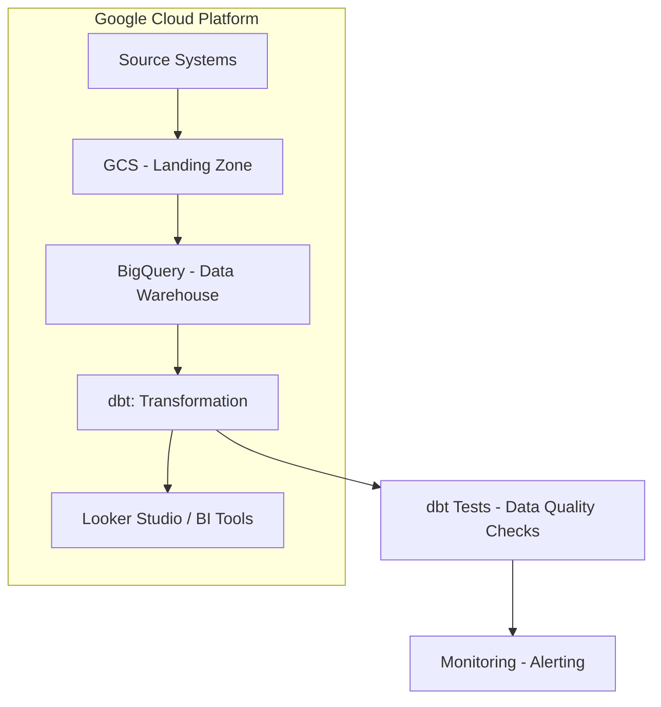
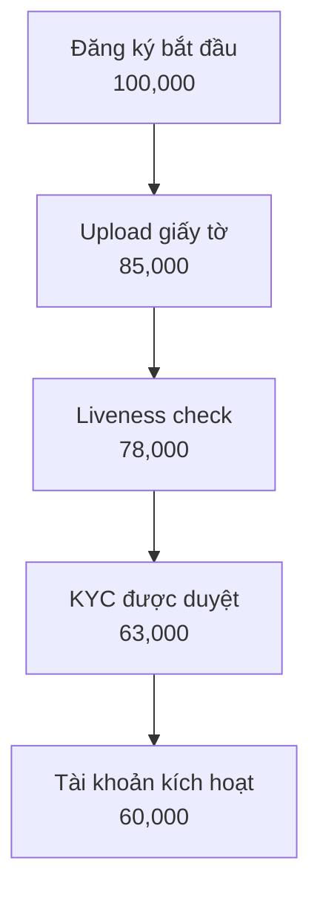

# Phân Tích Hành Trình Onboarding Khách Hàng (KYC/AML)

---
## Thuật Ngữ
---

<details>
<summary>Giải Nghĩa Các Thuật Ngữ Quan Trọng Trong Onboarding và KYC/AML</summary>

---


| **Thuật Ngữ**                      | **Định Nghĩa**                                                                 |
|-----------------------------------|--------------------------------------------------------------------------------|
| **KYC**                           | Know Your Customer – Quy trình xác minh danh tính khách hàng theo quy định.  |
| **AML**                           | Anti-Money Laundering – Chống rửa tiền, đảm bảo khách hàng không liên quan đến hoạt động tài chính phi pháp. |
| **Onboarding**                    | Quá trình đưa người dùng mới từ đăng ký đến khi có thể sử dụng đầy đủ dịch vụ.|
| **Chuyển đổi (Conversion)**       | Tỷ lệ người dùng hoàn tất một bước hoặc toàn bộ quá trình onboarding.         |
| **Phễu Onboarding (Funnel)**      | Chuỗi các bước người dùng cần thực hiện trong quá trình onboarding (ví dụ: đăng ký → gửi giấy tờ → kích hoạt). |
| **Điểm ma sát (Friction Point)**  | Các bước hoặc yếu tố trong quy trình gây cản trở, khiến người dùng dễ rời bỏ. |
| **OCR**                           | Optical Character Recognition – Công nghệ đọc ký tự từ ảnh giấy tờ.           |
| **Xác minh sinh trắc (Liveness Check)** | Kiểm tra khuôn mặt hoặc chuyển động để đảm bảo người thật đang thao tác. |
| **PEP**                           | Politically Exposed Person – Cá nhân có ảnh hưởng chính trị, cần giám sát chặt chẽ hơn. |
| **Tỷ lệ chấp thuận (Approval Rate)** | Tỷ lệ hồ sơ người dùng được duyệt qua các bước xác minh.                    |
| **Tỷ lệ từ chối (Rejection Rate)**   | Tỷ lệ hồ sơ bị từ chối qua các bước KYC.                                   |
| **Tỷ lệ rớt bước (Drop-off Rate)**   | Phần trăm người dùng không hoàn thành một bước nào đó trong phễu onboarding.|
| **Chờ xử lý thủ công**             | Những hồ sơ cần nhân viên can thiệp, không thể xử lý tự động.               |
| **user_id**                        | Mã định danh duy nhất của người dùng.                                        |
| **registration_channel**          | Kênh mà người dùng bắt đầu đăng ký (Web, Mobile, Referral...).               |
| **ocr_confidence**                | Mức độ tin cậy của kết quả nhận dạng ký tự từ giấy tờ.                       |
| **face_match_score**             | Điểm đo mức độ khớp giữa ảnh selfie và giấy tờ tùy thân.                     |
| **liveness_check**                | Quy trình kiểm tra người dùng là người thật, không phải ảnh hoặc bot.        |
| **pep_flag / sanction_flag**      | Cờ đánh dấu người dùng nằm trong danh sách chính trị hoặc bị cấm vận.        |
| **internal_risk_score**           | Điểm rủi ro nội bộ do hệ thống đánh giá dựa trên các chỉ báo.               |
| **abandonment_flag**              | Biến đánh dấu người dùng đã từ bỏ quy trình tại một bước nào đó.             |
| **retry_count**                   | Số lần người dùng gửi lại giấy tờ xác minh.                                  |
| **dim table**                     | Bảng dimension – chứa thông tin mô tả như người dùng, thiết bị, thời gian... |
| **fact table**                    | Bảng fact – lưu trữ các sự kiện hoặc hành vi có thể đo lường.               |
| **session_id**                    | Mã định danh của một phiên truy cập người dùng.                              |
| **duration_in_step_seconds**      | Thời gian người dùng ở lại tại một bước cụ thể trong quy trình onboarding.   |
| **kyc_result**                    | Kết quả xác minh danh tính: Approved, Rejected, Pending...                   |
| **ocr_status**                    | Trạng thái OCR: Success, Failure, Partial.                                   |
| **risk_score**                    | Điểm đánh giá rủi ro tổng hợp của người dùng.                                |
| **manual_review**                 | Quy trình đánh giá hồ sơ thủ công bởi con người.                             |
| **event_name**                    | Tên của sự kiện trong log ứng dụng (VD: KYC_STARTED).                        |
| **onboarding_step**              | Thứ tự các bước trong phễu onboarding.                                       |
| **channel_id**                    | ID của kênh đăng ký, dùng trong phân tích attribution.                       |
| **device_type / device_model**    | Loại và mẫu thiết bị người dùng sử dụng.                                     |
| **time_to_kyc_completion**        | Thời gian từ khi đăng ký đến khi hoàn tất xác minh danh tính.               |
| **funnel conversion rate**        | Tỷ lệ chuyển đổi giữa các bước trong hành trình onboarding.                 |


---
</details>

---
## Mục Lục
---
<details>
<summary>Xem tổng quan các chương và phần chính của tài liệu</summary>

---

- [Tóm Tắt Tổng Quan](#tóm-tắt-tổng-quan)
- [1. Phát Biểu Vấn Đề](#1-phát-biểu-vấn-đề)
- [2. Mục Tiêu Dự Án](#2-mục-tiêu-dự-án)
- [3. Kế Hoạch và Các Giai Đoạn Dự Án](#3-kế-hoạch-và-các-giai-đoạn-dự-án)
- [4. Nguồn Dữ Liệu và Thiết Kế Schema](#4-nguồn-dữ-liệu-và-thiết-kế-schema)
    - [4.1 – Nguồn Dữ Liệu Thô (Raw Data Sources)](#41--nguồn-dữ-liệu-thô-raw-data-sources)
    - [4.2 – Thiết Kế Schema Dữ Liệu Đề Xuất (Proposed Data Schema)](#42--thiết-kế-schema-dữ-liệu-đề-xuất-proposed-data-schema)
- [5. Logic Chuyển Đổi Dữ Liệu](#5-logic-chuyển-đổi-dữ-liệu)
    - [5.1 – Tổng Quan Về Luồng Dữ Liệu (Data Flow Overview)](#51--tổng-quan-về-luồng-dữ-liệu-data-flow-overview)
    - [5.2 – Chi Tiết Các Bước Chuyển Đổi (Detailed Transformation Steps)](#52--chi-tiết-các-bước-chuyển-đổi-detailed-transformation-steps)
        - [5.2.1 – Thu Thập Dữ Liệu Thô (Raw Data Ingestion)](#521--thu-thập-dữ-liệu-thô-raw-data-ingestion)
        - [5.2.2 – Làm Sạch & Chuẩn Hóa Dữ Liệu (Data Cleaning & Standardization)](#522--làm-sạch--chuẩn-hóa-dữ-liệu-data-cleaning--standardization)
        - [5.2.3 – Làm Giàu Dữ Liệu (Data Enrichment)](#523--làm-giàu-dữ-liệu-data-enrichment)
        - [5.2.4 – Xây Dựng Các Bảng Fact (Fact Table Construction)](#524--xây-dựng-các-bảng-fact-fact-table-construction)
        - [5.2.5 – Xây Dựng Các Bảng Dimension (Dimension Table Construction)](#525--xây-dựng-các-bảng-dimension-dimension-table-construction)
    - [5.3 – Đảm Bảo Chất Lượng Dữ Liệu (Data Quality Assurance)](#53--đảm-bảo-chất-lượng-dữ-liệu-data-quality-assurance)
    - [5.4 – Công Cụ và Công Nghệ Đề Xuất (Recommended Tools & Technologies)](#54--công-cụ-và-công-nghệ-đề-xuất-recommended-tools--technologies)
    - [5.5 – Tổng Kết Giai Đoạn Chuyển Đổi Dữ Liệu (Summary of Transformation Logic)](#55--tổng-kết-giai-đoạn-chuyển-đổi-dữ-liệu-summary-of-transformation-logic)
- [6. Khung Phân Tích và Các KPIs](#6-khung-phân-tích-và-các-kpis)
    - [6.1 – Mục Tiêu Phân Tích (Analytics Objectives)](#61--mục-tiêu-phân-tích-analytics-objectives)
    - [6.2 – Phân Tích Phễu Onboarding (Funnel Analysis)](#62--phân-tích-phễu-onboarding-funnel-analysis)
    - [6.3 – Chỉ Số KPI Cốt Lõi (Key Performance Indicators)](#63--chỉ-số-kpi-cốt-lõi-key-performance-indicators)
    - [6.4 – Phân Tích Hành Vi Người Dùng (User Behavior Analytics)](#64--phân-tích-hành-vi-người-dùng-user-behavior-analytics)
    - [6.5 – Phân Tích Tuân Thủ & Rủi Ro (Compliance & Risk Insights)](#65--phân-tích-tuân-thủ--rủi-ro-compliance--risk-insights)
- [7. Chiến Lược Báo Cáo và Dashboard](#7-chiến-lược-báo-cáo-và-dashboard)
    - [7.1 – Cấu Trúc Dashboard Đề Xuất Theo Chủ Đề (Theme-Oriented Dashboard Structure)](#71--cấu-trúc-dashboard-đề-xuất-theo-chủ-đề-theme-oriented-dashboard-structure)
    - [7.2 – Phân Loại Dashboard Theo Đối Tượng Người Dùng (Stakeholder-Oriented Dashboards)](#72--phân-loại-dashboard-theo-đối-tượng-người-dùng-stakeholder-oriented-dashboards)
    - [7.3 – Quy Ước Trực Quan Hóa Dữ Liệu (Visualization Guidelines)](#73--quy-ước-trực-quan-hóa-dữ-liệu-visualization-guidelines)
- [8. Tác Động Kinh Doanh và Khuyến Nghị](#8-tác-động-kinh-doanh-và-khuyến-nghị)
    - [8.1 – Khuyến Nghị Dựa Trên Phân Tích (Analysis-Driven Recommendations)](#81--khuyến-nghị-dựa-trên-phân-tích-analysis-driven-recommendations)
    - [8.2 – Tác Động Kinh Doanh Mong Đợi (Expected Business Impact)](#82--tác-động-kinh-doanh-mong-đợi-expected-business-impact)
    - [8.3 – Kế Hoạch Đo Lường và Theo Dõi (Measurement & Monitoring Plan)](#83--kế-hoạch-đo-lường-và-theo-dõi-measurement-monitoring-plan)

---

</details>

---
## Tóm Tắt Tổng Quan
---
<details>
<summary>Tổng Quan Cao Cấp về Khung Phân Tích và Tác Động Kinh Doanh Chính</summary>

---

- Báo cáo này tập trung vào phân tích hành trình `onboarding` và quy trình `KYC/AML` trong lĩnh vực tài chính, nhằm tối ưu chuyển đổi người dùng, tăng cường tuân thủ, và giảm thiểu rủi ro vận hành.

- Dựa trên bài toán giả định từ doanh nghiệp, nhóm phân tích đã thiết kế một hệ thống phân tích toàn diện, bao gồm:
  - **Lược đồ dữ liệu (schema)** chuẩn hóa theo mô hình Kim Tự Tháp (Star Schema).
  - **Pipeline xử lý dữ liệu** từ thu thập, làm sạch, đến xây dựng bảng `fact/dim`, kiểm soát chất lượng (DQA).
  - **Khung phân tích (Analytics Framework)** với các chỉ số KPI cốt lõi, phân tích hành vi, phân tích rủi ro.
  - **Dashboard theo chủ đề và người dùng**, hỗ trợ ra quyết định cho các bộ phận Điều hành, Vận hành, Risk, Marketing và Product.

- Từ các phân tích định lượng và định tính, báo cáo đưa ra **các khuyến nghị có thể hành động**, như cải tiến UI, tối ưu thuật toán OCR, tự động hóa duyệt hồ sơ rủi ro thấp.

- Các tác động kinh doanh mong đợi bao gồm:
  - **Tăng tỷ lệ chuyển đổi** người dùng đăng ký thành công.
  - **Giảm chi phí vận hành**, đặc biệt là chi phí xử lý thủ công.
  - **Cải thiện trải nghiệm người dùng** và mức độ hài lòng.
  - **Tăng cường hiệu quả quản lý rủi ro và tuân thủ** quy định pháp lý.

- Báo cáo này không chỉ cung cấp góc nhìn chiến lược, mà còn triển khai chi tiết về mặt kỹ thuật, quy trình và đo lường, sẵn sàng được ứng dụng vào thực tế hoặc mở rộng cho các dự án phân tích lớn hơn.

---

</details>


---

## 1. Phát Biểu Vấn Đề
---
<details>
<summary>Mô Tả Chi Tiết Thách Thức Kinh Doanh trong Quy Trình Onboarding Khách Hàng và KYC/AML</summary>

---

- **Tình Hình Hiện Tại:**
  - Nhiều khách hàng tiềm năng bắt đầu quy trình đăng ký nhưng bỏ dở giữa chừng.
  - Tồn tại các `điểm ma sát` đáng kể, đặc biệt trong các bước xác minh `KYC/AML` phức tạp.
- **Hậu Quả:**
  - `Mất Khách Hàng Tiềm Năng`: Ảnh hưởng trực tiếp đến việc thu hút người dùng và tăng trưởng kinh doanh.
  - `Tăng Chi Phí Vận Hành`: Do hỗ trợ thủ công, xác minh thất bại và xử lý lại.
  - `Trải Nghiệm Khách Hàng Chưa Tối Ưu`: Dẫn đến sự khó chịu của người dùng và ấn tượng ban đầu tiêu cực.
  - `Rủi Ro Tuân Thủ`: Quy trình `KYC/AML` kém hiệu quả tiềm ẩn rủi ro pháp lý và tuân thủ.
- **Thách Thức Chung:** Chúng ta thiếu hiểu biết rõ ràng, dựa trên dữ liệu về hành trình `onboarding` của khách hàng để xác định chính xác các `điểm đau` và tối ưu hóa quy trình một cách hiệu quả, đồng thời duy trì tuân thủ.

---

</details>

---

## 2. Mục Tiêu Dự Án
---
<details>
<summary>Các Mục Tiêu Rõ Ràng và Kết Quả Mong Đợi của Sáng Kiến Phân Tích</summary>

---

- **Mục Tiêu Chính:**
  - Xây dựng một hệ thống phân tích mạnh mẽ để có cái nhìn sâu sắc về hành trình `onboarding` của khách hàng.
  - Hệ thống này sẽ cho phép tối ưu hóa quy trình, giảm tỷ lệ bỏ cuộc và nâng cao trải nghiệm người dùng.
  - Đồng thời, đảm bảo tuân thủ đầy đủ các quy định `KYC/AML`.
- **Các Câu Hỏi Chính Cần Trả Lời:**
  - `Bước nào` trong quy trình `onboarding` có tỷ lệ bỏ cuộc cao nhất?
  - `Tại sao` người dùng lại bỏ dở quy trình tại những điểm cụ thể đó?
  - `Mất bao lâu` để một khách hàng hoàn tất toàn bộ luồng `onboarding` và xác minh?
  - `Những cải tiến khả thi nào` có thể được thực hiện để tinh gọn và đơn giản hóa quy trình mà không ảnh hưởng đến bảo mật và tuân thủ?

---

</details>

---

## 3. Kế Hoạch và Các Giai Đoạn Dự Án
---
<details>
<summary>Chiến Lược Toàn Diện Từ Đầu Đến Cuối để Giải Quyết Vấn Đề Phân Tích Onboarding</summary>

---

- Kế hoạch này phác thảo phương pháp tiếp cận 4 giai đoạn, tập trung vào việc biến dữ liệu thô thành thông tin chi tiết có thể hành động:

  ---

  #### Giai Đoạn 1: Thu Thập & Chuẩn Bị Dữ Liệu (Xây Dựng Nền Tảng)
  ---
  - **Những Gì Chúng Ta Sẽ Làm:**
    - Hợp tác với các nhóm kỹ thuật để xác định và thu thập tất cả dữ liệu liên quan đến đăng ký và xác minh khách hàng.
    - Ví dụ về dữ liệu:
      - `Thời điểm đăng ký của người dùng` (`timestamp`) (bắt đầu, hoàn thành từng bước).
      - `Các bước cụ thể đã hoàn thành` hoặc đã cố gắng thực hiện.
      - `Lỗi gặp phải` trong quá trình.
      - `Thời gian chờ đợi` cho mỗi bước xác minh.
      - `Kết quả xác minh` (thành công/thất bại, lý do thất bại).
      - `Nhật ký liên lạc` với người dùng (ví dụ: thông báo email/SMS).
    - Thiết kế một `sơ đồ dữ liệu` (`blueprint`) hoặc `schema` rõ ràng để dễ hiểu và sử dụng.
  - **Mục Tiêu:**
    - Đảm bảo có sẵn dữ liệu sạch, chính xác và có thể sử dụng được để phân tích.

  ---

  #### Giai Đoạn 2: Xây Dựng Khung Phân Tích (Vẽ Bức Tranh Toàn Cảnh)
  ---
  - **Những Gì Chúng Ta Sẽ Làm:**
    - Xây dựng các `phễu` (`funnels`) để trực quan hóa toàn bộ hành trình của khách hàng từ khi bắt đầu đăng ký đến khi kích hoạt tài khoản.
    - Định nghĩa các `chỉ số hiệu suất chính` (`KPIs`) như:
      - `Tỷ lệ chuyển đổi theo từng bước`.
      - `Thời gian trung bình để hoàn tất xác minh`.
      - `Tỷ lệ thất bại KYC` theo lý do.
      - `Chi phí trên mỗi lần onboarding thành công`.
    - Đề xuất các phương pháp `kiểm thử A/B` (`A/B testing`) cho các luồng `onboarding` khác nhau hoặc so sánh hiệu suất với các `benchmark`.
  - **Mục Tiêu:**
    - Xác định chính xác các bước gây tắc nghẽn và hiểu rõ tác động của chúng.

  ---

  #### Giai Đoạn 3: Phân Tích Chuyên Sâu & Xác Định Vấn Đề (Tìm Ra Gốc Rễ)
  ---
  - **Những Gì Chúng Ta Sẽ Làm:**
    - Thực hiện phân tích chuyên sâu để hiểu `tại sao` khách hàng bỏ cuộc.
    - Điều tra các yếu tố như:
      - Độ phức tạp của quy trình tải tài liệu.
      - Thời gian chờ đợi phản hồi.
      - Sự rõ ràng của hướng dẫn.
    - Phân tích các trường hợp `KYC/AML bị từ chối` để xác định các lý do phổ biến và đề xuất cải thiện quy trình tuân thủ.
  - **Mục Tiêu:**
    - Chỉ ra nguyên nhân gốc rễ của các vấn đề và các cơ hội cải thiện cụ thể.

  ---

  #### Giai Đoạn 4: Báo Cáo & Đề Xuất Giải Pháp (Biến Dữ Liệu Thành Hành Động)
  ---
  - **Những Gì Chúng Ta Sẽ Làm:**
    - Tổng hợp các phát hiện vào một báo cáo rõ ràng, dễ hiểu, tập trung vào các khuyến nghị có thể hành động.
    - Ví dụ về các khuyến nghị:
      - `Đơn giản hóa bước X` trong luồng.
      - `Tự động hóa kiểm tra Y`.
      - `Cải thiện thông báo cho người dùng` ở bước Z.
    - Phác thảo `Dashboard` (bảng điều khiển) để các nhóm liên quan có thể dễ dàng theo dõi hiệu suất theo thời gian thực.
  - **Mục Tiêu:**
    - Cung cấp thông tin chi tiết và giải pháp để các nhóm Sản phẩm, Marketing, Vận hành và Tuân thủ có thể cùng nhau hợp tác, nâng cao trải nghiệm khách hàng và hiệu quả kinh doanh.

  ---

- **Sử Dụng Công Cụ GenAI:**
  - Trong suốt tất cả các giai đoạn, các công cụ `GenAI` sẽ được tận dụng để tăng tốc độ phân tích, tạo báo cáo và đảm bảo độ chính xác, tối đa hóa hiệu quả và chất lượng đầu ra.

---

</details>

---
## 4. Nguồn Dữ Liệu và Thiết Kế Schema
---
<details>
<summary>Mô Tả Chi Tiết về Các Nguồn Dữ Liệu Thô và Mô Hình Dữ Liệu Đề Xuất</summary>

---

#### 4.1 – Nguồn Dữ Liệu Thô (Raw Data Sources)
---
- Để xây dựng khung phân tích hành trình `onboarding`, chúng ta cần thu thập dữ liệu từ nhiều hệ thống khác nhau trong quy trình đăng ký và xác minh.
- Dưới đây là các nhóm dữ liệu thô chính:

  ---

  ##### 🧾 Nhóm 1: Dữ Liệu Đăng Ký Người Dùng (User Registration Logs)
  ---
  - Bao gồm tất cả thông tin liên quan đến thời điểm người dùng bắt đầu quá trình đăng ký.
  - Trường dữ liệu quan trọng:
    - `user_id`: Mã định danh duy nhất
    - `registration_start_time`: Thời điểm bắt đầu đăng ký
    - `registration_channel`: Web / mobile / referral
    - `device_type`, `os_version`, `browser`: Dùng để phân tích hành vi thiết bị
    - `language`, `region`: Phục vụ phân tích theo địa lý

  ---

  ##### 🪪 Nhóm 2: Dữ Liệu Xác Minh Danh Tính (Identity Verification Logs)
  ---
  - Bao gồm thông tin giấy tờ người dùng cung cấp và quá trình xử lý `OCR`.
  - Trường dữ liệu chính:
    - `doc_type`: CMND / CCCD / Passport
    - `ocr_status`, `ocr_confidence`: Kết quả nhận dạng ký tự
    - `upload_time`, `verification_result`, `rejection_reason`
    - `retry_count`: Số lần thử lại (nếu có)

  ---

  ##### 🧠 Nhóm 3: Dữ Liệu Sinh Trắc (Biometric Verification)
  ---
  - Xác minh người thật (`liveness`) và đối chiếu khuôn mặt.
  - Trường dữ liệu:
    - `face_match_score`: Mức độ khớp khuôn mặt
    - `liveness_check_result`: true/false
    - `device_camera_quality`: chất lượng camera
    - `frame_blur_score`: đánh giá độ rõ ảnh
    - `action_prompt_passed`: có làm đúng yêu cầu (nhìn trái/phải...)

  ---

  ##### 🚦 Nhóm 4: Đánh Giá Rủi Ro & Tuân Thủ (Risk & Compliance)
  ---
  - Dữ liệu từ hệ thống chống rửa tiền (`AML`) và kiểm tra `PEP/sanction`.
  - Trường dữ liệu:
    - `pep_flag`, `sanction_flag`: Có nằm trong danh sách hay không
    - `internal_risk_score`: Điểm đánh giá nội bộ
    - `risk_decision`: approve / manual_review / reject
    - `manual_review_reason` (nếu có)

  ---

  ##### 💬 Nhóm 5: Nhật Ký Tương Tác & Giao Tiếp (User Communication Logs)
  ---
  - Ghi lại các lần gửi `email`, thông báo, chăm sóc người dùng.
  - Trường dữ liệu:
    - `email_sent`, `sms_sent`, `push_notification_sent`
    - `time_sent`, `user_response_time`
    - `support_ticket_opened`, `ticket_status`, `assigned_agent_id`

  ---

  ##### 📱 Nhóm 6: Hành Vi Ứng Dụng (App Event Logs)
  ---
  - Dữ liệu hành vi như mở `app`, thao tác ở từng bước `onboarding`.
  - Trường dữ liệu:
    - `screen_viewed`, `step_started`, `step_completed`
    - `timestamp`, `session_duration`, `abandonment_flag`

  ---

- Những nhóm dữ liệu này là nền tảng để thiết kế `schema`, xác định `funnel` và tính `KPI` trong các phần tiếp theo.

---
#### 4.2 – Thiết Kế Schema Dữ Liệu Đề Xuất (Proposed Data Schema)
---
- Để hỗ trợ phân tích hành trình `onboarding` khách hàng và `KYC/AML`, chúng ta đề xuất một mô hình dữ liệu tập trung, bao gồm các bảng được thiết kế để thu thập và tổ chức thông tin từ các nguồn dữ liệu thô khác nhau.
- Mục tiêu là tạo ra một `schema` rõ ràng, dễ truy vấn, giúp tính toán các chỉ số `KPI` và xây dựng `phễu` (`funnel`) một cách hiệu quả.
- Các bảng chính trong `schema` đề xuất của chúng ta bao gồm:

  ---

  ##### 📊 Bảng: `dim_users` (Thông tin Người Dùng)
  ---
  - **Mục đích:** Chứa các thông tin cơ bản và thuộc tính tĩnh của người dùng.
  - **Mối quan hệ:** Liên kết với tất cả các bảng khác thông qua `user_id`.
  - **Cấu trúc bảng:**

    | Tên Trường (Field Name) | Kiểu Dữ Liệu (Data Type) | Mô Tả (Description) |
    | :---------------------- | :----------------------- | :------------------ |
    | `user_id`               | `STRING`                 | `Khóa chính` (`Primary Key`), mã định danh duy nhất của người dùng. |
    | `registration_start_time` | `TIMESTAMP`              | Thời điểm khách hàng bắt đầu quá trình đăng ký tài khoản. |
    | `registration_channel`  | `STRING`                 | Kênh đăng ký ban đầu (ví dụ: `Web`, `Mobile App`, `Referral`, `Partnership`). |
    | `device_type`           | `STRING`                 | Loại thiết bị được sử dụng để đăng ký (`Mobile`, `Tablet`, `Desktop`). |
    | `os_version`            | `STRING`                 | Phiên bản hệ điều hành (`iOS 17`, `Android 13`, `Windows 10`). |
    | `browser_type`          | `STRING`                 | Loại trình duyệt (`Chrome`, `Safari`, `Firefox`). |
    | `language_preference`   | `STRING`                 | Ngôn ngữ mà người dùng đã chọn hoặc hệ thống phát hiện. |
    | `geo_country`           | `STRING`                 | Quốc gia của người dùng dựa trên IP hoặc thông tin đăng ký ban đầu. |
    | `email`                 | `STRING`                 | Địa chỉ email được sử dụng khi đăng ký (có thể được mã hóa/băm để bảo mật). |
    | `phone_number`          | `STRING`                 | Số điện thoại được sử dụng (có thể được mã hóa/băm). |
    | `account_status`        | `STRING`                 | Trạng thái tài khoản hiện tại (`Pending`, `Verified`, `Rejected`, `Suspended`). |
    | `registration_completion_time` | `TIMESTAMP`         | Thời điểm người dùng hoàn tất quá trình đăng ký cơ bản. |

  ---

  ##### 📈 Bảng: `fact_onboarding_events` (Các Sự Kiện Hành Trình Onboarding)
  ---
  - **Mục đích:** Ghi lại từng sự kiện hoặc bước mà người dùng thực hiện trong quá trình `onboarding`. Đây là bảng chính để xây dựng `phễu` (`funnel`).
  - **Mối quan hệ:** Liên kết với `dim_users` qua `user_id`.
  - **Cấu trúc bảng:**

    | Tên Trường (Field Name) | Kiểu Dữ Liệu (Data Type) | Mô Tả (Description) |
    | :---------------------- | :----------------------- | :------------------ |
    | `event_id`              | `STRING`                 | `Khóa chính`, mã định danh duy nhất cho mỗi sự kiện. |
    | `user_id`               | `STRING`                 | `Khóa ngoại` (`Foreign Key`), liên kết đến `dim_users`. |
    | `event_timestamp`       | `TIMESTAMP`              | Thời điểm chính xác xảy ra sự kiện. |
    | `event_name`            | `STRING`                 | Tên của sự kiện (`KYC_STARTED`, `ID_DOCUMENT_UPLOADED`, `LIVENESS_CHECK_FAILED`, `ACCOUNT_ACTIVATED`). |
    | `onboarding_step`       | `INT`                    | Số thứ tự của bước trong hành trình `onboarding` (ví dụ: `1` cho đăng ký, `2` cho tải giấy tờ). |
    | `step_description`      | `STRING`                 | Mô tả chi tiết về bước `onboarding`. |
    | `event_status`          | `STRING`                 | Trạng thái của sự kiện (`SUCCESS`, `FAILURE`, `PENDING`, `RETRY`). |
    | `error_code`            | `STRING`                 | Mã lỗi (nếu có) khi sự kiện thất bại. |
    | `error_message`         | `STRING`                 | Mô tả lỗi dễ hiểu (nếu có). |
    | `session_id`            | `STRING`                 | `ID` của phiên làm việc mà sự kiện xảy ra. |
    | `duration_in_step_seconds` | `INT`                 | Thời gian người dùng ở lại trong bước này trước khi chuyển tiếp hoặc thoát. |

  ---

  ##### 📋 Bảng: `fact_kyc_verification_details` (Chi Tiết Xác Minh KYC)
  ---
  - **Mục đích:** Lưu trữ thông tin chi tiết về từng lần nộp/xác minh giấy tờ và sinh trắc học.
  - **Mối quan hệ:** Liên kết với `dim_users` qua `user_id`.
  - **Cấu trúc bảng:**

    | Tên Trường (Field Name) | Kiểu Dữ Liệu (Data Type) | Mô Tả (Description) |
    | :---------------------- | :----------------------- | :------------------ |
    | `kyc_submission_id`     | `STRING`                 | `Khóa chính`, mã định danh duy nhất cho mỗi lần nộp `KYC`. |
    | `user_id`               | `STRING`                 | `Khóa ngoại`, liên kết đến `dim_users`. |
    | `submission_timestamp`  | `TIMESTAMP`              | Thời điểm người dùng gửi thông tin `KYC`. |
    | `document_type`         | `STRING`                 | Loại giấy tờ được nộp (`Passport`, `National ID`, `Driver's License`). |
    | `ocr_status`            | `STRING`                 | Trạng thái nhận dạng `OCR` (`Success`, `Failure`, `Partial`). |
    | `ocr_confidence_score`  | `FLOAT`                  | Điểm tin cậy của kết quả `OCR` (0.0 - 1.0). |
    | `face_match_score`      | `FLOAT`                  | Điểm khớp khuôn mặt từ ảnh giấy tờ và ảnh `liveness` (0.0 - 1.0). |
    | `liveness_check_result` | `BOOLEAN`                | Kết quả kiểm tra người thật (`true` nếu là người thật). |
    | `kyc_result`            | `STRING`                 | Kết quả xác minh cuối cùng (`Approved`, `Rejected`, `Under Review`, `Retry Needed`). |
    | `rejection_reason`      | `ARRAY<STRING>`          | Danh sách các lý do từ chối (ví dụ: `Blurred Document`, `Face Mismatch`, `Document Expired`). |
    | `processing_time_seconds` | `INT`                  | Thời gian xử lý `KYC` tự động/thủ công. |
    | `agent_id`              | `STRING`                 | `ID` của nhân viên xử lý thủ công (nếu có). |
    | `number_of_retries`     | `INT`                    | Số lần người dùng phải nộp lại `KYC` cho lần này. |

  ---

  ##### 🚨 Bảng: `fact_risk_assessments` (Đánh Giá Rủi Ro)
  ---
  - **Mục đích:** Ghi lại kết quả các đánh giá rủi ro `AML`/`PEP`/`Sanction` cho người dùng.
  - **Mối quan hệ:** Liên kết với `dim_users` qua `user_id`.
  - **Cấu trúc bảng:**

    | Tên Trường (Field Name) | Kiểu Dữ Liệu (Data Type) | Mô Tả (Description) |
    | :---------------------- | :----------------------- | :------------------ |
    | `risk_assessment_id`    | `STRING`                 | `Khóa chính`, mã định danh duy nhất cho mỗi lần đánh giá rủi ro. |
    | `user_id`               | `STRING`                 | `Khóa ngoại`, liên kết đến `dim_users`. |
    | `assessment_timestamp`  | `TIMESTAMP`              | Thời điểm đánh giá rủi ro được thực hiện. |
    | `risk_score`            | `INT`                    | Điểm rủi ro tổng thể của người dùng (ví dụ: 1-100). |
    | `pep_flag`              | `BOOLEAN`                | `True` nếu người dùng được xác định là `PEP` (Người có ảnh hưởng chính trị). |
    | `sanction_flag`         | `BOOLEAN`                | `True` nếu người dùng nằm trong danh sách trừng phạt. |
    | `aml_status`            | `STRING`                 | Trạng thái kiểm tra `AML` (`Clear`, `Match Found`, `Under Investigation`). |
    | `final_risk_decision`   | `STRING`                 | Quyết định rủi ro cuối cùng (`Approved`, `Manual Review`, `Rejected`). |
    | `decision_reason`       | `ARRAY<STRING>`          | Các lý do cụ thể cho quyết định rủi ro. |

  ---

  ##### 📧 Bảng: `fact_user_communications` (Tương Tác & Giao Tiếp Người Dùng)
  ---
  - **Mục đích:** Ghi lại tất cả các thông điệp hệ thống hoặc từ bộ phận hỗ trợ gửi đến người dùng trong quá trình `onboarding`.
  - **Mối quan hệ:** Liên kết với `dim_users` qua `user_id`.
  - **Cấu trúc bảng:**

    | Tên Trường (Field Name) | Kiểu Dữ Liệu (Data Type) | Mô Tả (Description) |
    | :---------------------- | :----------------------- | :------------------ |
    | `communication_id`      | `STRING`                 | `Khóa chính`, mã định danh duy nhất cho mỗi lần giao tiếp. |
    | `user_id`               | `STRING`                 | `Khóa ngoại`, liên kết đến `dim_users`. |
    | `communication_timestamp` | `TIMESTAMP`            | Thời điểm gửi tin nhắn/thông báo. |
    | `communication_type`    | `STRING`                 | Loại giao tiếp (`Email`, `SMS`, `Push Notification`, `In-App Message`). |
    | `message_content`       | `STRING`                 | Nội dung chính của tin nhắn (có thể cắt ngắn hoặc mã hóa). |
    | `delivery_status`       | `STRING`                 | Trạng thái gửi (`Sent`, `Delivered`, `Failed`, `Opened`). |
    | `user_interaction_status` | `STRING`               | Trạng thái tương tác của người dùng (`Clicked`, `Ignored`, `Responded`). |
    | `support_ticket_id`     | `STRING`                 | `ID` của `ticket` hỗ trợ liên quan (nếu có). |

  ---
  ##### 📄 Bảng: `fact_manual_review_logs` (Nhật Ký Duyệt Thủ Công)
  ---
  - **Mục đích:** Ghi lại thông tin chi tiết về quá trình duyệt `KYC` thủ công bởi nhân viên.
  - **Mối quan hệ:** Liên kết với `dim_users` qua `user_id` và có thể liên kết với `fact_kyc_verification_details` qua `kyc_submission_id`.
  - **Cấu trúc bảng:**

    | Tên Trường (Field Name) | Kiểu Dữ Liệu (Data Type) | Mô Tả (Description) |
    | :---------------------- | :----------------------- | :------------------ |
    | `review_id`             | `STRING`                 | `Khóa chính`, mã định danh duy nhất cho mỗi lần duyệt thủ công. |
    | `user_id`               | `STRING`                 | `Khóa ngoại`, liên kết đến `dim_users`. |
    | `kyc_submission_id`     | `STRING`                 | `Khóa ngoại`, liên kết đến `fact_kyc_verification_details`. |
    | `review_start_time`     | `TIMESTAMP`              | Thời điểm bắt đầu quá trình duyệt. |
    | `review_end_time`       | `TIMESTAMP`              | Thời điểm kết thúc quá trình duyệt. |
    | `review_result`         | `STRING`                 | Kết quả duyệt (`Approved`, `Rejected`, `Needs More Info`). |
    | `review_notes`          | `STRING`                 | Ghi chú của người duyệt về trường hợp này. |
    | `reviewer_id`           | `STRING`                 | `ID` của nhân viên thực hiện duyệt. |

  ---

  ##### 📊 Sơ đồ quan hệ giữa các bảng (ERD)
  ---

  ```mermaid
  erDiagram
      dim_users ||--o{ fact_onboarding_events : has
      dim_users ||--o{ fact_kyc_verification_details : has
      dim_users ||--o{ fact_risk_assessments : has
      dim_users ||--o{ fact_user_communications : has
      dim_users ||--o{ fact_manual_review_logs : has
      fact_kyc_verification_details ||--o{ fact_manual_review_logs : triggers
  ```
---
- Với thiết kế schema như trên, chúng ta có thể dễ dàng xây dựng các truy vấn phục vụ phân tích funnel (`drop-off rate`, `completion rate`), phân tích thời gian (`time-to-verify`), cũng như đánh giá hiệu quả quy trình `KYC/AML` và `manual review`.
- Đây là nền tảng vững chắc cho các bước xử lý tiếp theo: logic biến đổi dữ liệu, tính KPI và xây dựng dashboard.

---

</details>

---

## 5. Logic Chuyển Đổi Dữ Liệu
---
<details>
<summary>Mô Tả Các Quy Trình Làm Sạch, Chuẩn Hóa và Tổng Hợp Dữ Liệu</summary>

---
#### 5.1 – Tổng Quan Về Luồng Dữ Liệu (Data Flow Overview)
---

- Mục tiêu của phần này là cung cấp một cái nhìn toàn cảnh về quá trình dữ liệu được thu thập, xử lý và chuyển đổi để phục vụ phân tích hành trình `onboarding` khách hàng và `KYC/AML`.
- Luồng dữ liệu được thiết kế theo mô hình `ELT (Extract, Load, Transform)` hiện đại, cho phép linh hoạt trong việc xử lý dữ liệu quy mô lớn trên nền tảng `cloud data warehouse`.
- Các giai đoạn chính của luồng dữ liệu bao gồm:

  - **1. Thu Thập Dữ Liệu Thô (Raw Data Ingestion):**
    - Dữ liệu được thu thập liên tục hoặc theo đợt từ các hệ thống nguồn khác nhau như: hệ thống đăng ký, hệ thống `KYC/Biometric`, hệ thống `Risk/Compliance`, hệ thống giao tiếp, và nhật ký sự kiện ứng dụng.
    - Phương thức thu thập đa dạng bao gồm `API integration`, `database replication`, và `log forwarding`.

  - **2. Khu Vực Lưu Trữ Dữ Liệu Thô (Raw Data Landing Zone / Data Lake):**
    - Dữ liệu thô được lưu trữ nguyên trạng tại đây, thường là trên các dịch vụ `Cloud Storage` (ví dụ: `GCS`, `S3`), đảm bảo tính toàn vẹn và khả năng `re-processing` khi cần.

  - **3. Tải Dữ Liệu Vào Kho Dữ Liệu (Data Loading to Data Warehouse):**
    - Dữ liệu từ `Landing Zone` được tải vào một `Data Warehouse` mạnh mẽ (`Google BigQuery`, Snowflake, Redshift), tạo nền tảng cho các bước chuyển đổi hiệu suất cao.

  - **4. Chuyển Đổi Dữ Liệu (Data Transformation):**
    - Giai đoạn này thực hiện các phép làm sạch, chuẩn hóa, làm giàu và tổng hợp dữ liệu ngay trong `Data Warehouse` để xây dựng các bảng `dim` và `fact` theo `schema` đã thiết kế.

  - **5. Lớp Dữ Liệu Phân Tích (Analytical Data Layer):**
    - Các bảng `dim` và `fact` đã được xử lý và tối ưu hóa nằm trong `Data Warehouse`, sẵn sàng cho các mục đích phân tích và báo cáo.

  - **6. Lớp Tiêu Thụ Dữ Liệu (Data Consumption / Reporting):**
    - Dữ liệu từ lớp phân tích được sử dụng bởi các công cụ `Business Intelligence` (BI) để tạo ra các `dashboard`, báo cáo và tính toán các `KPI`.

- Luồng dữ liệu tổng quát có thể được hình dung qua sơ đồ sau:
---

  ```mermaid
    flowchart TD
  subgraph Source_Systems [Hệ thống nguồn]
    A[Hệ thống đăng ký] --> RawData
    B[Hệ thống KYC/Biometric] --> RawData
    C[Hệ thống Risk/Compliance] --> RawData
    D[Hệ thống Giao tiếp] --> RawData
    E[App Event Logs] --> RawData
    F[Hệ thống Duyệt thủ công] --> RawData
  end

  RawData["Khu vực lưu trữ dữ liệu thô (GCS/S3)"] --> Load["Tải vào Data Warehouse (BigQuery)"]
  Load --> Transform["Chuyển đổi dữ liệu (dbt/SQL)"]
  Transform --> AnalyticalLayer["Lớp dữ liệu phân tích (Dim & Fact Tables)"]
  AnalyticalLayer --> Consumption["Báo cáo & Dashboard (Looker Studio/Power BI)"]
  ```
---

- Luồng dữ liệu này được thiết kế để đảm bảo tính toàn vẹn, khả năng mở rộng và hiệu quả, cung cấp nền tảng vững chắc cho mọi hoạt động phân tích về hành trình `onboarding` khách hàng.

---
#### 5.2 – Chi Tiết Các Bước Chuyển Đổi (Detailed Transformation Steps)
---

##### 5.2.1 – Thu Thập Dữ Liệu Thô (Raw Data Ingestion)
---

<details>
<summary>Mô tả cách dữ liệu thô được thu thập từ nhiều hệ thống nguồn</summary>

---

- Giai đoạn đầu tiên trong pipeline ELT là **thu thập dữ liệu thô từ các hệ thống nguồn**, đảm bảo dữ liệu đầy đủ và chính xác cho các bước xử lý tiếp theo.
- Dữ liệu đến từ **nhiều hệ thống phân tán**, mỗi hệ thống có định dạng và tốc độ cập nhật khác nhau.

- **Hệ thống nguồn chính:**
    - Dữ liệu được thu thập từ các nhóm hệ thống sau:
        - **Hệ thống Đăng ký người dùng**: thông tin hồ sơ và thời điểm bắt đầu hành trình onboarding.
        - **Hệ thống KYC & Biometric**: bao gồm ảnh giấy tờ, trạng thái OCR, kết quả kiểm tra khuôn mặt và liveness.
        - **Hệ thống Risk & Compliance**: dữ liệu PEP/sanction, điểm rủi ro nội bộ, kết quả đánh giá.
        - **Hệ thống Giao tiếp & CSKH**: email, SMS, push notification, nhật ký ticket hỗ trợ.
        - **Ứng dụng & Mobile App**: dữ liệu sự kiện hành vi như chuyển bước, thoát giữa chừng, thời lượng thao tác.

- **Phương thức thu thập đề xuất:**

| Loại nguồn | Phương thức tích hợp | Công nghệ phù hợp |
|------------|----------------------|--------------------|
| API endpoints | Tự động gọi API định kỳ hoặc theo sự kiện | `Airflow`, `Cloud Functions` |
| Database logs | Realtime streaming hoặc CDC (Change Data Capture) | `Debezium`, `Kafka`, `BigQuery Data Transfer` |
| File-based logs | Tải theo lô (batch) từ storage (CSV, JSON, Parquet) | `Cloud Storage + dbt`, `Fivetran` |
| Event tracking | Gửi từ client/app theo sự kiện | `Segment`, `Snowplow`, `GA4`, `Firebase` |
| Manual review logs | Nhập tay hoặc đồng bộ từ hệ thống CRM nội bộ | `CSV`, `Google Sheets`, `App Script` |

- **Các điểm cần lưu ý:**
    - Đảm bảo **định danh người dùng thống nhất** (`user_id`) giữa các hệ thống (dùng UUID hoặc hashed ID).
    - Tất cả thời gian phải được **chuyển đổi sang UTC** để đồng bộ khi phân tích.
    - Dữ liệu thô nên được lưu vào **Landing Zone** theo format nguyên gốc, không biến đổi, để đảm bảo khả năng xử lý lại (`replayable`) và kiểm tra sai lệch.
...

---

- Giai đoạn thu thập dữ liệu là nền tảng quan trọng, ảnh hưởng trực tiếp đến độ tin cậy của hệ thống phân tích. Việc thiết kế ingestion pipeline phải đảm bảo:
  - Tự động hóa cao
  - Kiểm soát lỗi tốt
  - Dễ mở rộng khi hệ thống tăng trưởng

---
</details>


---
##### 5.2.2 – Làm Sạch & Chuẩn Hóa Dữ Liệu (Data Cleaning & Standardization)
---

<details>
<summary>Mô tả các quy trình làm sạch, chuẩn hóa và xử lý dữ liệu thô để đảm bảo chất lượng và tính nhất quán</summary>

---

- Mục tiêu của giai đoạn này là biến dữ liệu thô, có thể lộn xộn và không nhất quán, thành một định dạng sạch sẽ, chuẩn hóa và sẵn sàng cho phân tích.
- Đây là bước cực kỳ quan trọng vì nếu đầu vào là dữ liệu "rác" (Garbage In), thì đầu ra của phân tích cũng sẽ sai lệch nghiêm trọng (Garbage Out).

---

##### 🎯 Lý do cần làm sạch và chuẩn hóa

| Vấn đề phổ biến | Hậu quả nếu không xử lý |
|------------------|--------------------------|
| Dữ liệu thiếu / NULL | Gây sai lệch thống kê, lỗi khi join bảng |
| Định dạng không chuẩn | Không thể chuyển đổi hoặc so sánh |
| Trùng lặp bản ghi | Gây trùng đếm, sai kết quả phân tích |
| Giá trị ngoại lệ | Kéo lệch trung bình, gây hiểu nhầm |
| Không thống nhất | Gây khó khăn khi lọc, phân nhóm |

---

##### 🧹 Các bước làm sạch dữ liệu

| Vấn đề | Phương pháp xử lý |
|--------|--------------------|
| **NULL/thiếu dữ liệu** | Gán mặc định (`unknown`), loại bỏ nếu critical, đánh cờ `is_incomplete` |
| **Trùng lặp bản ghi** | Xác định dựa trên `user_id + event_name + timestamp`, giữ bản mới nhất |
| **Giá trị bất hợp lệ** | Dùng kiểm tra biên (boundary check), loại bỏ hoặc đánh cờ `invalid` |
| **Timestamp sai** | Chuẩn hóa về `UTC`, bỏ bản ghi có timestamp tương lai quá xa |
| **Dữ liệu phân tán** | Gộp trường tương đương, chuẩn hóa biến thể tên |

---

##### 🛠 Chuẩn hóa định dạng và chuỗi

| Đối tượng | Quy tắc chuẩn hóa |
|----------|--------------------|
| **Text fields** | lowercase hóa, trim space, viết hoa chuẩn (`Ho Chi Minh`) |
| **Country / Region** | Ánh xạ về ISO-3166 (`VN`, `Viet Nam`, `Vietnam` → `Vietnam`) |
| **Device / OS / Browser** | Dùng bảng mapping chuẩn (`chrome`, `iOS 17`, `Android`) |
| **Thời gian** | Chuyển về `ISO 8601` UTC (`2025-06-17T08:00:00Z`) |
| **Mã định danh** | Format chuẩn: UUID hoặc hashed, không rỗng, không trùng |

---

##### 🔧 Công cụ và kỹ thuật được đề xuất

| Công đoạn | Công cụ đề xuất |
|-----------|------------------|
| Làm sạch cơ bản | SQL (BigQuery Standard SQL) |
| Chuẩn hóa chuỗi | Python (`pandas`, `str.lower()`, `regex`, `fuzzywuzzy`) |
| Phát hiện trùng | `ROW_NUMBER() OVER`, `DISTINCT`, `pandas.duplicated()` |
| Kiểm tra thời gian | `TIMESTAMP_DIFF`, kiểm tra `> NOW()` |
| Mapping chuẩn | Python dict / SQL CASE / JOIN bảng tham chiếu |

---

- Ngoài ra, cần thêm cột **đánh cờ chất lượng** vào bảng dữ liệu để phân tích sau này, ví dụ:
  - `is_valid` (TRUE/FALSE)
  - `data_quality_flag`
  - `cleaning_note`

- Việc làm sạch và chuẩn hóa không chỉ giúp tạo ra dữ liệu tin cậy, mà còn làm nền tảng cho việc xây dựng bảng `fact`/`dim` chất lượng cao và KPI chính xác.

---
</details>


---
##### 5.2.3 – Làm Giàu Dữ Liệu (Data Enrichment)
---

<details>
<summary>Bổ sung thông tin bổ trợ vào dữ liệu để nâng cao giá trị phân tích</summary>

---

- Sau khi dữ liệu được làm sạch và chuẩn hóa, bước tiếp theo là **làm giàu dữ liệu** (enrichment).
- Mục tiêu của giai đoạn này là bổ sung thêm các trường thông tin có giá trị phân tích cao, phục vụ trực tiếp cho việc tính toán `KPIs`, theo dõi hành vi người dùng, và phân khúc hiệu quả.

---

##### 🔍 Các chiến lược enrichment phổ biến

| Nhóm dữ liệu | Kỹ thuật làm giàu áp dụng |
|-------------|---------------------------|
| **User registration** | Tính `registration_duration` = `completion_time - start_time` |
| **Device & region** | Tra cứu `geo-IP`, phân tích thiết bị từ `User-Agent` |
| **App events** | Gắn `event_stage`, tính `step_duration` trung bình |
| **KYC/AML** | Tính `is_high_risk_user`, phân loại `risk_level` |
| **Communication** | Xác định `response_delay_bucket`, hành vi phản hồi |
| **Session** | Tính toán `session_count`, `avg_session_duration` |

---

##### 🧠 Enrichment theo logic kinh doanh

- Phân khúc người dùng: theo quốc gia, thiết bị, nguồn kênh đăng ký
- Cohort tuần đăng ký: `W25_2025`
- Cờ hành vi đặc biệt: `first_pass_KYC`, `likely_churn = true`

---

##### 🛠 Công cụ hỗ trợ

| Mục đích | Công cụ gợi ý |
|---------|---------------|
| Enrich dạng text | SQL `LOWER()`, `REGEXP`, Python `re` |
| Ghép bảng | SQL `JOIN`, `LEFT JOIN` |
| Phân loại logic | SQL `CASE`, Python `if-else` |
| Kết nối API ngoài | Python `requests`, Spark `UDF` |

---

📌 **Xem thêm các chiến lược nâng cao bên dưới**:

</details>

<details>
<summary>📌 Chi tiết mở rộng: Các chiến lược enrichment nâng cao</summary>

---

##### ✅ Enrichment từ nguồn ngoài

##### 🌍 Vị trí địa lý từ IP
- **Cách làm**: IP → country, city, timezone
- **Nguồn**: MaxMind GeoIP2, IP2Location API
- **Lý do**: phân tích drop-off theo vùng, compliance địa phương

##### 💻 Thiết bị & hệ điều hành
- Trích từ User-Agent string
- Ví dụ enrich thêm: `device_category`, `os_version`, `browser_family`
- Hữu ích để kiểm tra liệu tỷ lệ thất bại KYC có liên quan đến thiết bị?

##### 📣 Thông tin chiến dịch Marketing
- Source/medium/campaign từ Firebase, Adjust
- Gắn thêm trường: `marketing_channel`, `is_paid_user`

---

##### ✅ Enrichment tính toán nội bộ

| Trường mới | Mô tả | Mục tiêu |
|------------|--------|----------|
| `duration_in_step_seconds` | Thời gian mỗi bước | UX tracking |
| `kyc_attempt_number` | Tổng lần gửi lại | Đánh giá friction |
| `risk_level_category` | Nhóm hóa risk_score | Báo cáo dễ hiểu hơn |
| `day_of_week`, `hour_of_day` | Trích từ timestamp | Phân tích theo hành vi giờ/ngày |
| `kyc_verification_status_granular` | Chi tiết hóa trạng thái KYC | Nhìn rõ điểm nghẽn |

---

##### ✅ Kỹ thuật chuyên sâu

- **User-defined enrichment logic**: gắn `user_type` = `trusted`, `new`, `risky`
- **Predictive enrichment** (gợi ý nếu đi xa hơn): Xác suất `conversion_likelihood`, `likely_to_drop`

---

- Các enrichment này giúp tạo thêm bối cảnh cho phân tích, góp phần làm **phễu onboarding chính xác hơn**, **phân tích cohort sâu hơn**, và hỗ trợ **ra quyết định kinh doanh hiệu quả**.

---
</details>


---
##### 5.2.4 – Xây Dựng Các Bảng Fact (Fact Table Construction)
---

<details>
<summary>Mô tả logic và các bước để tạo ra các bảng fact từ dữ liệu đã được làm sạch và làm giàu</summary>

---

- Các bảng **fact** lưu trữ dữ liệu định lượng hoặc sự kiện theo dòng thời gian, là nền tảng cho hầu hết các phân tích như: `funnel`, `conversion rate`, `drop-off analysis`, `retention`, `failure reason`, `risk decision`, v.v.
- Chúng có **khóa ngoại `user_id`** liên kết đến `dim_users` và thường gắn với thời gian (`timestamp`) để phân tích theo phiên/chu kỳ.

---

##### ✅ Các bảng fact chính cần xây dựng

---

##### 📊 `fact_onboarding_events` – Các sự kiện trong hành trình Onboarding

- **Nguồn dữ liệu:** Nhật ký sự kiện từ app/web (`app_event_logs`)
- **Mỗi bản ghi:** Một hành động cụ thể của người dùng trong hành trình onboarding

| Trường | Diễn giải logic |
|--------|------------------|
| `event_name` | Được ánh xạ từ mã sự kiện gốc, chuẩn hóa thành nhóm `KYC_STARTED`, `ID_UPLOAD`, `LIVENESS_PASS`, `ACCOUNT_ACTIVATED`, v.v. |
| `onboarding_step` | Gán số thứ tự cho từng bước trong phễu onboarding (ví dụ: `1` = đăng ký, `2` = upload giấy tờ) |
| `duration_in_step_seconds` | Tính toán bằng `event_end_time - event_start_time` hoặc thời gian giữa hai sự kiện |
| `event_status` | Gắn nhãn `SUCCESS`, `FAILURE`, `PENDING`, `RETRY` |
| `error_code`, `error_message` | Lấy từ hệ thống khi bước thất bại |
| `session_id`, `device_type` | Từ app logs hoặc cookie headers |

- **Phép tổng hợp:** Có thể `COUNT(DISTINCT step)` để tính tỷ lệ hoàn tất.

---

##### 📋 `fact_kyc_verification_details` – Chi tiết quá trình KYC

- **Nguồn dữ liệu:** Hệ thống xác minh giấy tờ, OCR, liveness
- **Mỗi bản ghi:** Một lần gửi thông tin xác minh

| Trường | Diễn giải logic |
|--------|------------------|
| `kyc_submission_id` | Mã hóa từ hệ thống nội bộ hoặc UUID |
| `document_type`, `ocr_status`, `face_match_score` | Trích xuất từ kết quả trả về của provider |
| `kyc_result` | Mapping lại trạng thái thô thành `Approved`, `Rejected`, `Retry`, `Under Review` |
| `rejection_reason` | Có thể là `ARRAY<STRING>` nếu lý do phức tạp |
| `number_of_retries` | Tính bằng `COUNT(*)` theo `user_id` |
| `processing_time_seconds` | `submission_end_time - start_time`, hoặc thời gian hệ thống xử lý log |

- **Gắn cờ enrichment:** `is_first_pass_success = TRUE` nếu chỉ có 1 bản ghi và `kyc_result = Approved`

---

##### 🚨 `fact_risk_assessments` – Đánh giá rủi ro AML/PEP

- **Nguồn dữ liệu:** Hệ thống risk scoring nội bộ, hoặc tích hợp bên ngoài (API sanction check)
- **Mỗi bản ghi:** Một lượt đánh giá rủi ro trên user

| Trường | Diễn giải |
|--------|-----------|
| `risk_score` | 0–100, từ hệ thống scoring |
| `pep_flag`, `sanction_flag` | Boolean |
| `final_risk_decision` | Mapping `Clear`, `Review`, `Reject` |
| `decision_reason` | `ARRAY<STRING>` nếu có nhiều lý do |

---

##### 💬 `fact_user_communications` – Tương tác với người dùng

- **Nguồn dữ liệu:** CRM, hệ thống gửi Email/SMS, ticket support
- **Mỗi bản ghi:** Một lượt gửi thông báo hoặc phản hồi hỗ trợ

| Trường | Diễn giải |
|--------|-----------|
| `communication_type` | `Email`, `Push`, `In-app`, `SMS` |
| `delivery_status` | `Delivered`, `Failed`, `Opened` |
| `user_interaction_status` | Gắn enrichment `Clicked`, `Ignored`, `Responded` |
| `support_ticket_id` | Liên kết đến bảng `ticket`, nếu có |

---

##### 📎 `fact_manual_review_logs` – Lượt xử lý thủ công

- **Nguồn:** Hệ thống nội bộ ghi lại các hành động của đội kiểm duyệt người thật
- **Mỗi bản ghi:** Một lượt truy cập hồ sơ để xem xét bằng tay

| Trường | Diễn giải |
|--------|-----------|
| `reviewer_id` | Mã hóa ID nhân sự xử lý |
| `action_type` | `Approve`, `Escalate`, `Reject` |
| `notes`, `review_duration` | Dữ liệu vận hành dùng để đánh giá năng suất & consistency |

---

##### 🔗 Mối quan hệ với Dimension Tables

- Mỗi bảng fact sẽ có các khóa ngoại:  
  - `user_id` → `dim_users`  
  - `session_id` → (nếu cần, tách bảng `dim_sessions`)  
  - `document_type`, `communication_type`, v.v. có thể là `dim_code` (tùy dự án)

---

##### 🛠 Công cụ / Kỹ thuật thực hiện

| Bước | Công cụ gợi ý |
|------|----------------|
| Join, transform | SQL (BigQuery), dbt |
| Xử lý enrich phức tạp | Python (pandas), Spark |
| Tự động hóa ETL | dbt model, Airflow DAG |
| Kiểm tra | Great Expectations, dbt tests |

---

- Việc xây dựng tốt các bảng fact giúp **rút ngắn thời gian phân tích**, **giảm lỗi logic**, và **mở rộng được hệ thống phân tích trong tương lai**.

---
</details>


---
##### 5.2.5 – Xây Dựng Các Bảng Dimension (Dimension Table Construction)
---

<details>
<summary>Mô tả logic và các bước để tạo ra các bảng dimension từ dữ liệu đã được làm sạch và làm giàu</summary>

---

- Các bảng dimension (**dim tables**) cung cấp ngữ cảnh mô tả chi tiết cho các sự kiện và phép đo lường trong các bảng fact.
- Chúng chứa các thuộc tính (attributes) được dùng để lọc, nhóm và phân tích dữ liệu – ví dụ: người dùng nào, thời gian nào, qua kênh nào, sử dụng thiết bị gì.
- Mỗi bảng dim có một **khóa chính (Primary Key)** duy nhất, và các bảng fact sẽ tham chiếu tới thông qua **khóa ngoại (Foreign Key)**.

---

##### 📘 `dim_users` – Thông Tin Người Dùng

- **Mục đích:** Lưu trữ thông tin mô tả và trạng thái của người dùng trong hành trình onboarding.
- **Nguồn dữ liệu:**  
  - Hệ thống đăng ký (registration system)  
  - Dữ liệu xác minh KYC/Biometric  
  - Dữ liệu Risk & Compliance  

- **Logic xây dựng:**
  - Đảm bảo mỗi `user_id` duy nhất.
  - **SCD Type 1:** Dùng cho các thuộc tính cập nhật liên tục như `email`, `phone_number`.
  - **SCD Type 2:** Cho các thuộc tính cần theo dõi lịch sử như `risk_category`, `user_segment`.

- **Các trường đặc trưng:**
  - `user_id`, `registration_time`, `first_kyc_success_time`
  - `latest_kyc_status`, `risk_category`, `is_active_user`
  - `user_segment`, `geo_country`, `language_preference`

---

##### 📅 `dim_time` – Thông Tin Thời Gian

- **Mục đích:** Phân tích thời gian theo ngày/tuần/tháng/quý/năm.
- **Nguồn dữ liệu:** Sinh tự động bằng SQL/Python.

- **Trường dữ liệu:**
  - `date_key` (YYYYMMDD), `date`, `day_of_week`, `week_num`, `month`, `quarter`, `year`
  - `is_weekend`, `holiday_name`

- **Ứng dụng:** Hỗ trợ slice/dice dữ liệu theo thời gian trong dashboard.

---

##### 📶 `dim_channel` – Kênh Đăng Ký / Marketing

- **Mục đích:** Cung cấp ngữ cảnh về nguồn người dùng đến từ đâu.
- **Nguồn dữ liệu:** Từ marketing attribution (`GA`, `Firebase`, `AppsFlyer`...)

- **Logic xây dựng:**
  - Chuẩn hóa các giá trị `channel`, `source`, `medium`
  - Gom nhóm thành `channel_group` như: `Paid`, `Organic`, `Referral`

- **Trường dữ liệu:**
  - `channel_id`, `channel_name`, `channel_group`, `source`, `campaign_id`

---

##### 📱 `dim_device` – Thiết Bị Người Dùng

- **Mục đích:** Phân tích trải nghiệm onboarding theo từng thiết bị.
- **Nguồn dữ liệu:** Trích từ `User-Agent` hoặc event logs.

- **Logic enrichment:**
  - Trích xuất từ chuỗi `user_agent` → `device_type`, `os`, `browser`, `device_model`

- **Trường dữ liệu:**
  - `device_id`, `device_type`, `os_version`, `browser_type`, `device_model`

---

##### 💬 `dim_communication_type` – Loại Giao Tiếp

- **Mục đích:** Chuẩn hóa loại tin nhắn trong `fact_user_communications`
- **Giá trị ví dụ:** `Email`, `SMS`, `Push`, `In-App Message`

---

##### 📄 `dim_document_type` – Loại Giấy Tờ

- **Mục đích:** Chuẩn hóa và phân loại các loại giấy tờ người dùng cung cấp.
- **Giá trị ví dụ:** `Passport`, `National ID`, `Driver's License`

---

##### 🔗 Mối Quan Hệ Giữa Fact và Dimension Tables

| Fact Table | Dimension Table Tham Chiếu |
|------------|-----------------------------|
| `fact_onboarding_events` | `dim_users`, `dim_time`, `dim_channel`, `dim_device` |
| `fact_kyc_verification_details` | `dim_users`, `dim_document_type`, `dim_time` |
| `fact_risk_assessments` | `dim_users`, `dim_time` |
| `fact_user_communications` | `dim_users`, `dim_communication_type`, `dim_time` |

---

##### 🛠 Công Cụ / Kỹ Thuật Đề Xuất

| Tác vụ | Công cụ gợi ý |
|-------|----------------|
| Xây dựng `dim_users` | SQL (BigQuery), `dbt` (cho SCD Type 2), Python |
| Sinh `dim_time` | SQL (`GENERATE_DATE_ARRAY` – BigQuery), Python |
| Chuẩn hóa `dim_channel`, `dim_device` | SQL `CASE`, `UDF`, thư viện `user_agents` |
| Quản lý pipeline | dbt models, Airflow DAGs |

---

##### ✅ Tổng Kết

- Việc xây dựng các bảng dimension chuẩn xác là yếu tố then chốt để phân tích sâu, slice/dice hiệu quả, và xây dựng dashboard thân thiện cho stakeholder.
- Mỗi bảng dimension cần đảm bảo: dữ liệu sạch, không trùng, chuẩn hóa và dễ `JOIN` với các bảng fact.
- Dimension Tables là lớp “ngữ cảnh” bổ sung giá trị phân tích mà dữ liệu sự kiện (event) đơn lẻ không thể mang lại.

---
</details>


---
#### 5.3 – Đảm Bảo Chất Lượng Dữ Liệu (Data Quality Assurance)
---

<details>
<summary>Mô tả các biện pháp và công cụ để duy trì chất lượng dữ liệu xuyên suốt Data Pipeline</summary>

---

##### 🎯 Mục Tiêu & Tầm Quan Trọng

- **Data Quality Assurance (DQA)** là yếu tố then chốt để xây dựng niềm tin vào hệ thống phân tích.
- Đặc biệt trong môi trường tuân thủ nghiêm ngặt như `KYC/AML`, dữ liệu sai lệch có thể dẫn đến:
  - Đánh giá rủi ro sai
  - Phân tích hành vi sai lệch
  - Báo cáo không đạt chuẩn kiểm toán

---

##### 🔍 5 Yếu Tố Cốt Lõi của Chất Lượng Dữ Liệu

- **Accuracy**: Dữ liệu phản ánh đúng thực tế nghiệp vụ (ví dụ: `user_id`, `event_time` phải chính xác).
- **Completeness**: Dữ liệu không thiếu trường bắt buộc (`kyc_result`, `registration_channel`...).
- **Consistency**: Không mâu thuẫn giữa các hệ thống, các bản ghi (ví dụ: KYC status không thay đổi bất hợp lý).
- **Timeliness**: Dữ liệu có mặt đúng lúc để phân tích (ví dụ: dashboard cập nhật hàng ngày).
- **Validity**: Tuân thủ định dạng, kiểu dữ liệu, quy tắc nghiệp vụ (`email`, `risk_score`, `status`...).

---

##### 🧱 Kiểm Tra DQA Theo Tầng (Layered QA Strategy)

##### ✅ 1. Source Layer – Tại Nguồn

- **Mục tiêu**: Phát hiện sớm dữ liệu bẩn trước khi vào pipeline.
- **Ví dụ**:
  - Kiểm tra số cột trong file CSV.
  - Đảm bảo schema của file JSON đúng định dạng.

##### ✅ 2. Transformation Layer – Khi Làm Sạch & Làm Giàu

- **Mục tiêu**: Đảm bảo tính toàn vẹn, chính xác sau mỗi bước xử lý.
- **Ví dụ**:
  - `user_id` là duy nhất trong `dim_users`.
  - `kyc_result` chỉ chứa giá trị hợp lệ.
  - `foreign keys` của `fact_*` đều tồn tại trong `dim_*`.

##### ✅ 3. Consumption Layer – Trước Khi Phân Tích

- **Mục tiêu**: Đảm bảo dữ liệu sẵn sàng cho BI/dashboard.
- **Ví dụ**:
  - So sánh `conversion rate` giữa dashboard và query SQL gốc.
  - Tổng số user mới trong ngày không đột ngột = 0.

---

##### 🛠️ Các Kiểm Tra Cụ Thể và Công Cụ Gợi Ý

| Loại Kiểm Tra            | Mô Tả & Mục Tiêu                                                                 | Công Cụ / Kỹ Thuật                                      |
|--------------------------|-----------------------------------------------------------------------------------|----------------------------------------------------------|
| **Uniqueness**           | Đảm bảo khóa chính (user_id, event_id) là duy nhất                              | `dbt tests: unique`, `SQL COUNT(DISTINCT)`              |
| **Completeness**         | Các trường bắt buộc không NULL                                                   | `dbt not_null`, `SQL WHERE col IS NULL`                 |
| **Validity**             | Giá trị hợp lệ, đúng định dạng                                                   | `dbt accepted_values`, `SQL REGEXP`, `CASE WHEN`        |
| **Referential Integrity**| `FK` trong fact tồn tại trong dim                                                | `dbt relationships`, `LEFT JOIN NULL CHECK`             |
| **Volume/Growth**        | Phát hiện sụt giảm/tăng bất thường về số lượng bản ghi                           | `BigQuery Monitoring`, `Looker Health`, `dbt metrics`   |
| **Timeliness**           | Dữ liệu có được cập nhật đúng lịch không                                         | `Airflow DAG SLA`, `last_updated_at`, `alert rules`     |
| **Consistency**          | So sánh KPI giữa hệ thống nguồn và kết quả phân tích                             | `dbt snapshots`, `SQL JOIN + ASSERT`, `data diff`       |

---

##### 🔄 Quy Trình Xử Lý Lỗi DQA

1. **Phát hiện lỗi**: Tự động qua dbt test hoặc cảnh báo từ hệ giám sát.
2. **Cảnh báo**: Gửi thông báo qua Email/Slack đến nhóm liên quan.
3. **Root Cause Analysis**: Tìm nguyên nhân: lỗi source, parsing, logic transformation?
4. **Khắc phục & Backfill**: Sửa lỗi và chạy lại phần dữ liệu bị ảnh hưởng.
5. **Theo dõi sau khắc phục**: Đảm bảo không tái diễn.

---

##### ✅ Tổng Kết

- DQA không phải là “chốt kiểm tra” cuối cùng, mà là **điểm giám sát xuyên suốt pipeline**.
- Việc xây dựng hệ thống kiểm tra toàn diện ở mọi tầng giúp:
  - Ngăn lỗi từ sớm → tiết kiệm chi phí.
  - Tăng uy tín của đội Data đối với Compliance, Product.
  - Bảo vệ doanh nghiệp khỏi rủi ro pháp lý, đặc biệt với KYC/AML.

---
</details>


#### 5.4 – Công Cụ và Công Nghệ Đề Xuất (Recommended Tools & Technologies)
---
<details>
<summary>Liệt kê và giải thích các công cụ, công nghệ được lựa chọn cho việc xây dựng Data Pipeline</summary>

---

##### 🎯 Mục Tiêu

- Xây dựng một hệ thống xử lý dữ liệu onboarding/KYC hiện đại, mạnh mẽ, dễ mở rộng và duy trì.
- Ưu tiên các công cụ cloud-native (Google Cloud Platform) kết hợp với các công cụ mã nguồn mở nổi bật (dbt, Airflow).
- Đảm bảo pipeline hỗ trợ các nhu cầu phân tích đa dạng, theo thời gian thực và theo lô.

---

##### 🏗️ Kiến Trúc Tổng Thể và Luồng Dữ Liệu



---

##### 📌 Công Cụ Theo Chức Năng

---

##### 1. Nền Tảng Lưu Trữ Dữ Liệu Thô (Raw Data Landing Zone / Data Lake)

- **Công cụ:** Google Cloud Storage (GCS)
- **Lý do lựa chọn:**
  - Khả năng mở rộng không giới hạn
  - Tích hợp sâu với BigQuery, Airflow, Cloud Functions
  - Chi phí thấp và bền vững

---

##### 2. Kho Dữ Liệu (Data Warehouse)

- **Công cụ:** Google BigQuery
- **Lý do lựa chọn:**
  - Serverless, xử lý dữ liệu quy mô lớn nhanh chóng
  - Chuẩn SQL và hỗ trợ BigQuery ML
  - Kết nối trực tiếp với Looker Studio, Power BI

---

##### 3. Công Cụ Tích Hợp / Thu Thập Dữ Liệu (Ingestion Tools)

- **Công cụ:**
  - BigQuery Data Transfer Service
  - Cloud Functions, Cloud Run
  - Kafka, Google Cloud Pub/Sub
  - Fivetran, Airbyte

- **Lý do lựa chọn:** Hỗ trợ ingestion từ SaaS, API, và streaming event logs hiệu quả

---

##### 4. Công Cụ Chuyển Đổi Dữ Liệu (Transformation)

- **Công cụ:** dbt + BigQuery SQL
- **Tùy chọn:** Python / PySpark (Cloud Dataflow)

- **Lý do lựa chọn:**
  - Modular modeling, version control
  - Auto-documentation và testing
  - In-warehouse processing tối ưu hiệu suất

---

##### 5. Công Cụ Điều Phối (Orchestration)

- **Công cụ:** Apache Airflow (Cloud Composer)
- **Lý do lựa chọn:**
  - Quản lý DAGs rõ ràng
  - Tích hợp cảnh báo khi pipeline lỗi
  - Cộng đồng lớn, dễ mở rộng

---


##### 6. Công Cụ Đảm Bảo Chất Lượng Dữ Liệu (DQA)

- **Công cụ:** dbt tests, Great Expectations, Soda Core
- **Lý do lựa chọn:**
  - Kiểm tra `not_null`, `unique`, `relationships`
  - Định nghĩa các expectation rõ ràng, tạo báo cáo tình trạng dữ liệu
  - Tích hợp vào CI/CD

---

##### 7. Công Cụ BI / Trực Quan Hóa (Visualization)

- **Công cụ:** Looker Studio (hoặc Power BI, Tableau)
- **Lý do lựa chọn:**
  - Miễn phí, dễ dùng, phù hợp stakeholder không kỹ thuật
  - Kết nối gốc BigQuery, tương tác real-time
  - Tạo dashboard động, chia sẻ dễ dàng

---

##### ✅ Tổng Kết Công Cụ Đề Xuất

| Thành phần                      | Công cụ chính                              | Ghi chú                                              |
|--------------------------------|--------------------------------------------|------------------------------------------------------|
| Data Lake                      | Google Cloud Storage (GCS)                 | Lưu trữ dữ liệu thô, mở rộng tốt                    |
| Data Warehouse                 | BigQuery                                   | Phân tích dữ liệu lớn, hiệu suất cao                |
| Ingestion                      | Pub/Sub, Fivetran, Cloud Functions         | Hỗ trợ cả batch và streaming ingestion              |
| Transformation                 | dbt + SQL, Python                          | Modular hóa logic xử lý, dễ kiểm thử và maintain    |
| Orchestration                  | Airflow / Cloud Composer                   | Điều phối pipeline linh hoạt và có kiểm soát lỗi    |
| Data Quality Assurance (DQA)  | dbt tests, Great Expectations              | Giám sát chất lượng dữ liệu toàn pipeline           |
| Visualization / BI            | Looker Studio, Power BI, Tableau           | Tạo báo cáo và dashboard cho các bên liên quan      |

---

</details>

---

#### 5.5 – Tổng Kết Giai Đoạn Chuyển Đổi Dữ Liệu (Summary of Transformation Logic)
---
<details>
<summary>Tóm lược toàn bộ giai đoạn ETL/ELT trước khi chuyển sang phân tích</summary>

---

- Giai đoạn chuyển đổi dữ liệu (Section 5) đã mô tả chi tiết luồng xử lý từ thô đến phân tích, bao gồm:
  - ✅ Thu thập và làm sạch dữ liệu từ nhiều nguồn không đồng nhất.
  - ✅ Làm giàu dữ liệu bằng thông tin bên ngoài và biến phái sinh.
  - ✅ Xây dựng các bảng `fact` (sự kiện, hành vi) và `dim` (ngữ cảnh mô tả).
  - ✅ Áp dụng kiểm soát chất lượng dữ liệu toàn diện.
  - ✅ Lựa chọn công cụ hiện đại, cloud-native, chi phí tối ưu và dễ mở rộng (BigQuery, dbt, Airflow, Looker).

- Luồng dữ liệu này đảm bảo rằng toàn bộ nền tảng phân tích cho hành trình `onboarding` và `KYC/AML` là:
  - 🔍 **Chính xác** về nghiệp vụ
  - 💡 **Sẵn sàng phân tích sâu** để khám phá insight
  - 🧱 **Mở rộng được** khi nhu cầu tăng trưởng

- Đây là tiền đề vững chắc để bước sang **Chương 6 – Khung phân tích và KPI**, nơi dữ liệu sẽ thực sự phát huy sức mạnh hỗ trợ ra quyết định kinh doanh.

---
</details>

</details>

---
## 6. Khung Phân Tích và Các KPIs
---
<details>
<summary>Định Nghĩa Các Chỉ Số Hiệu Suất Chính và Các Phương Pháp Phân Tích</summary>

#### 6.1 – Phân Tích Phễu Onboarding (Onboarding Funnel Analysis)
---
<details>
<summary>Thiết kế phễu hành trình khách hàng và các điểm rơi quan trọng</summary>

---

- **Mục tiêu:** Hiểu hành vi người dùng trong từng bước của quá trình onboarding và phát hiện các điểm gây gián đoạn để tối ưu hóa trải nghiệm.

- **Định nghĩa các bước chính trong hành trình onboarding:**

  | Bước | Mô tả Hành Vi                       | Điều kiện trong Dữ Liệu                          | Nguồn Dữ Liệu                |
  |------|--------------------------------------|--------------------------------------------------|------------------------------|
  | B1   | Bắt đầu đăng ký                     | `event_name = 'REGISTRATION_STARTED'`            | `fact_onboarding_events`     |
  | B2   | Tải giấy tờ xác minh                | `event_name = 'ID_DOCUMENT_UPLOADED'`            | `fact_onboarding_events`     |
  | B3   | Hoàn tất xác minh khuôn mặt         | `event_name = 'LIVENESS_CHECK_COMPLETED'`        | `fact_onboarding_events`     |
  | B4   | KYC được phê duyệt                 | `kyc_result = 'Approved'`                        | `fact_kyc_verification_details` |
  | B5   | Kích hoạt tài khoản thành công      | `event_name = 'ACCOUNT_ACTIVATED'`               | `fact_onboarding_events`     |

- **Các chỉ số phân tích chính trong phễu:**

  | Tên Chỉ Số                         | Công Thức / Logic                                                      |
  |------------------------------------|------------------------------------------------------------------------|
  | `step_completion_rate`            | Tỷ lệ hoàn thành mỗi bước: `count(Bn) / count(B1)`                    |
  | `drop_off_rate_Bn`                | Tỷ lệ rớt tại bước Bn: `1 - step_completion_rate(Bn)`                 |
  | `avg_time_between_steps`          | Thời gian trung bình giữa hai bước: `AVG(Timestamp(Bn+1) - Timestamp(Bn))` |
  | `kyc_retry_ratio`                 | `COUNT(retry > 0) / COUNT(all)` trong bảng `fact_kyc_verification_details` |
  | `conversion_rate`                 | `count(B5) / count(B1)` – tỷ lệ hoàn tất onboarding thành công         |

- **Lợi ích của phân tích phễu:**
  - Xác định các điểm "thắt cổ chai" gây gián đoạn onboarding.
  - Đưa ra cải tiến giao diện người dùng, UX hoặc quy trình xác minh.
  - Theo dõi hiệu suất onboarding theo thời gian, thiết bị, kênh đăng ký...

---

</details>

---
#### 6.2 – Phân Tích Phễu Onboarding (Funnel Analysis)
---
<details>
<summary>Phân tích hành trình người dùng qua các bước chính trong quá trình onboarding</summary>

---

##### 🎯 Mục Tiêu

- Hiểu rõ nơi người dùng rời bỏ (drop-off) trong quá trình onboarding.
- Đánh giá hiệu quả của từng bước chuyển đổi (conversion).
- Hỗ trợ tối ưu hóa quy trình onboarding, giảm thiểu điểm ma sát (friction points).

---

##### 🧭 Các Bước Chính Trong Phễu Onboarding

- Các bước chính có thể được xác định như sau (tuỳ theo logic business thực tế):
  1. **Đăng ký bắt đầu** (`registration_started`)
  2. **Gửi giấy tờ xác minh** (`document_uploaded`)
  3. **Xác minh khuôn mặt / liveness check** (`liveness_completed`)
  4. **Được duyệt KYC** (`kyc_approved`)
  5. **Tài khoản được kích hoạt** (`account_activated`)

---

##### 📊 Chỉ Số Cốt Lõi Trong Funnel

| Bước                        | Số Người Dùng | Tỷ Lệ Chuyển Đổi Từng Bước | Tỷ Lệ Drop-off | Ghi Chú |
|----------------------------|----------------|------------------------------|----------------|----------|
| Đăng ký bắt đầu            | 100,000        | –                            | –              |          |
| Gửi giấy tờ                | 85,000         | 85%                          | 15%            | Một số người rời bỏ ngay sau đăng ký |
| Hoàn tất liveness          | 78,000         | 91.8%                        | 8.2%           |          |
| Được duyệt KYC             | 63,000         | 80.7%                        | 19.3%          |          |
| Tài khoản được kích hoạt   | 60,000         | 95.2%                        | 4.8%           | Một số bị treo do kiểm tra bổ sung |

---

##### 🧩 Segmenting Funnel – Phân Khúc Phễu

- Phân tích theo hệ điều hành:
  - iOS vs Android: Có sự khác biệt về tỷ lệ từ bỏ sau bước liveness?
- Phân tích theo kênh đăng ký:
  - Paid Ads vs Organic vs Referral – nhóm nào có conversion tốt hơn?
- Phân tích theo khu vực địa lý:
  - Có quốc gia hoặc khu vực nào có drop-off cao bất thường không?

---

##### 📈 Biểu Đồ Funnel (Minh Họa Mermaid)


---

##### 💡 Gợi Ý Hành Động
- Xác định và xử lý các điểm ma sát lớn nhất trong funnel.
- Thử nghiệm A/B với thiết kế UI hoặc hướng dẫn người dùng tại bước drop-off cao.
- Thiết kế lại thông báo lỗi hoặc hỗ trợ realtime tại bước xác minh KYC để giảm tỷ lệ retry và từ bỏ.

</details>

---

#### 6.3 – Chỉ Số KPI Cốt Lõi (Key Performance Indicators)
---
<details>
<summary>Tập hợp các chỉ số chính đo lường hiệu suất (approval rate, retry count, KYC time...) và đề xuất công thức tính toán</summary>

---

##### 🎯 Mục Tiêu

- Định nghĩa hệ thống các chỉ số hiệu suất cốt lõi (`Key Performance Indicators – KPIs`) giúp đo lường chất lượng, tốc độ, hiệu quả và khả năng mở rộng của quy trình `onboarding`, `KYC`, và kiểm soát `rủi ro`.
- Các chỉ số này là nền tảng để ra quyết định tối ưu hóa hành trình người dùng, cải tiến hệ thống xác minh và đo lường hiệu quả vận hành.

---

##### 📌 Bảng KPI Chính

| **Tên KPI** | **Định nghĩa** | **Công thức (Pseudo SQL / Logic)** | **Nguồn dữ liệu** | **Ý nghĩa kinh doanh** |
|-------------|----------------|------------------------------------|-------------------|-------------------------|
| **Registration Completion Rate** | Tỷ lệ người dùng kích hoạt tài khoản thành công trên tổng số đăng ký. | `COUNT(DISTINCT user_id WHERE event = 'account_activated') / COUNT(DISTINCT user_id WHERE event = 'registration_started')` | `fact_onboarding_events` | Đo hiệu quả tổng thể của quy trình onboarding. |
| **KYC Approval Rate** | Tỷ lệ hồ sơ KYC được duyệt. | `COUNT(*) WHERE kyc_result = 'Approved' / COUNT(*)` | `fact_kyc_verification_details` | Đánh giá hiệu quả hệ thống xác minh danh tính. |
| **Avg. Time to KYC Approval** | Thời gian trung bình từ đăng ký đến lúc KYC thành công. | `AVG(TIMESTAMP_DIFF(kyc_approved_time, registration_time, MINUTE))` | `fact_onboarding_events`, `fact_kyc_verification_details` | Đo tốc độ xác minh và trải nghiệm người dùng. |
| **KYC Retry Rate** | Tỷ lệ người dùng phải thử KYC > 1 lần. | `COUNT(user_id HAVING COUNT(kyc_submission_id) > 1) / COUNT(DISTINCT user_id)` | `fact_kyc_verification_details` | Đo tính rõ ràng của hướng dẫn xác minh. |
| **Face Match Failure Rate** | Tỷ lệ thất bại đối sánh khuôn mặt. | `COUNT(*) WHERE face_match_score < 0.5 / COUNT(*)` | `fact_kyc_verification_details` | Đo hiệu quả công nghệ nhận diện. |
| **Document Rejection Rate by Reason** | Phân tích nguyên nhân từ chối giấy tờ. | `COUNT(*) WHERE rejection_reason = 'Blurred Document' / TOTAL` | `fact_kyc_verification_details` | Xác định vấn đề phổ biến trong xác minh. |
| **Risky User % (by Category)** | Tỷ lệ người dùng có rủi ro cao. | `COUNT(*) WHERE risk_score >= 80 / COUNT(*)` | `fact_risk_assessments` | Theo dõi mức độ rủi ro chung của hệ thống. |
| **Manual Review Queue Volume** | Số hồ sơ cần xem xét thủ công. | `COUNT(*) WHERE kyc_result = 'Under Review'` | `fact_kyc_verification_details`, `fact_manual_review_logs` | Quản lý khối lượng công việc đội vận hành. |
| **Avg. Manual Review Time** | Thời gian xử lý thủ công trung bình. | `AVG(review_end - review_start)` | `fact_manual_review_logs` | Đánh giá năng suất đội review. |
| **Drop-off Rate by Step** | Tỷ lệ rơi rụng theo từng bước trong phễu. | `1 - (users_at_step_n / users_at_step_n-1)` | `fact_onboarding_events` | Tìm điểm ma sát cần cải tiến. |

---

##### 🧮 Phân Tích Đa Chiều Cho KPI

- **Theo kênh đăng ký:** `registration_channel` → Xác định kênh hiệu quả nhất.
- **Theo thiết bị:** `device_type`, `os_version` → Đánh giá hiệu năng theo nền tảng.
- **Theo địa lý:** `geo_country`, `geo_city` → Phát hiện chênh lệch khu vực.
- **Theo thời gian:** `date_key`, `day_of_week`, `hour_of_day` → Tìm xu hướng theo lịch.

---

##### 🎯 Thiết Lập Mục Tiêu & Giám Sát

- Nên gắn mỗi KPI với **một mục tiêu kinh doanh** (OKR) cụ thể.
- Ví dụ:
  - `KYC Approval Rate` ≥ 85%
  - `Time to KYC Approval` ≤ 15 phút
  - `Drop-off ở bước 2` < 10%
- **Tần suất theo dõi:** Hàng ngày/tuần/tháng → Hiển thị trên dashboard Looker/Power BI.

---

##### 🛠️ Công Cụ Gợi Ý

| Công cụ | Ứng dụng |
|--------|----------|
| **SQL (BigQuery)** | Tính toán KPIs, lọc theo dimensions |
| **dbt metrics** | Quản lý KPIs dưới dạng model chuẩn, versioned |
| **Looker Studio / Power BI** | Hiển thị và chia sẻ KPIs động |
| **Airflow** | Tự động refresh số liệu định kỳ |

---

</details>

---
#### 6.4 – Phân Tích Hành Vi Người Dùng (User Behavior Analytics)
---
<details>
<summary>Segment hành vi theo thiết bị, kênh đăng ký, thời gian, và phân tích các hành vi cụ thể</summary>

---

##### 🎯 Mục Tiêu

- Hiểu được cách người dùng tương tác với hệ thống trong từng bước `onboarding` và `KYC/AML`.
- Phát hiện các yếu tố dẫn đến thành công hoặc thất bại khi người dùng đi qua các bước onboarding.
- Tối ưu hóa trải nghiệm người dùng và giảm tỷ lệ `drop-off`.

---

##### 🧩 Các Hướng Phân Tích Cụ Thể

---

###### 1. Phân đoạn hành vi (Behavioral Segmentation)

- **Theo thiết bị, OS, trình duyệt:**
  - Sử dụng `dim_device` để nhóm hành vi người dùng theo `device_type`, `os_version`, `browser`.
  - *Ví dụ phân tích:* Người dùng iOS có tỷ lệ thành công KYC cao hơn Android? Tỷ lệ lỗi cao hơn khi dùng Firefox?

- **Theo kênh đăng ký (`dim_channel`):**
  - So sánh thời gian hoàn tất onboarding và tỷ lệ drop-off theo kênh (`Organic`, `Paid`, `Referral`).
  - Phân tích ROI theo từng channel kết hợp với attribution data.

- **Theo thời gian (`dim_time`):**
  - Tỷ lệ thành công KYC theo từng giờ trong ngày (heatmap).
  - Phân tích `trễ xử lý` theo ngày trong tuần hoặc giờ cao điểm.

- **Theo vị trí địa lý (`geo_country`, `geo_city`):**
  - Cross-tab hiệu suất onboarding theo vị trí, sử dụng map chart để hiển thị.
  - Phân tích khu vực có tỷ lệ từ chối giấy tờ cao (ảnh mờ, thiếu dữ liệu...).

- **Theo kết quả trạng thái:**
  - Hành vi khác nhau giữa `KYC Passed` lần đầu và nhóm `Retry nhiều lần`.
  - Phân nhóm người dùng có `risk_score` cao và xem hành vi tương tác khác biệt ra sao.

---

###### 2. Phân tích hành vi Retry KYC/AML

- **Mục tiêu:** Xác định nguyên nhân người dùng phải retry KYC/AML và tác động đến tỷ lệ chuyển đổi.

- **Chỉ số bổ sung gợi ý:**
  - `Avg Retry Count per User`
  - `Median Time Between Retries`
  - `Top 3 Rejection Reasons`
  - `Retry Success Rate`: % user thành công sau retry đầu tiên, thứ 2...

- **Phân tích theo `user cohort`:** Nhóm người dùng retry ≥ 2 lần có tỷ lệ chuyển đổi thấp hơn bao nhiêu %?

---

###### 3. Phân tích lỗi hệ thống và trải nghiệm người dùng

- **Heatmap Error by Step + Device:**
  - Tạo biểu đồ hiển thị lỗi theo bước và loại thiết bị.
  - Phân tích xem lỗi cụ thể nào thường xuyên xuất hiện tại cùng bước onboarding.

- **Tỷ lệ lỗi dẫn đến `abandonment`:**
  - Lỗi nào có xác suất cao nhất làm người dùng rời bỏ phễu?

---

###### 4. Phân tích Active vs Inactive

- **Mục tiêu:** Hiểu người dùng có tiếp tục quay lại sau khi onboarding không?

- **Gợi ý phân tích:**
  - `D1`, `D7`, `D30` Retention Rate
  - `Avg Time to First Transaction`
  - `Active Rate by Onboarding Speed`: Người hoàn thành KYC trong <15 phút có tỷ lệ D7 active cao hơn?

---

##### 🛠️ Công Cụ và Kỹ Thuật

| Công cụ | Ứng dụng |
|--------|----------|
| **BigQuery SQL** | Phân tích hành vi, tính retry, cohort, retention |
| **dbt models** | Tạo bảng `user_behavior_metrics`, `user_retention_flags` |
| **Python + Pandas + Seaborn** | Vẽ heatmap, histograms, clustering hành vi |
| **BI tools (Looker Studio, Power BI)** | Dashboard funnel by segment, retry analysis |
| **Segment / Mixpanel (tuỳ tổ chức)** | Track hành vi realtime, hỗ trợ A/B testing hành trình |

---

##### 📈 Gợi ý Dashboard Hành Vi (Dashboard Ideas)

- **Funnel by Device Type / Channel**
- **Retry Rate Heatmap by Day**
- **KYC Completion vs Drop-off Timeline**
- **User Flow Sankey Diagram**
- **Error Root Cause TreeMap**

---

</details>

---
#### 6.5 – Phân Tích Tuân Thủ & Rủi Ro (Compliance & Risk Insights)
---
<details>
<summary>Phân tích dữ liệu PEP, sanction, risk_score và các yếu tố liên quan đến tuân thủ AML/KYC</summary>

---

##### 🎯 Mục Tiêu

- Xác định và phân tích rủi ro liên quan đến hành vi onboarding của người dùng.
- Đảm bảo quy trình tuân thủ các yêu cầu pháp lý liên quan đến AML/KYC.
- Cải thiện hiệu quả vận hành của các bước kiểm tra thủ công và tự động.

---

##### 📊 Các Phân Tích & Chỉ Số Chính

---

###### 1. Phân Tích Phân Bố Điểm Rủi Ro (Risk Score Analysis)

- **Chỉ số gợi ý:**
  - `Avg. Risk Score`, `Median Risk Score`
  - `Risk Score Distribution by Channel/Geo`
  - `% High-Risk Users (> threshold)`

- **Gợi ý visualization:** Histogram hoặc Boxplot theo nhóm `geo_country`, `registration_channel`.

- **Phân tích nâng cao:**
  - Tìm mối tương quan giữa `device_type`, `time_of_day`, `doc_type` với điểm rủi ro.

- **Nguồn dữ liệu:** `fact_risk_assessments`, `dim_users`, `dim_channel`, `dim_device`.

---

###### 2. Phân Tích PEP & Sanction (Screening Effectiveness)

- **Chỉ số:**
  - `PEP Match Rate`, `Sanction Match Rate`
  - `False Positive Rate`
  - `Median Time to Resolve Flagged Users`

- **Phân tích nâng cao:**
  - Tỷ lệ cảnh báo PEP sai lệch giữa các quốc gia (false positive by country).
  - Mức độ ảnh hưởng của việc gắn cờ đến tỷ lệ chuyển đổi.

- **Nguồn dữ liệu:** `fact_risk_assessments`, `fact_manual_review_logs`, `dim_users`.

---

###### 3. Phân Tích Lý Do Từ Chối KYC (Rejection vs Risk Insight)

- **Chỉ số:**
  - `Top Rejection Reasons for High-Risk Users`
  - `Risk Score vs. KYC Approval Probability` (phân tích hồi quy logistic)
  - `KYC Drop-off vs. Rejection Risk`

- **Phân tích nâng cao:**
  - Dùng clustering để nhóm người dùng bị từ chối nhiều lần & điểm rủi ro cao → xác định “profile nguy cơ cao”.

- **Nguồn dữ liệu:** `fact_kyc_verification_details`, `fact_risk_assessments`, `dim_users`.

---

###### 4. Phân Tích Manual Review (Manual Handling Efficiency)

- **Chỉ số:**
  - `Avg. Review Duration`, `Volume per Agent`
  - `Escalation Rate`: % hồ sơ được chuyển lên cấp cao hơn
  - `Decision Accuracy`: So sánh quyết định thủ công và đánh giá ML/Rule

- **Phân tích nâng cao:**
  - Phân tích performance theo từng agent (agent-level benchmarking).
  - Gợi ý dashboard realtime: “Queue by risk level”, “Agent workload heatmap”.

- **Nguồn dữ liệu:** `fact_manual_review_logs`, `fact_risk_assessments`.

---

###### 5. Phân Tích Anomaly và Cảnh Báo Realtime (Realtime Fraud Monitoring)

- **Tình huống điển hình cần cảnh báo:**
  - `Multiple Failed KYC Attempts from Same IP`
  - `Sudden Surge in High-Risk Signups (per geo/channel)`
  - `Spike in Sanction Hits`

- **Kỹ thuật:**
  - `Streaming detection`: Pub/Sub + Dataflow
  - `Rule engine`: Trigger cảnh báo nếu vượt ngưỡng
  - `ML-based anomaly detection`: Isolation Forest hoặc Autoencoder (dùng BigQuery ML hoặc Vertex AI)

- **Gợi ý dashboard cảnh báo:**
  - ⚠️ **Fraud Spike Alert Panel**
  - 🔎 **Suspicious Behavior Timeline**

---

##### 🛠️ Công Cụ & Kỹ Thuật

| Thành phần | Công cụ đề xuất | Ứng dụng |
|------------|-----------------|----------|
| Data Query & Transform | BigQuery SQL, dbt | Phân tích bảng `risk`, `KYC`, `review` |
| Anomaly Detection | Python (Scikit-learn), BigQuery ML | Xây mô hình ML phát hiện bất thường |
| Realtime Monitoring | Cloud Pub/Sub, Dataflow | Dòng sự kiện & rule-based alert |
| Dashboard & Reporting | Looker Studio, Power BI | Báo cáo cho team Compliance & Ops |
| Review Logs Tracking | Google Sheets / BigQuery + Data Studio | Đơn giản hóa giám sát performance agent |

---

##### 💡 Gợi Ý Mở Rộng

- Kết hợp dữ liệu KYC, Risk, và User Behavior → xây dựng **Risk Profiling Engine**.
- Triển khai bảng `user_risk_summary` (dbt model) để chuẩn hóa báo cáo Compliance.
- Đánh giá tác động business của cảnh báo sai (`false positive cost`) và tối ưu thuật toán.

---

</details>


</details>


---
## 7. Chiến Lược Báo Cáo và Dashboard
---
<details>
<summary>Các Hình Ảnh Trực Quan và Cấu Trúc Báo Cáo Đề Xuất cho Các Bên Liên Quan</summary>

---

### 🎯 Mục Tiêu

- Cung cấp thông tin phân tích rõ ràng, kịp thời và có thể hành động cho các bên liên quan.
- Thiết kế các dashboard theo từng nhóm người dùng: Điều hành (C-level), Vận hành, Risk & Compliance, Marketing, Product.
- Tập trung vào các chủ đề: Hành trình onboarding, hiệu quả KYC, giám sát rủi ro và hiệu suất xử lý thủ công.

---

### 📐 Nguyên Tắc Thiết Kế Dashboard

- **Phân tách theo chủ đề:** Mỗi dashboard chỉ tập trung vào một nhóm câu hỏi cụ thể.
- **Tương tác động (interactive):** Cho phép người dùng lọc theo thời gian, kênh, thiết bị, khu vực, risk level...
- **Trực quan hóa phù hợp:** Chọn biểu đồ đúng với loại dữ liệu (funnel, line chart, bar, stacked column, table…).
- **Cấu trúc thông tin phân cấp:** Từ tổng quan đến chi tiết (drill-down).

---

#### 7.1 – Cấu Trúc Dashboard Đề Xuất Theo Chủ Đề (Theme-Oriented Dashboard Structure)
---
<details>
<summary>Tổng quan về các dashboard chính dựa trên các lĩnh vực phân tích cốt lõi</summary>

---

##### 📊 Dashboard 1: Onboarding Funnel Overview
- **Mục tiêu:** Theo dõi tỷ lệ hoàn thành onboarding và các điểm rớt chính.
- **Thành phần:**
  - Funnel Chart: Từ `Started Registration` → `KYC Started` → `Liveness Check` → `Account Activated`.
  - Drop-off Rate by Step (bar chart)
  - Segment by Channel / Device / Country
  - Trendline: Completion Rate theo ngày

##### 📈 Dashboard 2: KYC Performance
- **Mục tiêu:** Đo lường hiệu suất và chất lượng xử lý hồ sơ xác minh.
- **Thành phần:**
  - KYC Approval Rate & Retry Rate (KPI cards)
  - Avg. Time to Approval (line)
  - Document Rejection Reasons (pie chart)
  - KYC Attempts Distribution

##### ⚠️ Dashboard 3: Risk & Compliance Monitoring
- **Mục tiêu:** Giám sát người dùng rủi ro, xử lý cảnh báo PEP/Sanction.
- **Thành phần:**
  - Distribution of Risk Scores (histogram)
  - PEP / Sanction Flagged User Trend
  - Manual Review Volume by Category
  - Decision Breakdown (Approved, Rejected, Escalated)

##### 🔄 Dashboard 4: Manual Review Operations
- **Mục tiêu:** Theo dõi hiệu suất đội vận hành xử lý thủ công.
- **Thành phần:**
  - Avg. Manual Review Time
  - Queue Size over Time
  - Review Outcome by Agent
  - SLA Compliance Rate

##### 📢 Dashboard 5: Channel Effectiveness
- **Mục tiêu:** Đánh giá hiệu quả các kênh marketing trong việc mang lại người dùng chất lượng.
- **Thành phần:**
  - Completion Rate by Channel
  - Avg. Time to KYC by Channel
  - Risk Score by Channel
  - Conversion Funnel theo Channel

---
</details>

#### 7.2 – Phân Loại Dashboard Theo Đối Tượng Người Dùng (Stakeholder-Oriented Dashboards)
---
<details>
<summary>Thiết kế dashboard phù hợp với từng nhóm người dùng trong tổ chức</summary>

---

- Mỗi bên liên quan (stakeholder) trong tổ chức có nhu cầu thông tin và góc nhìn khác nhau. Việc xây dựng các dashboard chuyên biệt cho từng nhóm giúp đảm bảo dữ liệu được hiểu đúng và ra quyết định nhanh chóng.

---

##### 🎯 1. Executive Dashboard – Dành cho C-Level

- **Mục tiêu:** Cung cấp cái nhìn tổng quan về hiệu suất hệ thống onboarding & KYC/AML.
- **Chỉ số chính:**
  - Tổng số người dùng mới theo ngày/tuần/tháng
  - Conversion rate toàn phễu
  - KYC approval rate
  - Risky user % theo thời gian
- **Đặc điểm:**
  - Hiển thị tối giản, ưu tiên các KPI chính dạng số
  - Có biểu đồ xu hướng (trend) theo thời gian
  - Thiết kế gọn, không cần drill-down quá chi tiết

---

##### 👮 2. Risk & Compliance Dashboard

- **Mục tiêu:** Theo dõi tuân thủ AML/KYC và các chỉ số rủi ro.
- **Chỉ số chính:**
  - Số người bị flag PEP/Sanction
  - Risk score trung bình và phân phối
  - Manual review volume
  - False positive rate
- **Đặc điểm:**
  - Biểu đồ heatmap, histogram để phân tích phân phối
  - Drill-down đến hồ sơ rủi ro cụ thể
  - Có thể gắn cảnh báo nếu vượt ngưỡng

---

##### ⚙️ 3. Operational Dashboard – Dành cho Nhóm KYC/Manual Review

- **Mục tiêu:** Theo dõi khối lượng và hiệu suất xử lý hồ sơ KYC hàng ngày.
- **Chỉ số chính:**
  - Số hồ sơ cần xem xét
  - Thời gian xử lý trung bình
  - KYC retry rate
  - Backlog theo ngày
- **Đặc điểm:**
  - Biểu đồ bar theo ngày, table chi tiết theo nhân viên
  - Cảnh báo khi backlog vượt ngưỡng
  - Có tính năng lọc theo nhân viên, loại hồ sơ

---

##### 📱 4. Product/UX Dashboard – Dành cho Nhóm Phát Triển Sản Phẩm

- **Mục tiêu:** Phân tích hành vi người dùng, phát hiện điểm ma sát (friction points).
- **Chỉ số chính:**
  - Drop-off rate theo từng bước onboarding
  - Thời gian trung bình ở mỗi bước
  - Retry reasons phân tích theo device/channel
- **Đặc điểm:**
  - Funnel chart, line chart, phân tích phân đoạn theo OS, thiết bị
  - Có thể dùng để A/B testing UI mới

---

##### 📣 5. Marketing Dashboard

- **Mục tiêu:** Đánh giá hiệu quả các chiến dịch thu hút người dùng mới.
- **Chỉ số chính:**
  - New user acquisition theo channel
  - Conversion rate theo campaign
  - Cost per acquisition (CPA) nếu có tích hợp chi phí
- **Đặc điểm:**
  - Biểu đồ stacked bar, line chart, pie chart
  - Có thể tích hợp với dữ liệu attribution từ Google Ads, Firebase, AppsFlyer...

---

</details>

### 🧰 Công Cụ Triển Khai

| Thành phần             | Công cụ gợi ý            | Lý do                                                                 |
|------------------------|--------------------------|----------------------------------------------------------------------|
| BI Tool                | Looker Studio            | Dễ sử dụng, tích hợp gốc với BigQuery                               |
| Alternative            | Power BI, Tableau        | Đáp ứng nhu cầu doanh nghiệp nâng cao                               |
| Visualization Libraries| matplotlib, seaborn      | Dùng trong phân tích chuyên sâu hoặc notebooks                      |
| Drill-down logic       | SQL (BigQuery), dbt      | Chuẩn bị data layer tối ưu cho dashboard                            |

---
#### 7.3 – Quy Ước Trực Quan Hóa Dữ Liệu (Visualization Guidelines)
---
<details>
<summary>Hướng dẫn lựa chọn biểu đồ, màu sắc, định dạng để đảm bảo dashboard dễ đọc, nhất quán và chuyên nghiệp</summary>

---

- **Mục tiêu:** Đảm bảo tính nhất quán và dễ hiểu trong tất cả các dashboard, giúp các bên liên quan dễ dàng tiếp nhận thông tin, tránh hiểu sai số liệu hoặc quá tải thị giác.

---

##### 🎨 1. Lựa Chọn Biểu Đồ Theo Ngữ Cảnh

| Mục đích trực quan                     | Biểu đồ phù hợp                             | Ghi chú                                                                 |
|----------------------------------------|---------------------------------------------|-------------------------------------------------------------------------|
| Theo dõi tỷ lệ chuyển đổi từng bước    | Funnel Chart                                 | Dùng cho onboarding hoặc conversion funnels                            |
| So sánh tỷ lệ (giữa các nhóm/kênh)     | Stacked Bar Chart, Grouped Bar Chart         | Dùng cho tỷ lệ giữa các kênh, thiết bị, quốc gia                       |
| Phân tích xu hướng theo thời gian      | Line Chart, Area Chart                       | Dùng cho các chỉ số như Completion Rate theo ngày, Retry Rate theo tuần |
| Phân phối dữ liệu                      | Histogram, Box Plot                          | Dùng cho Risk Score, Time to Approve                                   |
| So sánh cấu phần (composition)         | Pie Chart, Donut Chart                       | Dùng cho Document Rejection Reasons                                    |
| Phân tích chi tiết, drill-down         | Table, Tree Map                              | Dùng khi cần hiển thị dữ liệu theo chiều sâu (ví dụ theo từng agent)   |

---

##### 🎯 2. Màu Sắc và Định Dạng Gợi Ý

- **Màu sắc theo ngữ nghĩa:**
  - `Xanh lá`: Thành công, đã hoàn thành (approved, activated…)
  - `Đỏ`: Lỗi, bị từ chối (rejected, error…)
  - `Cam`: Cảnh báo, chờ xử lý (under review, pending…)
  - `Xanh dương`: Trung lập, mặc định (default, ongoing…)

- **Tránh sử dụng quá 5-6 màu chính trên 1 dashboard.**

- **Định dạng số liệu:**
  - Dùng `,` để ngăn cách hàng nghìn (ví dụ: `12,345`).
  - Sử dụng `%` cho tỷ lệ và định dạng một cách nhất quán (`76.4%`, không viết `76,4 phần trăm`).
  - Dữ liệu thời gian nên có định dạng chuẩn `YYYY-MM-DD`, hoặc `DD/MM/YYYY` tùy theo ngôn ngữ người dùng.

---

##### ✅ 3. Các Quy Tắc Bổ Sung

- **Đặt tiêu đề rõ ràng** cho từng biểu đồ, bảng số liệu.
- **Gắn nhãn trục (axis labels)** đầy đủ, tránh viết tắt gây khó hiểu.
- **Tooltips / Hover labels** nên được bật trong các công cụ BI để hỗ trợ thông tin bổ sung mà không làm rối biểu đồ.
- **Filter mặc định** nên là `7 ngày gần nhất` hoặc `tháng hiện tại`, nhưng cho phép chọn tùy ý.
- **Các KPI quan trọng** nên được đặt lên đầu dashboard dưới dạng thẻ (`KPI cards`) dễ nhìn.

---

> ⚠️ Việc duy trì quy chuẩn trực quan giúp các dashboard trở nên nhất quán, dễ bảo trì, và được người dùng tin tưởng.

---
</details>


</details>


---
## 8. Tác Động Kinh Doanh và Khuyến Nghị
---
<details>
<summary>Phân tích tác động kinh doanh và khuyến nghị triển khai cải tiến</summary>

---

- Phần này trình bày các hành động có thể thực hiện nhằm cải thiện hiệu suất của hệ thống `onboarding` và `KYC/AML`, dựa trên dữ liệu phân tích từ chương 6–7.
- Đồng thời, phần này cũng đề xuất khung đo lường hiệu quả triển khai và duy trì quy trình theo vòng phản hồi liên tục.

---

### 8.1 – Khuyến Nghị Dựa Trên Phân Tích (Analysis-Driven Recommendations)
<details>
<summary>Đề xuất các hành động cụ thể từ phân tích dữ liệu</summary>

---

#### Tối ưu hóa Phễu Chuyển Đổi (Onboarding Funnel Optimization)

- **Phát hiện**: Tỷ lệ `drop-off` cao tại bước `Liveness Check` và `Document Upload`.
- **Hành động đề xuất**:
  - Tích hợp video hướng dẫn trực quan ngay trong ứng dụng.
  - Giảm bớt số lượng trường thông tin yêu cầu ban đầu.
  - Triển khai `A/B testing` giao diện người dùng.
  - Cải thiện hiển thị lỗi bằng hướng dẫn đơn giản, dễ hiểu.

---

#### Cải thiện Hiệu suất KYC (KYC Performance)

- **Phát hiện**: `KYC Retry Rate` cao do lỗi hệ thống hoặc ảnh không đạt yêu cầu.
- **Hành động đề xuất**:
  - Nâng cấp công cụ `OCR`, sử dụng mô hình học máy chuyên biệt.
  - Tăng cường phản hồi rõ ràng và hỗ trợ người dùng sửa lỗi.
  - Mở rộng danh sách tài liệu được chấp nhận.
  - Cải thiện giao diện tải ảnh, tránh lỗi do thao tác.

---

#### Nâng cao Hiệu quả Vận hành (Operational Efficiency)

- **Phát hiện**: Thời gian xử lý thủ công cao, xuất hiện tình trạng backlog.
- **Hành động đề xuất**:
  - Tự động phê duyệt hồ sơ có `risk_score` thấp.
  - Phân loại và ưu tiên hồ sơ theo mức độ khẩn cấp.
  - Xây dựng dashboard hỗ trợ ra quyết định cho reviewer.

---

#### Quản lý Rủi ro & Tuân thủ (Risk & Compliance)

- **Phát hiện**: Tỷ lệ `false positive` cao trong sàng lọc `PEP/Sanction`.
- **Hành động đề xuất**:
  - Tối ưu thuật toán đánh giá rủi ro.
  - Tích hợp thêm nguồn dữ liệu từ hành vi người dùng.
  - Áp dụng `audit log` cho quy trình quyết định rủi ro.

---

</details>

---

### 8.2 – Tác Động Kinh Doanh Mong Đợi (Expected Business Impact)
<details>
<summary>Định lượng giá trị và lợi ích kỳ vọng</summary>

---

| **Mục tiêu**               | **Tác động mong đợi**                           | **Chỉ số đo lường**                                     | **Lợi ích kinh doanh**                                      |
|----------------------------|--------------------------------------------------|----------------------------------------------------------|--------------------------------------------------------------|
| Tăng chuyển đổi            | Tăng tỷ lệ người dùng hoàn tất onboarding       | `Registration Completion Rate`, `KYC Approval Rate`      | Mở rộng tập người dùng, tăng trưởng doanh thu                |
| Giảm chi phí vận hành      | Tự động hóa quy trình, giảm thời gian xử lý     | `Avg. Manual Review Time`, `Queue Volume`                | Giảm nhân lực thủ công, tối ưu chi phí                        |
| Nâng cao trải nghiệm       | Giảm lỗi, tăng tốc độ xác minh KYC              | `KYC Retry Rate`, `Time to KYC Success`                  | Tăng sự hài lòng, giảm rủi ro bỏ cuộc                         |
| Giảm thiểu rủi ro          | Tăng độ chính xác trong đánh giá                | `False Positive Rate`, `Risky User %`                    | Bảo vệ tài sản, tăng độ tin cậy với đối tác và cơ quan quản lý |
| Ra quyết định tốt hơn      | Cung cấp dữ liệu rõ ràng qua dashboard          | Tần suất sử dụng dashboard, số quyết định dựa trên dữ liệu | Ra quyết định nhanh và chính xác hơn                         |

---

</details>

---

### 8.3 – Kế Hoạch Đo Lường và Theo Dõi (Measurement & Monitoring Plan)
<details>
<summary>Khung theo dõi hiệu quả triển khai cải tiến</summary>

---

- **Thiết lập đường cơ sở**:
  - Đo các chỉ số KPI hiện tại trước khi thay đổi để làm benchmark.

---

- **Theo dõi liên tục qua dashboard**:
  - Sử dụng dashboard (Chương 7) để giám sát KPI mỗi ngày/tuần/tháng.

---

- **Phân tích theo Cohort**:
  - So sánh hành vi người dùng sau khi cải tiến với trước đó theo nhóm thời gian.

---

- **Thử nghiệm A/B**:
  - Thực hiện kiểm thử `A/B` với các cải tiến giao diện hoặc logic để xác định tác động chính xác.

---

- **Báo cáo định kỳ**:
  - Tổng hợp tác động mỗi tháng/quý, gửi đến các bên liên quan nội bộ.

---

- **Phản hồi vòng lặp**:
  - Nhận phản hồi từ người dùng và các team nghiệp vụ để cải tiến tiếp theo.

---

</details>

</details>

---